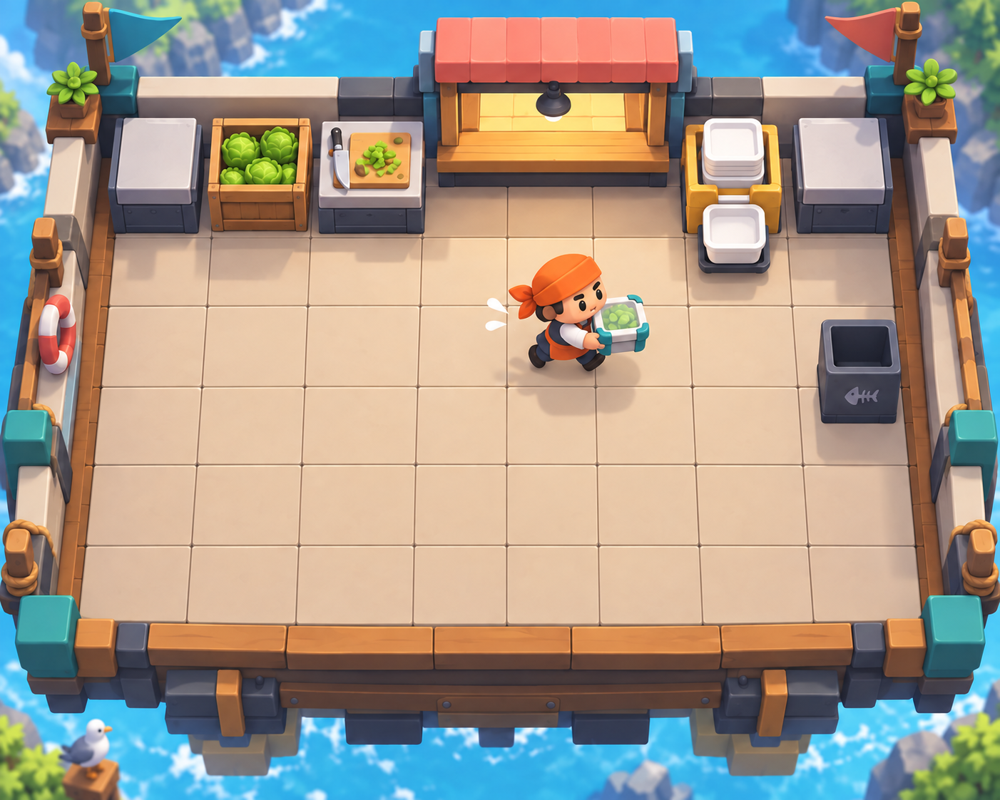
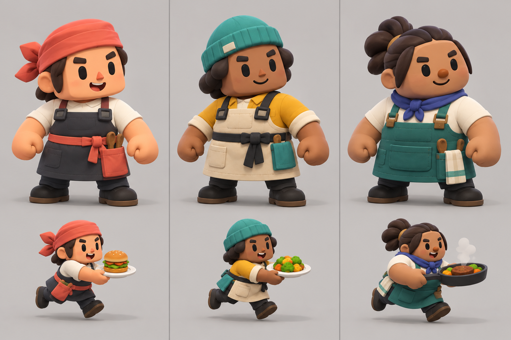
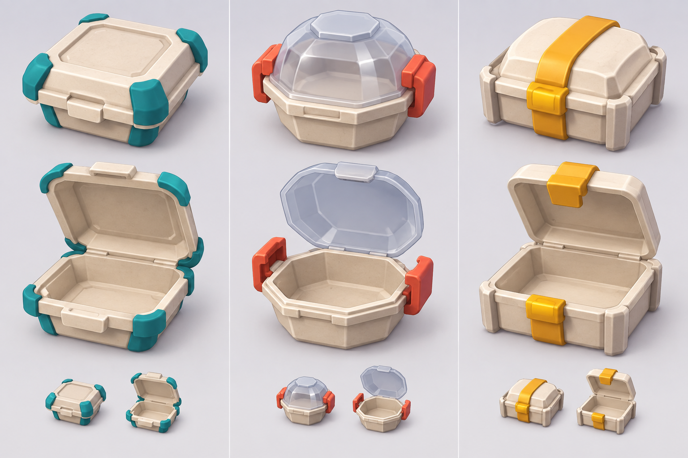

# COOKED OUT! ビジュアル開発 第3ラウンド

- 作成日: 2026-09-11
- 状態: 比較用。製品採用アートではない
- 生成方法: Codex内蔵画像生成
- 基準: 第2ラウンドのAを独自性、Bをゲーム画面の可読性、Cを出張営業の構図基準とし、厨房を正方形グリッドへ統一

## 1. チュートリアル1-1完成イメージ



### 評価

- 正方形の床セルと1セル単位の設備幅が視覚的に分かる
- プレイヤーはマス中心へ固定されず、連続移動しているように見える
- 初回生成にあった穴と皿は、チュートリアル仕様に合わせて床と共通配達容器へ修正した
- 画像は造形と色の参考であり、正確なセル数と配置は[正方形グリッド厨房仕様](../game-design/05_square_grid_kitchen_system.md)の10×8論理データを使う
- 最終版では背景を弱め、グリッド外周と各設備の独自形状をさらに詰める

### 初回生成プロンプト

```text
Use case: stylized-concept
Asset type: gameplay environment concept for tutorial stage 1-1 of an original cooperative cooking action game
Input images: Images 1-3 are visual readability references only; do not edit, reproduce, or copy their specific layouts or characters
Primary request: show a simple solo salad tutorial kitchen built on an unmistakable 10-by-8 square modular grid; every floor tile is one square cell and every standard counter or station occupies exactly one cell; the grid must be visually legible through floor seams and aligned counter footprints without debug labels
Scene/backdrop: self-contained kitchen platform with an original rectangular footprint and a few void cells; lettuce crate, chopping station, assembly counter, delivery-container dispenser, service hatch, trash bin, and two spare counters; exactly one player cook
Subject: one squat original cook taking chopped lettuce toward an empty delivery container; stations are large, simple, and immediately distinguishable by top silhouette
Style/medium: polished stylized 3D gameplay screenshot, chunky toy-diorama geometry, soft bevels, matte materials, low texture density, playful and production-friendly
Composition/framing: fixed high three-quarter orthographic camera, entire 10-by-8 grid and outer boundary visible, centered stage, no cinematic perspective, no depth of field
Lighting/mood: bright neutral studio daylight, cheerful and highly readable
Color palette: warm off-white floor, charcoal counter bases, teal preparation accents, coral service accents, mustard container accents
Constraints: original stage layout and original character; explicit square grid alignment; one-cell-wide counters; character moves continuously rather than standing locked to a tile center; no diners, no UI, no text, no logo, no watermark, no trademarks; do not copy any specific existing stage, character, prop, palette, or costume
Avoid: irregular freeform station placement, anime face, realistic human, tall chef hat, clutter, picturesque background, glossy advertising render
```

### 修正プロンプト

```text
Use case: precise-object-edit
Asset type: corrected gameplay environment concept for tutorial stage 1-1
Input image: Image 1 is the edit target
Primary request: change only two gameplay-spec errors: replace both square holes in the kitchen floor with normal intact square floor tiles that continue the existing grid seams, and replace the round white plate in the cook's hands with a closed rounded-square delivery container holding the finished lettuce salad inside; use the teal-corner-bumper container design from the project's container concept direction
Invariants: preserve the exact camera, stage footprint, square grid alignment, station placement, character identity and pose, lighting, colors, background, and rendering style; no other additions or removals
Constraints: the floor must be fully walkable with no gaps; the carried object must read as a square delivery container rather than a plate; no text, logo, watermark, trademarks
```

## 2. 料理人キャラクター候補



### 候補

- 左・A: 四角い顔とバンダナ。遠距離で最も輪郭を認識しやすいが、料理人として定番に近い
- 中・B: ニット帽と仕事着。料理店だけでなく配達・出張営業にも自然で、COOKED OUT!の独自性を出しやすい
- 右・C: 髪型とスカーフで柔らかい印象。外見バリエーションへ展開しやすいが、エプロン上の小物が少し多い

3案はいずれも顔がまだ小さく、人間だけだったため基本キャラクター案としては不採用。次案では約2頭身、顔を大きくし、人間より動物を多くする。コック帽と衣装は共通化し、顔・頭部、腕、脚、必要な尻尾を固有部品にする。全キャラクターは同じHumanoid骨格、当たり判定、移動速度、作業速度を使う。

### 生成プロンプト

```text
Use case: stylized-concept
Asset type: character-direction comparison sheet for an original cooperative cooking action game
Input images: Images 1-3 are references for chunky scale, matte materials, and gameplay readability only; do not copy their character faces, clothing, or proportions
Primary request: design three clearly different but cohesive cook character candidates for the same game, arranged as three equal vertical columns; each candidate shown in a neutral three-quarter full-body pose plus one small running or carrying silhouette; all must remain readable from a distant fixed gameplay camera
Scene/backdrop: plain warm light-gray studio background with subtle ground shadows and clean column separation, no text labels
Subject: Candidate one has a rounded-square head, compact torso, short limbs, coral bandana, dark wrap apron, and asymmetrical side pocket; candidate two has a soft trapezoid head, bell-shaped torso, teal knit cap, mustard work jacket, and cross-back apron; candidate three has a pebble-shaped head, sturdy barrel torso, tied-back hair, indigo neckerchief, and teal utility apron; diverse skin tones; no traditional tall chef hats; simple expressive brows and eyes, small distinct noses, oversized bare stylized hands rather than white gloves
Style/medium: polished stylized 3D character design sheet, chunky hand-sculpted toy forms, soft bevels, matte clay-and-fabric surfaces, minimal detail, strong original silhouettes
Composition/framing: landscape sheet, three balanced columns, consistent camera, scale, and lighting, all feet visible
Lighting/mood: bright soft studio lighting, friendly, energetic, humorous
Color palette: charcoal, cream, teal, coral, mustard, indigo used in different proportions
Constraints: original character language suitable for shared humanoid rig; about 1.8 heads tall but with three distinct outer silhouettes; no text, logo, watermark, trademarks; do not reproduce any specific existing cook, animal chef, costume, face, hand treatment, or color arrangement
Avoid: anime faces, realistic anatomy, chibi fashion illustration, white cartoon gloves, identical round bodies, tall chef hats, detailed accessories, weapons, cinematic background
```

## 3. 共通配達容器候補



### 候補

- 左・A: 角当て付き角形容器。投げる物として認識しやすく、積み重ねやすい
- 中・B: 八角形＋透明蓋。中身を見せやすいが、丸い皿との区別と積載効率が弱い
- 右・C: 太い固定バンド付き。閉状態は強いが、バンドが料理表示を隠し、開閉アニメーションが複雑になる

採用方向はAの角形・角当てと、Bの透明蓋を組み合わせる。角当ては容器の固定識別色にし、プレイヤーカラーや料理状態とは兼用しない。汁物も別容器や内部ボウルへ分けず、同じ深型密閉容器を使う。

### 生成プロンプト

```text
Use case: product-mockup
Asset type: delivery-container concept comparison sheet for an original cooperative cooking action game
Input images: Images 1-3 are references for chunky scale, matte materials, and gameplay readability only; do not copy their props
Primary request: design three alternative versions of one universal disposable delivery container that can hold salad, soup bowl insert, sandwich, hamburger plate components, curry, pasta, noodles, or breakfast; each version must be safe to throw in gameplay, stackable, clearly closed versus open, and readable at tiny on-screen size
Scene/backdrop: clean light neutral studio sheet divided into three equal columns without text; each candidate shown closed, open, and as a tiny gameplay-scale silhouette
Subject: Candidate one is a rounded-square clamshell with four diagonal corner bumpers and a broad recessed lid panel; candidate two is a low octagonal tray with a hinged translucent dome and two oversized side latches; candidate three is a square tray with a shallow arched lid, one bold wraparound locking band, and impact-resistant corner ribs; no compartments specific to one cuisine
Style/medium: polished stylized 3D game prop concepts, chunky simplified geometry, matte compostable fiber with limited colored molded accents, production-friendly topology
Composition/framing: landscape three-column comparison sheet, consistent three-quarter product angle, generous spacing
Lighting/mood: soft neutral studio light, clear functional presentation
Color palette: natural cream fiber base with restrained teal, coral, or mustard identification accents
Materials/textures: matte molded fiber, soft translucent heat-safe lid where specified, minimal texture noise
Constraints: original designs, one-cell counter footprint, strong silhouette, lid cannot visually resemble a plate, no food brand styling; actual transparent background if supported; no text, logo, watermark, trademarks; do not copy a specific existing game's plate, box, or serving prop
Avoid: pizza box, paper bag, realistic food photography, excessive small hinges, fragile thin parts, glossy takeaway branding, decorative patterns
```

## 4. 次の判断

1. 料理人の基礎をA・B・Cのどれにするか。推奨はB
2. 配達容器をA・B・Cのどれにするか。推奨はA
3. グリッドの床目地を常時この程度見せるか、少し薄くするか
4. チュートリアル1-1の10×8論理配置案を試作基準にしてよいか
