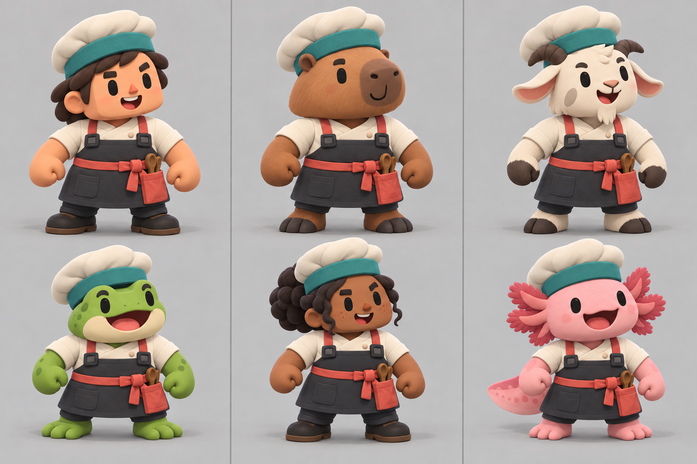
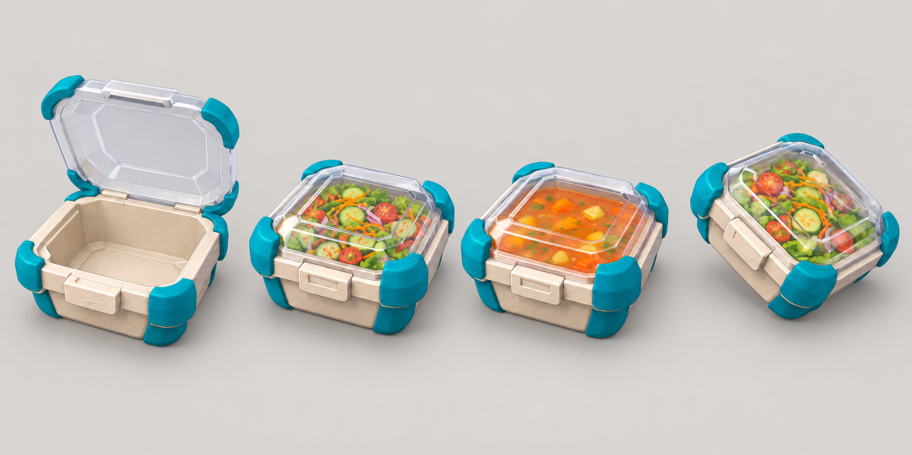
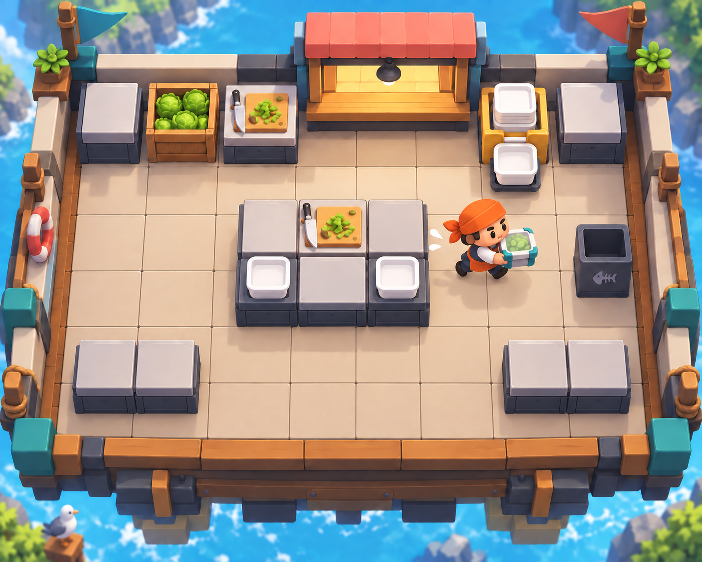

# COOKED OUT! ビジュアル開発 第4ラウンド

- 作成日: 2026-09-11
- 状態: 方向確認用。製品採用アートではない
- 生成方法: Codex内蔵画像生成・画像編集
- 反映した回答: 約2頭身、顔を主役、動物多数、共通帽子・共通衣装、角当て角形容器＋透明蓋、汁物も同一容器、中程度の床目地、密度を上げた10×8厨房

## 1. 約2頭身・動物多数の料理人



### 評価

- 人間2体、動物4体とし、動物が多数になる方向を一枚で確認できる
- 全員の帽子、上着、エプロンを共通化し、顔、耳・角・外鰓、腕、脚を固有化した
- 前案より頭部と顔が大きく、固定俯瞰カメラでも表情を主役にしやすい
- カピバラ、ヤギ、カエル、アホロートルは候補例であり、初期名簿の確定ではない
- 製品化時は共通Humanoid骨格、当たり判定、手の作業位置を先に固定し、種ごとの外形差が操作性能差にならないよう再設計する
- 既存作品固有の動物選定、顔、帽子、衣装、配色を組み合わせて再現しない

### 生成プロンプト

```text
Use case: stylized-concept
Asset type: revised playable-character roster concept sheet for an original cooperative cooking action game
Input image: Image 1 is a style and material reference only; replace all character designs
Primary request: design six cohesive playable cooks in two rows of three; four are animals and two are humans; every character is exactly about two heads tall, with the head occupying roughly half of total height and the face occupying most of the front of the head so expressions remain visible from a distant high gameplay camera
Subject: animal characters are a capybara, goat, frog, and axolotl; two human characters have distinct face shapes and skin tones; all six wear the exact same shared chef hat silhouette and exact same shared base outfit: a low wide off-white culinary cap with a teal band, cream short-sleeved wrap-front cook jacket, charcoal cropped utility apron with coral cross straps; faces/heads, ears/horns/gills, exposed forearms/hands, exposed lower legs/feet, and optional tails are character-specific; hands are not white gloves
Style/medium: polished stylized 3D character roster sheet, chunky hand-sculpted toy forms, soft bevels, matte clay and fabric, simple large facial features, strong silhouettes, production-friendly shared humanoid rig
Composition/framing: clean landscape studio sheet, six equal full-body three-quarter poses, all feet visible, consistent camera and scale, subtle ground shadows, no text labels
Lighting/mood: bright soft neutral studio light, friendly, humorous, expressive
Color palette: shared cream, charcoal, teal, coral clothing; species colors remain natural but simplified
Constraints: shared hat and clothing must visibly match across all six; animal characters outnumber humans; faces are the focal point; identical gameplay ability, collider envelope, and bone layout implied; no text, logo, watermark, trademarks; original designs only
Avoid: tall traditional toque, anime faces, realistic anatomy, tiny eyes, oversized clothing details, different costumes per character, white cartoon gloves, copying any specific existing game character or animal-chef design
```

## 2. 透明蓋付き共通配達容器



### 評価

- A案の深い角形本体と四隅の角当てに、B案の透明蓋を統合した
- 開いた空容器、サラダ完成、汁物完成、投擲中を同じ容器で比較した
- 汁物用の別ボウルや内部容器は設けず、同じ本体の密閉性で成立させる
- 料理完成後も上面から中身を確認でき、皿や食材との区別もしやすい
- 初回生成画像の市松模様は実際の透過ではなく画像内へ描かれていたため、最終確認用画像では無地の背景へ編集した
- 製品内では汁物へ液体物理を使わず、固定された液面と小さな揺れだけで表現する案を次の判断とする

### 初回生成プロンプト

```text
Use case: product-mockup
Asset type: finalized direction sheet for one universal delivery-container design in an original cooking action game
Input image: Image 1 is a concept reference; combine the left candidate's rounded-square body and four corner bumpers with the middle candidate's transparent lid, but redesign as one coherent original object
Primary request: show the same universal container in four states: open and empty for assembly, closed with a salad visibly inside, closed with soup visibly inside the exact same deep base without any separate bowl or insert, and flying through the air in a safe thrown pose
Subject: deep rounded-square molded-fiber base, four large diagonal teal impact bumpers, a shallow crystal-clear hinged lid with a broad recessed square top, one simple front latch, strong compact silhouette; transparent lid reveals the finished food clearly
Style/medium: polished stylized 3D game prop design, chunky simplified production-friendly geometry, matte compostable cream fiber, satin teal bumpers, clean transparent lid
Composition/framing: landscape four-state comparison on a genuinely transparent background, consistent three-quarter product angle, generous spacing, no text
Lighting/mood: soft neutral product lighting
Constraints: every state is the exact same container; soup uses no internal bowl and does not spill; completed state reads as lid closed; suitable for stacking and throwing; one-cell counter footprint; no text, logo, watermark, trademarks; original design
Avoid: plate silhouette, pizza box, paper bag, opaque lid, separate soup cup, realistic branding, small fragile hinges, excessive detail
```

### 背景修正プロンプト

```text
Use case: precise-object-edit
Asset type: universal delivery-container comparison sheet cleanup
Input image: Image 1 is the edit target
Primary request: replace only the entire gray checkerboard-pattern background with a perfectly smooth warm light-gray studio background and soft grounded contact shadows beneath the four objects
Invariants: preserve all four container objects exactly, including geometry, open or closed states, transparent lids, teal corner bumpers, salad, soup, thrown angle, positions, scale, lighting, and crop
Constraints: no checkerboard pattern, no transparency simulation pattern, no text, logo, watermark, or extra objects; change only the background
```

## 3. 密度を上げたチュートリアル1-1厨房



### 評価

- 中央へ3×2セルの作業島、下側へ短い補助カウンターを置き、前案の広すぎる中央を埋めた
- 作業島の周囲には一セル以上の周回路を残し、基本移動と回り込みを教えられる
- 床目地は中程度に見せ、設備の一セル幅と合わせて正方形グリッドを読む
- 1-1なので穴、動く床、加熱器具、皿洗いは置かない
- 画像生成はセル数、設備数、厳密な位置を保証しない。実装で使う正本は[正方形グリッド厨房仕様](../game-design/05_square_grid_kitchen_system.md)の10×8データであり、この画像を配置図として転記しない

### 編集プロンプト

```text
Use case: precise-object-edit
Asset type: denser corrected gameplay environment concept for tutorial stage 1-1
Input image: Image 1 is the edit target
Primary request: redesign only the interior kitchen layout so the middle no longer feels empty: add one compact rectangular 3-by-2 island made from exactly six aligned one-cell square counters near the center, place the assembly counter on the island, add two short pairs of auxiliary one-cell counters near the lower left and lower right, and move the cook into a clear corridor beside the island
Invariants: preserve the same high orthographic camera, outer rectangular stage footprint, intact square floor grid with no holes, top wall lettuce crate/chopping/service/container stations, trash bin, single cook, transparent-lid square delivery container, lighting, materials, colors, and background
Gameplay constraints: every counter footprint aligns exactly to one square floor cell; preserve at least a one-cell walkable loop around the central island; no blocked stations; no heating equipment, moving floor, hazards, diners, or extra characters
Constraints: medium-strength floor seams, compact readable tutorial kitchen, no text, UI, logo, watermark, trademarks
Avoid: empty ballroom-like center, freeform diagonal placement, adding holes, cinematic perspective, clutter
```

## 4. このラウンドで確定した方向と残る判断

確定した方向:

- キャラクターは約2頭身で顔を主役とし、人間より動物を多くする
- 帽子と基本衣装は共通、顔・頭部・腕・脚・種固有部位は個別とする
- 配達容器は角当て付き角形本体＋透明蓋、汁物も同じ容器とする
- 製品画面の床目地は中程度の強さとする
- 1-1は10×8を維持し、中央作業島で密度を上げる

次に決める項目は、[次期大枠仕様・回答用質問票 v0.5](../project/NEXT_DECISION_QUESTIONS_V5.md)へまとめた。
