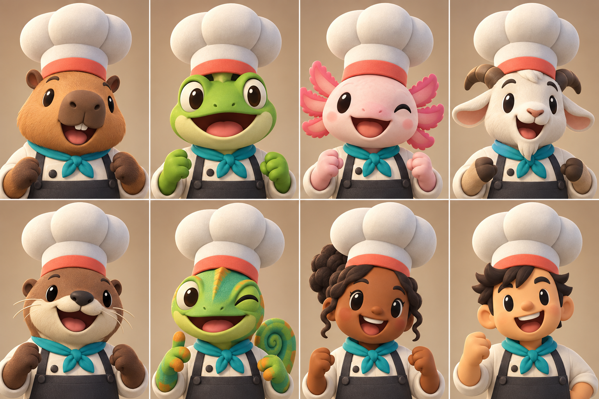
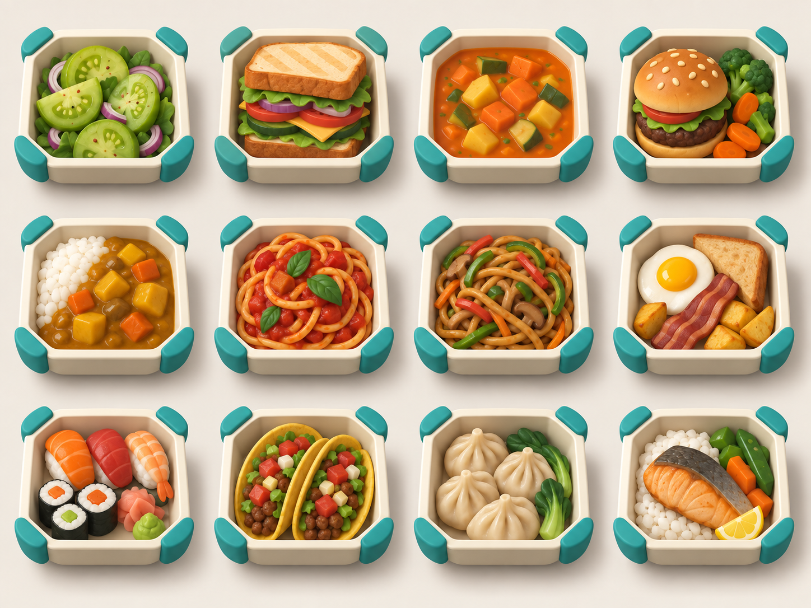

# COOKED OUT! ビジュアル開発 第5ラウンド

- 作成日: 2026-09-11
- 状態: 顔の読みやすさと料理簡略度の参考。人間を含むためキャラクター名簿としては不採用
- 生成方法: Codex内蔵画像生成
- 入力画像の扱い: ユーザー添付画像は第三者作品のキャラクター選択画面と見られるため、読みやすい正面肖像、大きな帽子、単純な目鼻、共通制服という一般原則だけを参照し、画像自体はプロジェクトへ複製していない

## 1. キャラクター選択肖像



### 評価

- 前回の全身案より顔と帽子が大きく、添付画像で求められた選択画面の読みやすさに近づいた
- 動物6体の顔の読みやすさは参考にするが、人間2体は廃止し、正式キャストは全員動物へ変更した
- 帽子、ジャケット、スカーフ、エプロンを共通化し、顔、腕、手、種固有部位で個体差を作った
- カピバラ、カエル、アホロートル、ヤギ、カワウソ、カメレオンは候補例で、初期12体の確定名簿ではない
- 帽子の膨らみと画面構成は参考画像との距離をさらに取る必要がある。本番用には帽子の傾き、後頭部、帯位置を独自化する
- この画像で顔の大きさを承認後、同じ8体の全身二頭身・正面／側面／背面を別途作る

### 生成プロンプト

```text
Use case: stylized-concept
Asset type: original playable-character selection portrait sheet for COOKED OUT!, a cooperative cooking action game
Input image: Image 1 is a visual-language reference only for the readable front-facing portrait format, oversized soft chef hats, simple friendly facial features, and unified staff clothing; do not reproduce any specific character, animal species lineup, face, costume details, color arrangement, kitchen background, or UI from it
Primary request: create eight entirely original cook characters in a clean 4-by-2 portrait grid; six animals and two humans; each character faces mostly forward with head, face, shoulders, and small hands visible; the head and face dominate, implying an approximately two-head-tall full body
Subject: original animal roster of capybara, frog, axolotl, goat, river otter, and chameleon, plus two humans with clearly different skin tones and face shapes; every cook wears the exact same shared oversized three-lobed off-white chef cap with a coral hat band, the same cream wrap-front cook jacket, teal neckerchief, and charcoal apron bib; faces, ears, horns, gills, skin/fur, forearms, and hands are species-specific; each has a different cheerful or determined expression
Style/medium: polished stylized 3D game character portraits, chunky hand-sculpted toy forms, very large simple oval eyes, tiny simple noses, broad readable mouths, round cheeks, soft bevels, matte clay and fabric, low detail, designed for a distant mobile-game camera
Composition/framing: landscape sheet with eight equal clean portrait cells, two rows of four, consistent close frontal camera and scale, each full hat visible, no selection arrows, no UI, no text labels
Lighting/mood: warm neutral studio lighting, bright, friendly, comic, highly readable
Color palette: shared off-white, coral, teal, charcoal uniform; simplified natural species colors
Constraints: animal characters clearly outnumber humans; exact same hat and base uniform across all eight; original character identities; compatible-looking shared humanoid rig and gameplay abilities; no text, logo, watermark, trademarks
Avoid: copying the reference character roster, pug, mouse, eagle, cat, fox, panda, blue uniform, exact reference hat silhouette, anime rendering, realistic anatomy, small faces, intricate accessories, white gloves, different costumes per character
```

## 2. 料理12系統の大まかな造形試験



### 評価

- サラダ、サンドイッチ、スープ、ハンバーグ、カレー、パスタ、炒め麺、朝食、寿司、タコス、餃子、焼き魚を同一条件で比較した
- 写実的な細部ではなく、大きな形と色面で材料が分かる
- 同じ角形配達容器を使うことで、注文票とゲーム内完成物を対応させやすい
- 12種を小さくしても大分類は読める。個別派生では材料を増やしすぎず、一つの追加具材を大きく見せる
- 容器が料理ごとに同じため、今後は料理自体の外形差をより強める必要がある
- 透明蓋は注文票では完全に開き、実ゲームの完成物では閉じる

### 生成プロンプト

```text
Use case: stylized-concept
Asset type: rough finished-dish visual-language sheet for COOKED OUT! order tickets and recipe planning
Primary request: design twelve broad, simple, immediately readable finished-food icons that establish a scalable style for a future 36-recipe-family catalog
Subject: green tomato salad, stacked vegetable sandwich, chunky orange vegetable soup, hamburger with simple side vegetables, curry rice, red tomato pasta, stir-fried noodles, breakfast with egg and toast, sushi assortment, two tacos, steamed dumplings, pan-seared fish with rice; each dish sits in the same deep rounded-square cream delivery tray with four teal corner bumpers, shown open from above so the food is unobstructed
Style/medium: polished but deliberately coarse stylized 3D game-food concept sheet, chunky toy-like food pieces, rounded geometric shapes, matte clay materials, minimal garnish, low texture detail, bold silhouette and color blocks, production-friendly
Composition/framing: clean landscape 4-by-3 grid, twelve equal isolated top-down three-quarter icons, consistent scale and camera, generous spacing, no text or labels
Lighting/mood: soft neutral studio light, appetizing, cheerful, highly readable at tiny mobile UI size
Color palette: saturated but controlled natural food colors, cream trays, teal corner bumpers
Constraints: each meal must be identifiable from shape and major color blocks without fine detail; same tray design in all cells; no lids covering the food; no plates, restaurant branding, text, logo, watermark, or trademarks; original designs
Avoid: photorealistic food, tiny garnishes, busy sauces, intricate plating, multiple dishware styles, cinematic backgrounds, excessive gloss, dense texture noise
```

## 3. 次の画像生成

1. 料理スタイルを承認後、36系統を12種×3シートで作る
2. 各料理を個別の注文票画像へ切り替える
3. 全動物の初期12キャラクター候補を作り、種と顔シルエットを確定する
4. 承認キャラクターを全身二頭身と三面図へ展開する
5. 第2〜9章の厨房キーアートを各一枚作る
6. 以後の画像生成は専用の別タスクで進める

量産方法は[ビジュアル基準・画像量産工程](VISUAL_BIBLE_AND_IMAGE_FACTORY.md)を正とする。
