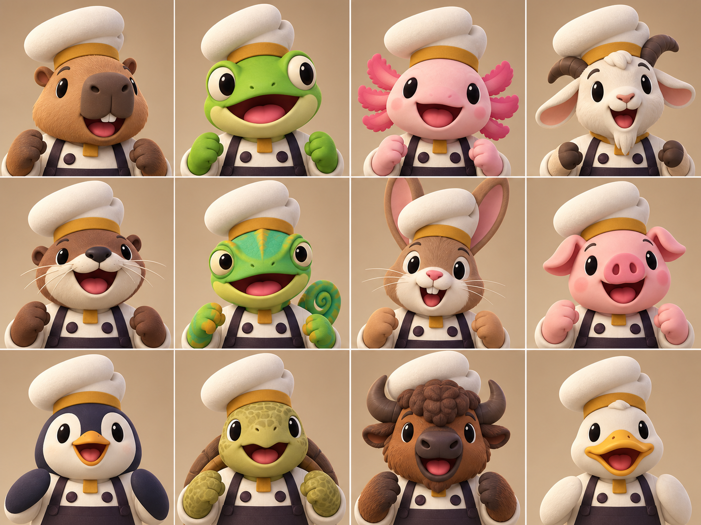
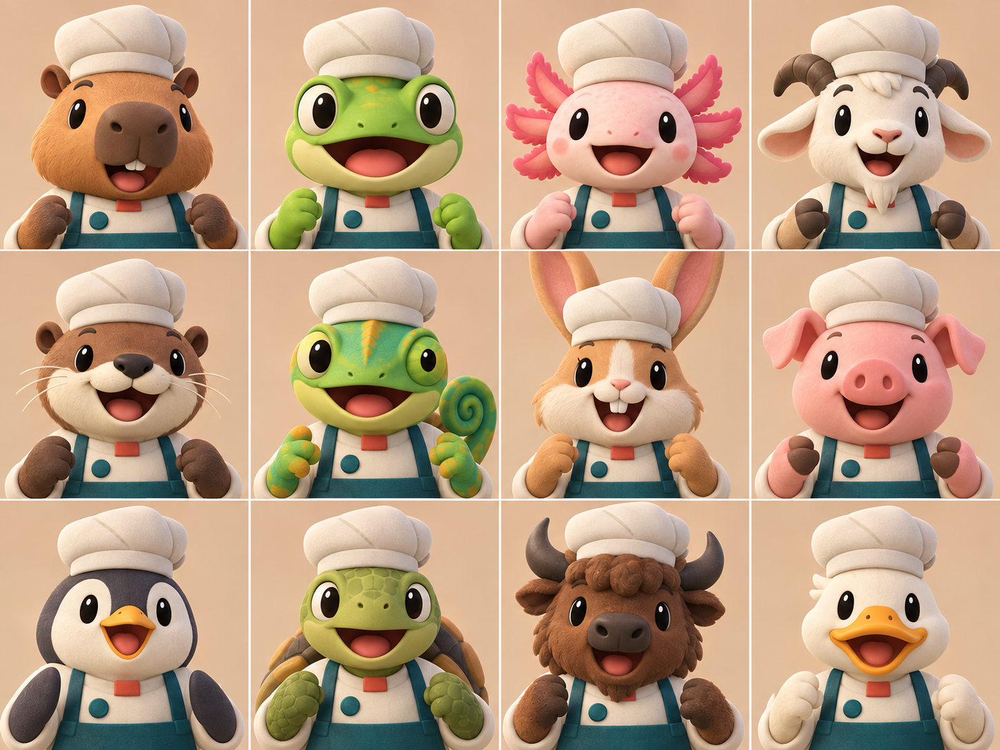

# COOKED OUT! ビジュアル開発 第6ラウンド

- 作成日: 2026-09-11
- 対象: `style_version 1` 承認候補のうち、優先1「初期12体の全動物キャラクター選択肖像」
- 状態: 比較ラウンド完了。2026-09-11に候補Aの造形方向を承認。掲載v1名簿は正本更新により第7ラウンドv2へ差し替え
- 生成方法: Codex内蔵画像生成
- 入力画像: プロジェクト内の第5ラウンド肖像、料理12系統試験、1-1厨房案を、顔サイズ・簡略度・材質・照明だけの参考として使用

## 1. このラウンドの目的

大量生成前に、同一の12動物種、同一カメラ、同一照明で帽子と制服の方向だけを変えたA/Bを比較する。人間キャラクターは含めず、既存作品や第5ラウンドの三房型帽子、人物、UI、配色を継承しない。

名簿順は両案とも左上から右下へ次の通り。

1. カピバラ
2. アマガエル
3. アホロートル
4. シロイワヤギ
5. カワウソ
6. カメレオン
7. ウサギ
8. ブタ
9. ペンギン
10. リクガメ
11. バイソン
12. アヒル

この名簿は当ラウンド時点の比較用であり、後続の正本更新により[第7ラウンドの正本対応v2](VISUAL_DEVELOPMENT_ROUND_07.md#2-初期12体--候補a正本対応v2)へ差し替えた。

## 2. 候補A — 非対称ウェッジ帽



- 共通帽子: 低い非対称ウェッジ形、左へわずかに傾く一枚の丸い冠、後部の浅い折り、上寄りの黄土色バンド
- 共通制服: 生成画像ではクリーム色の上衣、黄土色の短い角形ネックタブ、濃いプラム色の留め具とエプロンとして読める
- 長所: 帽子の輪郭が典型的な三房型や背の高いトーク帽から最も離れている。プラム色が顔色と分離し、12体を縮小しても肩の共通形が読める
- 注意: プロンプトでは巻き合わせ上衣を指定したが、生成結果は濃色の肩ひもが強く、エプロン／サスペンダーに見える。三面図へ進む前に上衣の合わせとエプロン境界を明示する必要がある

## 3. 候補B — 角丸ブロック帽



- 共通帽子: 低い角丸長方形、斜めの押し目、折り返しのある下縁
- 共通制服: 生成画像では淡いオート色の上衣、珊瑚色の短い角形ネックタブ、濃い青緑の留め具とエプロンとして読める
- 長所: 制服の機能色が既存の料理容器・厨房設備とつながりやすく、全セルの統一感が高い
- 注意: 帽子が一般的な低いトーク帽に近く、Aより固有性が弱い。青緑と珊瑚は第5ラウンドおよび既存設備案と近いため、作品全体の役割色として再定義せず使うと既視感が残る

## 4. 比較評価

| 評価軸 | 候補A | 候補B | 判定 |
|---|---|---|---|
| 12体・全動物 | 12セルすべて動物 | 12セルすべて動物 | 両方合格 |
| 顔・帽子・肩の読みやすさ | 顔が大きく、帽子全体が見える | 顔が大きく、帽子全体が見える | 両方合格 |
| 種固有シルエット | 耳、角、外鰓、くちばし、甲羅、前腕が明瞭 | 同様に明瞭 | 両方合格 |
| 共通帽子・共通制服 | ほぼ統一。ヤギとバイソンの角も帽子外周へ整理 | ほぼ統一。折り返し幅に軽微な揺れ | 両方合格 |
| 約2頭身の含意 | 大きな頭、短い肩と腕で成立 | 同様に成立 | 両方合格 |
| 小画面コントラスト | 濃いプラムが輪郭を締める | 青緑は明快だが既存案と近い | A優位 |
| 帽子の独自性 | 非対称の一枚形が明確 | 一般的な低いトークに寄る | A優位 |
| 既存の料理・厨房との同作品感 | 丸い厚形、マット材、明るい中立光は一致。黄土とプラムは人物系の役割色として区別可能 | 形・材質・照明・青緑機能色まで直接つながる | Bが即時一致、Aも条件付き合格 |
| 量産時の修正負荷 | 上衣合わせとエプロン境界を固定する必要あり | 帽子固有性の追加設計が必要 | Aの方が修正範囲を限定しやすい |

## 5. 推奨

候補Aを `style_version 1` のキャラクター方向として承認する。

理由は、顔の可読性と共通骨格の成立を維持しながら、帽子の外形と制服の人物系配色を既存作品および第5ラウンドから明確に離せるためである。料理・設備では青緑を「容器角当て・操作設備の機能色」として残し、キャラクター制服では黄土とプラムを使う役割分離にすれば、同じ丸い厚形・マット材・中立光の中でカテゴリを識別できる。

候補Bは比較終了とし、以後の量産基準には使わない。ただし、この時点では `style_version 1` 全体を宣言しない。次の比較ラウンドで、候補Aの帽子・クリーム・黄土・プラムと同じ造形言語を使った料理シート試験および基本設備／1-1〜1-3厨房基準を確認し、三領域が同じ作品に見えることを承認してから固定する。

## 6. 生成プロンプト — 候補A

```text
Use case: stylized-concept
Asset type: style_version 1 approval-candidate sheet for playable character selection portraits in COOKED OUT!, an original cooperative cooking action game
Input images: Image 1 is a project-internal reference only for face size, frontal framing, and readability; do not preserve its roster, humans, exact hat, exact uniform, cell styling, or color arrangement. Image 2 is a project-internal material reference only for chunky matte toy-like 3D and restrained detail. Image 3 is a project-internal environment reference only for broad rounded forms and neutral bright lighting. Do not copy any layout or object placement from any input.
Primary request: create exactly twelve entirely original animal cook portraits in a clean 4-column by 3-row grid for comparison candidate A. Every cell contains one and only one different animal cook: capybara, tree frog, axolotl, mountain goat, river otter, chameleon, rabbit, pig, penguin, tortoise, bison, and duck. No humans.
Subject: all twelve share the exact same base uniform and the exact same chef-cap design. Shared cap is an original low asymmetrical soft wedge: one broad rounded crown leaning slightly to the cook's left, a shallow notched rear fold, and a narrow woven ochre band placed unusually high; absolutely no classic three-puff or mushroom toque silhouette. Shared uniform is a warm-cream wrap-front cook jacket with two oversized dark-plum fastening discs, a short squared ochre neck tab, and a dark-plum apron bib. Exposed forearms and small rounded paws, claws, flippers, or hooves must be species-specific; no gloves. Each portrait preserves a compatible shared humanoid shoulder width and hand height.
Species identity: capybara has a tall blocky muzzle and small round ears; frog has a wide head and raised eyes; axolotl has three large simple external-gill branches on each side; goat has short swept-back horns and long ears; otter has a pale whisker muzzle; chameleon has independently angled dome eyes and a small curled tail tip visible by one shoulder; rabbit has two long ears passing clearly behind the shared cap; pig has a broad round snout; penguin has a short wedge beak and flipper-like forearms; tortoise has a scaled head and small shell rim visible behind shoulders; bison has a heavy forehead and compact outward horns; duck has a broad flat beak.
Style/medium: polished stylized 3D game-character concept sheet; chunky hand-sculpted toy forms; approximately two-head-tall proportions implied by huge heads and short shoulders; simple oval eyes with minimal highlights; tiny or species-correct noses; broad readable mouths and thick simple brows; soft bevels; matte clay, felt, and rubber materials; very low texture density; no realistic fur strands.
Composition/framing: exact landscape 4-by-3 equal grid; straight clean separators; consistent close frontal chest-up camera, identical scale and lighting, entire cap visible in every cell, face and cap dominate each portrait; no cropped ears or horns; warm solid parchment background in every cell.
Lighting/mood: bright neutral studio lighting, gentle short shadows, friendly, energetic, legible at small mobile size; no depth-of-field blur.
Color palette: shared warm cream, ochre, and dark plum uniform; simplified natural animal colors with controlled saturation and no repeated rainbow arrangement.
Constraints: exactly 12 portraits and 12 animal cooks; no human or human-like face; one animal per cell; exact same cap and exact same base uniform across all twelve; visibly distinct species silhouettes; original designs; no text, labels, numbers, logo, watermark, selection UI, arrows, icons, kitchen backdrop, props, utensils, plates, or food.
Avoid: reproducing any existing game character, costume, chef-hat silhouette, UI, layout styling, or palette; three-lobed puffy chef hats; tall mushroom toques; white gloves; different outfits per animal; photorealism; anime rendering; tiny faces; busy accessories; dramatic cinematic lighting; blue-coral-teal uniform palette.
```

## 7. 生成プロンプト — 候補B

```text
Use case: stylized-concept
Asset type: style_version 1 approval-candidate sheet for playable character selection portraits in COOKED OUT!, an original cooperative cooking action game
Input images: Image 1 is a project-internal reference only for face size, frontal framing, and readability; do not preserve its roster, humans, exact hat, exact uniform, cell styling, or color arrangement. Image 2 is a project-internal material reference only for chunky matte toy-like 3D and restrained detail. Image 3 is a project-internal environment reference only for broad rounded forms and neutral bright lighting. Do not copy any layout or object placement from any input.
Primary request: create exactly twelve entirely original animal cook portraits in a clean 4-column by 3-row grid for comparison candidate B. Every cell contains one and only one different animal cook: capybara, tree frog, axolotl, mountain goat, river otter, chameleon, rabbit, pig, penguin, tortoise, bison, and duck. No humans.
Subject: all twelve share the exact same base uniform and the exact same chef-cap design. Shared cap is an original compact rounded rectangular baker cap: a low padded oblong crown with two shallow diagonal pressed seams, a rolled lower rim, and a small rear tuck, worn level; absolutely no classic three-puff or mushroom toque silhouette. Shared uniform is a pale-oat wrap-front cook jacket with two oversized deep-teal fastening discs, a short squared muted-coral neck tab, and a deep-teal apron bib. Exposed forearms and small rounded paws, claws, flippers, or hooves must be species-specific; no gloves. Each portrait preserves a compatible shared humanoid shoulder width and hand height.
Species identity: capybara has a tall blocky muzzle and small round ears; frog has a wide head and raised eyes; axolotl has three large simple external-gill branches on each side; goat has short swept-back horns and long ears; otter has a pale whisker muzzle; chameleon has independently angled dome eyes and a small curled tail tip visible by one shoulder; rabbit has two long ears passing clearly behind the shared cap; pig has a broad round snout; penguin has a short wedge beak and flipper-like forearms; tortoise has a scaled head and small shell rim visible behind shoulders; bison has a heavy forehead and compact outward horns; duck has a broad flat beak.
Style/medium: polished stylized 3D game-character concept sheet; chunky hand-sculpted toy forms; approximately two-head-tall proportions implied by huge heads and short shoulders; simple round-rectangle eyes with minimal highlights; tiny or species-correct noses; broad readable mouths and straight simple brows; soft bevels; matte clay, felt, and rubber materials; very low texture density; no realistic fur strands.
Composition/framing: exact landscape 4-by-3 equal grid; straight clean separators; consistent close frontal chest-up camera, identical scale and lighting, entire cap visible in every cell, face and cap dominate each portrait; no cropped ears or horns; light desaturated peach solid background in every cell.
Lighting/mood: bright neutral studio lighting, gentle short shadows, friendly, energetic, legible at small mobile size; no depth-of-field blur.
Color palette: shared pale oat, deep teal, and muted coral uniform; simplified natural animal colors with controlled saturation and no repeated rainbow arrangement.
Constraints: exactly 12 portraits and 12 animal cooks; no human or human-like face; one animal per cell; exact same cap and exact same base uniform across all twelve; visibly distinct species silhouettes; original designs; no text, labels, numbers, logo, watermark, selection UI, arrows, icons, kitchen backdrop, props, utensils, plates, or food.
Avoid: reproducing any existing game character, costume, chef-hat silhouette, UI, layout styling, or palette; three-lobed puffy chef hats; tall mushroom toques; white gloves; different outfits per animal; photorealism; anime rendering; tiny faces; busy accessories; dramatic cinematic lighting; yellow-plum uniform palette.
```

## 8. 入力と修正

- 参照入力1: `concepts/cook_portraits_reference_driven_v3.png`。顔の大きさ、正面寄り胸上、明るい中立光だけを参照
- 参照入力2: `concepts/dish_style_12_family_sampler_v1.png`。大きな形、低いテクスチャ密度、マットな玩具材だけを参照
- 参照入力3: `concepts/tutorial_1_1_dense_grid_v3.png`。丸い厚形と中立光だけを参照。設備座標は参照しない
- 生成後の画素修正: なし。生成元PNGを改変せずプロジェクトへコピー
- 出力解像度: 1448×1086 RGB PNG
- SHA-256 A: `217f81f11e295e5cdfccc125fe272d242a01ea634eaac522c874c15724b5c7cb`
- SHA-256 B: `8c0e0648b0b6444fa15691d1279b9bdad9b70a5285571efe8454237a8f69089d`
