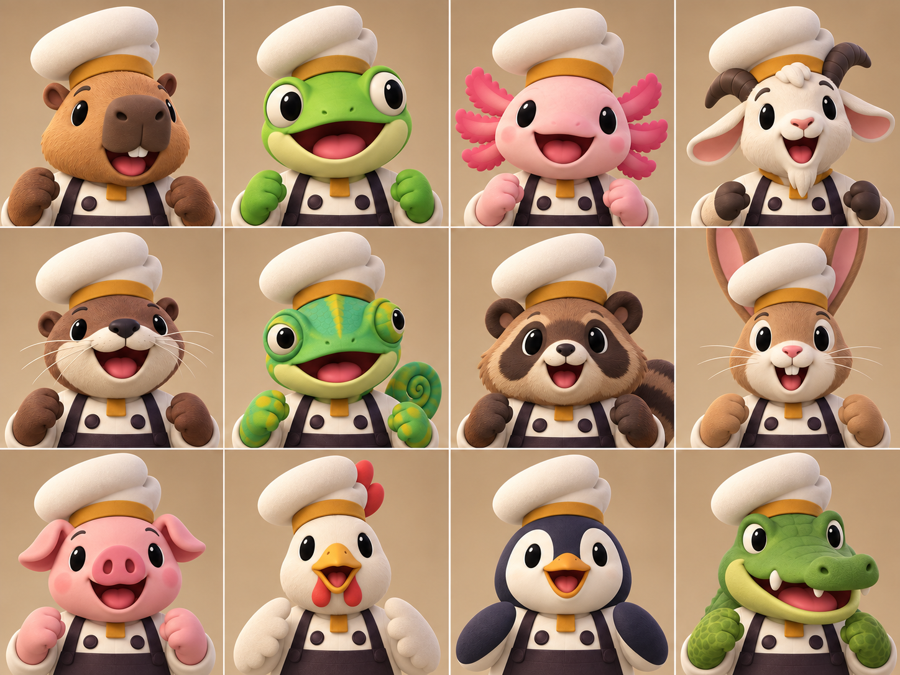
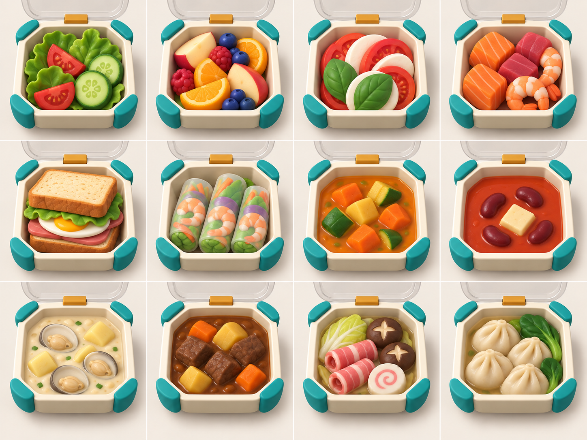
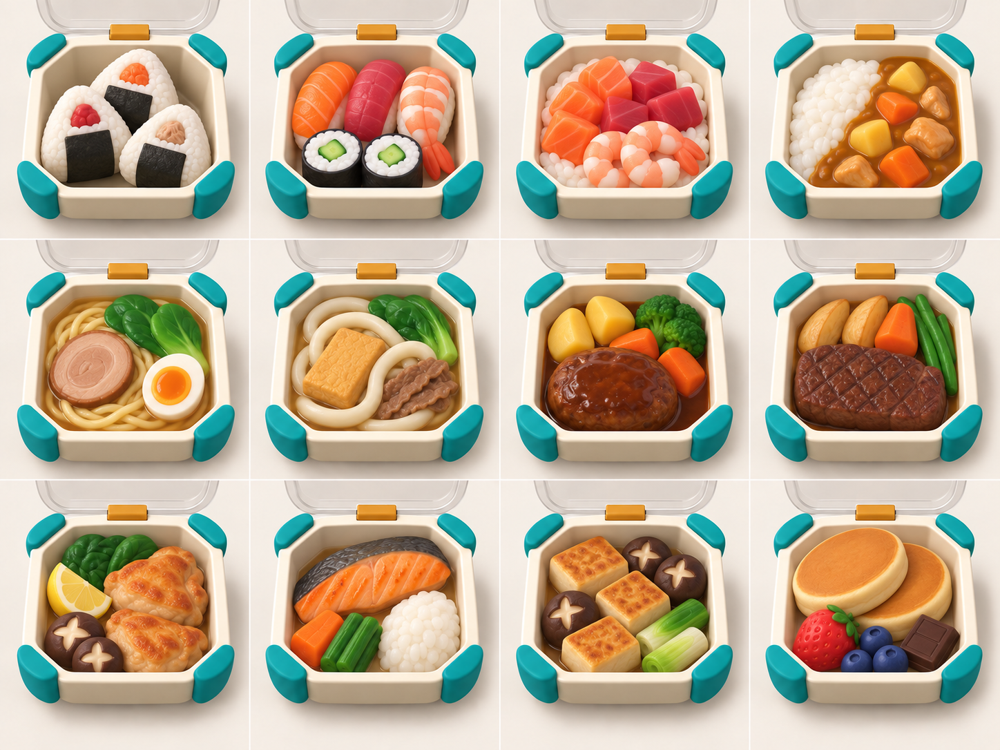
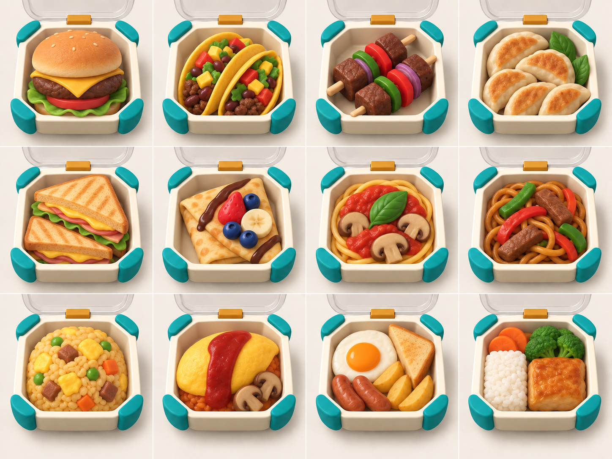

# COOKED OUT! ビジュアル開発 第7ラウンド

- 作成日: 2026-09-11
- 対象: 承認済み候補Aの正本名簿対応、36料理系統の12種×3シート
- 状態: キャラクター方向は承認済み。正本対応v2と料理3シートは承認候補。`style_version 1` 全体は未固定
- 生成方法: Codex内蔵画像生成

## 1. 正本更新への対応

第6ラウンド後に初期12体の種が正本で確定したため、候補Aの帽子、制服、材質、照明を維持し、名簿だけを正本どおりに再生成した。第6ラウンド候補A v1のリクガメ、バイソン、アヒルは量産名簿には使わない。

## 2. 初期12体 — 候補A・正本対応v2



左上から右下へ、カピバラ、カエル、アホロートル、ヤギ、カワウソ、カメレオン、タヌキ、ウサギ、ブタ、ニワトリ、ペンギン、ワニ。哺乳類6、鳥類2、爬虫類2、両生類2で、人間を含まない。

- 候補Aの低い非対称ウェッジ帽を全員で維持
- クリーム、黄土、濃いプラムの共通制服を維持
- 顔、腕、耳、角、外鰓、くちばし、翼、尻尾、鱗を種固有にできている
- タヌキは実在動物として表現し、民話衣装や追加小物を付けていない
- 全12枠で帽子と顔の大きさ、胸上の作業高さが揃っている

## 3. 料理系統シート1 — #1〜#12



| 行 | 左から右 |
|---|---|
| 1 | #1 グリーンサラダ、#2 フルーツサラダ、#3 カプレーゼ、#4 刺身盛り |
| 2 | #5 サンドイッチ、#6 生春巻き、#7 野菜スープ、#8 トマトスープ |
| 3 | #9 クラムチャウダー、#10 ビーフシチュー、#11 寄せ鍋、#12 水餃子 |

## 4. 料理系統シート2 — #13〜#24



| 行 | 左から右 |
|---|---|
| 1 | #13 おにぎり、#14 寿司、#15 海鮮丼、#16 カレーライス |
| 2 | #17 ラーメン、#18 うどん、#19 ハンバーグプレート、#20 ステーキプレート |
| 3 | #21 チキンソテー、#22 焼き魚定食、#23 豆腐ステーキ、#24 パンケーキ |

## 5. 料理系統シート3 — #25〜#36



| 行 | 左から右 |
|---|---|
| 1 | #25 ハンバーガー、#26 タコス、#27 ケバブ、#28 焼き餃子 |
| 2 | #29 ホットサンド、#30 クレープ、#31 パスタ、#32 炒め麺 |
| 3 | #33 炒飯、#34 オムライス、#35 朝食プレート、#36 弁当セット |

## 6. 比較・評価

| 評価軸 | 結果 | 判定・次工程 |
|---|---|---|
| 正本どおりの36系統 | 3シートに#1〜#36を番号順で収録 | 合格 |
| 共通容器 | 全36セルで同じ角形・深型・クリーム色容器、青緑の角当て、黄土色ヒンジ | 合格 |
| 注文票の開蓋 | 全セルで透明蓋を後方へ完全に開き、料理を覆わない | 合格 |
| カメラ・縮尺 | 4×3、上から約25度、料理占有率がおおむね70〜80% | 合格 |
| 大きな形と色面 | 大分類は2〜4個の主要形状で判別可能 | 合格 |
| 人間・文字・UI混入 | なし | 合格 |
| キャラクターとの同作品感 | 丸い厚形、軟らかい面取り、マットな玩具材、中立光、クリームと黄土が一致 | 合格 |
| カテゴリ役割色 | 人物はプラム、容器・設備機能部は青緑として分離しつつ、黄土ヒンジで接続 | 合格 |
| 細部密度 | #33炒飯の粒、果物の種、魚・肉表面は他より細かい | 個別注文票化で簡略化 |
| 光沢 | #19〜#21の肉表面、カレー・煮込みの一部に光沢が強い | 個別注文票化で粗さを上げる |

キャラクターと料理の二領域は同じ作品として成立している。`style_version 1` 全体の固定には、基本設備と1-1〜1-3厨房で同じ材質、輪郭、機能色が成立することの確認が残る。

## 7. 生成プロンプト — 初期12体・候補A v2

```text
Use case: stylized-concept
Asset type: corrected style_version 1 playable-character selection portrait sheet for COOKED OUT!, preserving the user-approved candidate A art direction while conforming to the now-canonical launch roster
Input images: Image 1 is the user-approved candidate A style anchor. Preserve its low asymmetrical one-piece soft-wedge chef cap leaning slightly left, shallow rear fold, narrow high ochre band, warm-cream shared jacket, oversized dark-plum fastening discs, squared ochre neck tab, dark-plum apron bib, huge readable animal faces, chunky matte hand-sculpted toy forms, warm parchment cells, bright neutral studio light, and 4-by-3 format. Do not preserve the old animal roster where it conflicts with this prompt.
Primary request: exactly twelve original animal cooks in this exact 4-by-3 order: capybara; tree frog; axolotl; mountain goat; river otter; chameleon; Japanese raccoon dog or tanuki as a real animal; rabbit; pig; chicken; penguin; crocodile. No humans.
Shared design invariants: identical approved cap and warm-cream, ochre, dark-plum uniform; exposed species-specific forearms; no gloves; common humanoid shoulder width and hand height.
Species identity: blocky capybara muzzle; raised frog eyes; three large axolotl gill branches per side; goat horns and long ears; otter whisker muzzle; chameleon dome eyes and curled tail tip; tanuki eye mask, compact muzzle, round ears, striped tail tip without folklore props; rabbit ears behind cap; pig snout; chicken comb, wattles, short beak and wing forearms; penguin color blocks, short wedge beak and flippers; crocodile long rounded snout, blunt lower teeth, eye ridges and scaled forearms.
Style/medium: polished stylized 3D; approximately two-head-tall; big simple oval eyes; broad mouths and simple brows; soft bevels; matte clay, felt and rubber; very low texture density.
Composition/framing: exact landscape 4-by-3 equal grid; frontal chest-up camera; identical scale and lighting; entire cap and species silhouette visible; warm solid parchment background.
Constraints: exactly 12 canonical animals in exact order; no duplicates or missing animals; no humans; one animal per cell; no text, logo, watermark, UI, props, utensils, plates, food, or kitchen backdrop.
Avoid: tortoise, bison, duck, existing game characters or costumes, folklore tanuki costume, three-lobed puffy hats, mushroom toques, white gloves, photorealism, anime, tiny faces, busy accessories, dramatic light, blue-coral-teal uniform palette.
```

## 8. 生成プロンプト — 料理シート1

```text
Use case: stylized-concept
Asset type: style_version 1 approval-candidate finished-dish sheet 1 of 3 for COOKED OUT! order tickets and 3D production planning
Input images: approved candidate A for chunky rounded matte material, neutral light, warm cream, ochre, and dark-plum language; previous rough food sampler only for upper three-quarter camera, large color blocks, simple silhouettes, and a universal deep rounded-square tray. Do not copy exact arrangements.
Primary request: exact 4-by-3 order: green salad; fruit salad; caprese; sashimi assortment; sandwich; fresh spring rolls; vegetable soup; tomato soup; clam chowder; beef stew; mixed hot pot; boiled dumplings.
Universal container: identical deep rounded-square warm-cream container in every cell, thick soft-beveled walls, four deep-teal corner bumpers, ochre rear hinge, transparent lid visibly hinged and completely open at about 105 degrees beyond the rear edge; never closed, absent, hovering, covering food, or replaced by other dishware. No inner bowls or plates.
Food designs: use 2–4 large masses per dish—broad leaves and wedges for salads; large fruit segments; thick caprese discs; large fish and shrimp blocks; one stacked sandwich; three large spring rolls; oversized soup and stew chunks; large cabbage, meat rolls, mushrooms and fish-cake disc for hot pot; four large dumplings and broad greens.
Style/medium: polished stylized 3D game food; hand-sculpted toy forms; big rounded geometry; soft bevels; matte clay and rubber; deliberately coarse detail.
Composition/framing: exact landscape 4-by-3 grid; identical top-down three-quarter view tilted about 25 degrees; food occupies 70–80% of tray interior; entire container and open lid visible; plain light warm-gray background.
Constraints: exactly 12 meals in stated order; one universal container; all lids fully open; readable at mobile size; soup directly in the deep container; no text, logo, watermark, UI, utensils, hands, people, animals, kitchen, or props.
Avoid: closed or missing lids, multiple containers, inner bowls, photorealism, tiny garnish, dense sauce, intricate plating, excessive gloss, complex backgrounds, or copying another game's ticket style.
```

## 9. 生成プロンプト — 料理シート2・3

シート2と3はシート1を容器、カメラ、照明、セル構成の固定参照にし、次の料理指定をそれぞれ一資産一生成で使用した。

### シート2

```text
Asset type: style_version 1 approval-candidate finished-dish sheet 2 of 3
Exact 4-by-3 order: onigiri; sushi; seafood rice bowl; curry rice; ramen; udon; hamburger-steak plate; steak plate; chicken saute; grilled-fish set; tofu steak; pancakes.
Food designs: three rice triangles; three nigiri plus two cucumber rolls; rice bed with salmon, tuna and shrimp blocks; rice mound beside chunky curry; noodle coil with meat disc, egg half and greens; thick udon loops with tofu, meat and greens; oval hamburger steak with large sides; steak slab with large sides; two chicken pieces with lemon, mushrooms and greens; fish fillet with rice and vegetables; three tofu blocks with mushrooms and green onion; two pancake discs with large fruit and one chocolate slab.
```

### シート3

```text
Asset type: style_version 1 approval-candidate finished-dish sheet 3 of 3
Exact 4-by-3 order: hamburger; tacos; kebab; pan-fried dumplings; hot sandwich; crepe; pasta; stir-fried noodles; fried rice; omurice; breakfast plate; bento set.
Food designs: one bold hamburger stack; two folded tacos; two short blunt kebab skewers with large cubes; five crescent dumplings with golden faces; two diagonal hot-sandwich halves; one folded crepe triangle with large fruit and broad chocolate stripe; thick pasta nest with tomato, mushrooms and leaf; thick stir-fried noodles with large pepper and meat strips; compact fried-rice mound with broad embedded color blocks; smooth omelet oval with one broad sauce stripe; egg, toast, sausages and potato wedges; bento with one rice block, one main block and two vegetable blocks without an internal divider.
```

### シート2・3共通制約

```text
Use case: stylized-concept
References: candidate A v2 for rounded matte material and color language; sheet 1 for exact 4-by-3 cells, universal container, deep-teal bumpers, ochre hinge, fully open transparent lid, camera, scale, light, background and low detail. Do not repeat sheet 1 meals.
Use the same deep warm-cream delivery container in all 12 cells. Lid is visibly hinged at the rear and fully open at about 105 degrees, never closed, missing, hovering, or covering food. No inner bowls, plates, alternate dishware, text, logos, watermark, UI, utensils, people, animals, kitchen scene, or props.
Polished stylized 3D game food; hand-sculpted toy forms; big rounded geometry; soft bevels; matte clay and rubber; controlled natural colors; bright neutral light; exact landscape 4-by-3 grid; identical 25-degree upper three-quarter camera; food occupies 70–80% of the tray; readable as 2–4 major color masses at tiny mobile size.
Avoid photorealistic food, tiny diced garnish, dense sauce patterns, intricate plating, excessive gloss, multiple container types, complex backgrounds, or copying another game's order-ticket styling.
```

## 10. 入力・修正・検証値

- キャラクターv2入力: 第6ラウンド候補A v1をスタイル参照。旧名簿は維持しないよう明示
- 料理シート1入力: キャラクター候補A v1と第5ラウンド料理試験を参照
- 料理シート2・3入力: 正本対応キャラクターv2と料理シート1を参照
- 生成後の画素修正: なし。生成元PNGを改変せずプロジェクトへコピー
- 全画像: 1448×1086 RGB PNG
- SHA-256 キャラクターv2: `4ecb656aa8a843964c55c0b6b8c7fd28efe2648458dac93230b11310be1e3fd9`
- SHA-256 料理シート1: `24cf664306c34ec4e1b807bf00b5ba63a0327e42e9ede3cb952777b528841378`
- SHA-256 料理シート2: `7ed97a9770ef43b4fa5e90d699b144a1abc77535a913f1b21a38f170ae9e60e5`
- SHA-256 料理シート3: `b4fb69c5b46f8c738eca0af8f29439c5cc8382517df15a9493c34760a490d438`

