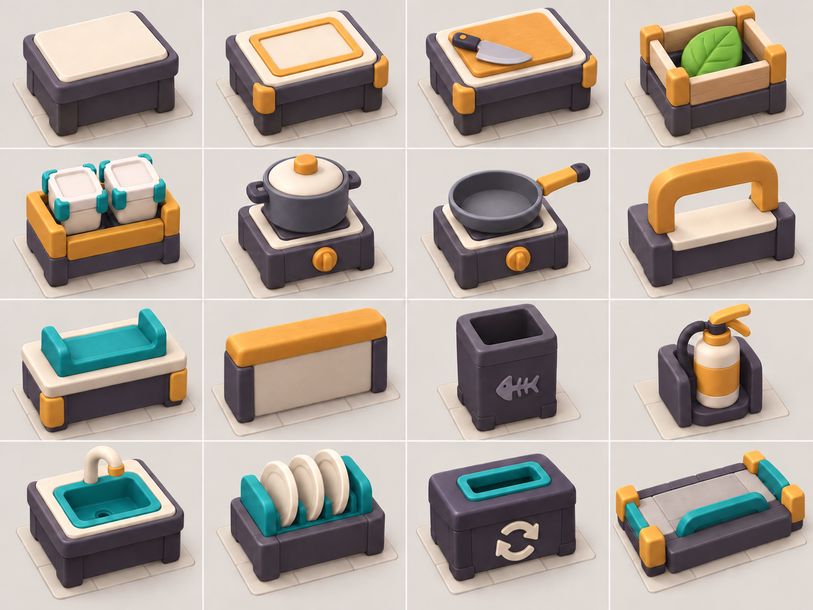
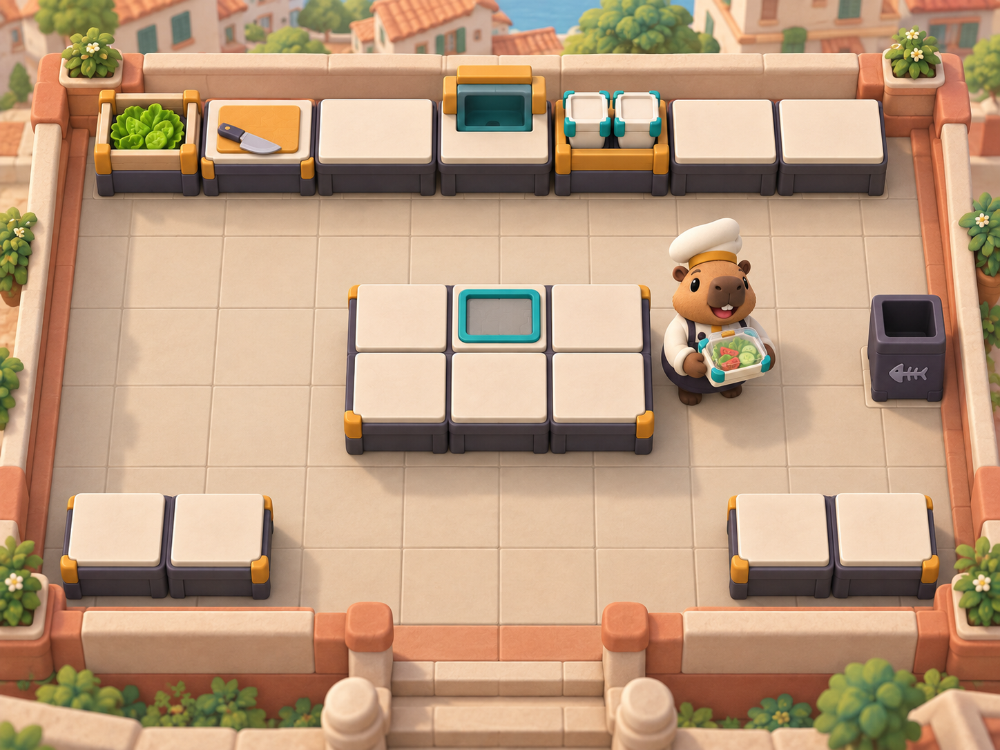
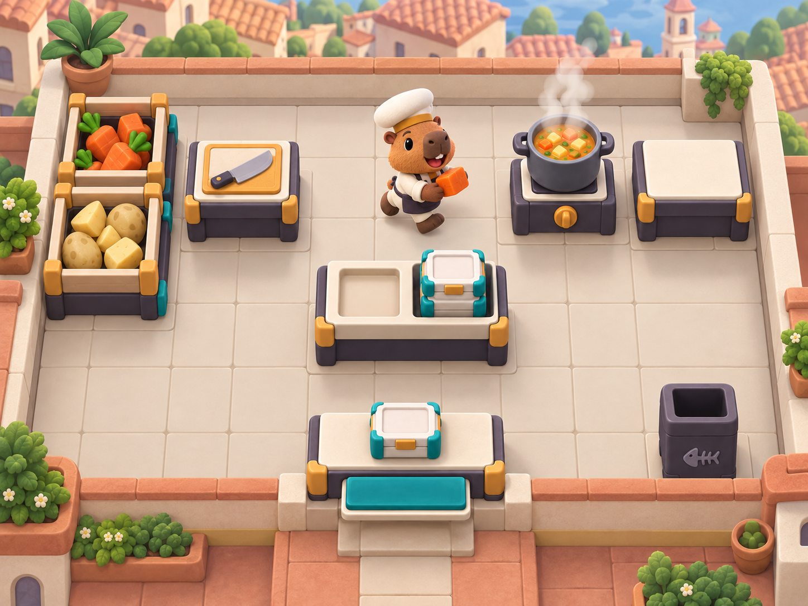
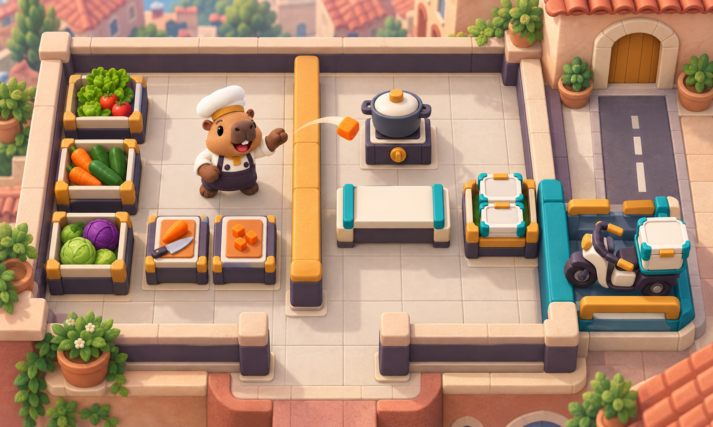

# COOKED OUT! ビジュアル開発 第8ラウンド

- 作成日: 2026-09-11
- 対象: 料理派生の視覚規則、基本設備16種、チュートリアル1-1〜1-3厨房美術基準
- 状態: `style_version 1` の全領域候補が完成。設備・厨房は承認候補
- 生成方法: Codex内蔵画像生成。設備シートのみ記号を一回修正

## 1. 同じ工程で中身が違う料理への対応

料理は次の三層で扱う。

```text
工程文法
  └─ 料理系統（大きな完成輪郭を変える）
       └─ 注文派生（土台を固定し、一つの主材料を大きく差し替える）
```

36料理シートは各系統の代表形であり、注文票108〜180件を兼ねない。同じ工程の別系統は、輪郭、主色、容器内の占有方向のうち二つ以上を変える。同一系統の派生は、容器、カメラ、土台、主要配置を固定し、追加または差替材料を一つの大きな形として見せる。

例:

| 系統 | 固定する土台 | 派生で変える大形状 |
|---|---|---|
| グリーンサラダ | 大きな葉物3塊 | トマトの赤い扇形／キュウリの緑円 |
| サンドイッチ | パン2枚と積層幅 | 野菜の緑帯／卵の黄白帯／肉の褐色帯 |
| 寄せ鍋 | 汁面と葉物配置 | 肉巻き／魚介塊／野菜塊 |

派生量産時は、系統代表の個別切り出しを編集アンカーにして、変更する材料スロットだけを一生成ずつ差し替える。注文票では蓋を完全に開き、ゲーム内完成品では同じ中身のまま蓋を閉じる。

## 2. 基本設備16種



| 行 | 左から右 |
|---|---|
| 1 | 通常カウンター、組立カウンター、まな板、共通食材供給箱 |
| 2 | 配達容器供給、鍋一式、フライパン一式、現地提供口 |
| 3 | 配達代行受取、低い投擲・受渡し壁、ゴミ箱、消火器台 |
| 4 | シンク、清潔皿置場、回収箱、バイク積込台 |

- 標準設備は1セル幅、バイク積込台は2×1の大形状として設計
- クリーム色を作業面、濃いプラムを構造体、青緑を機能接触面、黄土を操作・接続・安全縁に使用
- まな板、鍋、フライパン、洗浄、廃棄、回収を色だけでなく上面形状で区別
- 初回生成で回収箱の記号が文字Cに見えたため、二本の循環矢印へ限定修正した

## 3. 1-1 — はじめての一皿



- 町の低い屋上・中庭に置かれた訓練厨房を第1章の共通美術テーマとする
- 10×8論理データの上側設備列、中央3×2島、下側補助台、右側ゴミ箱を造形参考へ反映
- 中央島の周囲を一周できること、穴・加熱・皿洗いがないことを視覚化
- 完成料理を持つため、配達容器の透明蓋は閉じた状態

画像が10×8のセル数や設備座標を正確に再現しているとはみなさない。実装は`TutorialKitchenGrid.Create()`および正方形グリッド厨房仕様のデータを正とする。

## 4. 1-2 — はじめての鍋



- 食材箱、まな板、鍋、火から外す台、組立・容器、提供口の短い往復を見せる
- 鍋は大きな円筒、湯気、黄土色操作部で遠目から識別
- 穴、動的設備、フライパン、皿洗い、投擲壁、道路を入れない
- 1-2の確定グリッドデータは未作成のため、配置は美術参考のみ

## 5. 1-3 — 投げて届ける



- 黄土色上面の低い壁で食材側と鍋・組立側を分ける
- ソロが閉じ込められないよう、壁端を回れる空間を残す
- 野菜を低い壁越しに投げる瞬間、着地側の鍋・台、積込台、バイク、極短い一本道を一画面に収める
- バイク積載中の完成容器は透明蓋を閉じる
- 交通、分岐、歩行者、事故要素はまだ入れない
- 1-3の確定グリッドデータは未作成のため、配置は美術参考のみ

## 6. 同作品性の評価

| 評価軸 | 結果 | 判定 |
|---|---|---|
| 太く丸い形 | キャラクター、料理、設備、外周建築で共通 | 合格 |
| 材質 | マットな粘土・ゴム・粉体塗装調で統一 | 合格 |
| 機能色 | クリーム／プラム／青緑／黄土を役割別に維持 | 合格 |
| 照明 | 明るい中立光、短い影、強い被写界深度なし | 合格 |
| 小画面可読性 | 設備の上面形状と色面が高角度でも読める | 合格 |
| グリッド | 中程度の床目地と1セル設備幅で自然に読める | 合格 |
| 人間・文字・UI | なし | 合格 |
| 独自性 | 町の訓練中庭、ウェッジ帽、プラム構造体、黄土縁を共通化 | 合格候補 |
| 実装座標との分離 | 画像は非正本。1-1のみ既存10×8データを参照 | 合格 |

第8ラウンド時点で、キャラクター、料理、設備、厨房が同じ作品として成立する`style_version 1`候補一式が揃った。

## 7. 生成プロンプト — 基本設備

```text
Use case: stylized-concept
Asset type: style_version 1 approval-candidate equipment visual-language sheet for COOKED OUT! grid kitchens and 3D production planning
Input images: approved animal-character anchor for chunky rounded geometry, matte materials, cream, ochre and plum; approved-format food sheet for cream, teal, ochre functional language and common container; older kitchen concept only for high three-quarter camera, readable cell scale and modular construction. Do not copy its layout, scenery, human, flags or palette.
Primary request: exact 4-by-4 order: plain prep counter; assembly counter; chopping-board station; universal ingredient dispenser crate; common delivery-container dispenser; pot heating station; frying-pan heating station; local serving hatch; delivery-agency handoff counter; low throw-and-pass wall; trash bin; fire-extinguisher docking station; sink washing station; clean reusable-plate rack; lost-item recovery box; motorcycle loading bay.
Design system: ordinary stations use one square cell and a low waist-high profile; motorcycle bay may use 2×1. Thick rounded-square plinths, recessed tops, one clear purpose per silhouette. Warm-cream work surfaces, dark-plum structures, deep-teal functional contact areas, ochre controls, hinges, safety edges and connection cues.
Style/medium: polished original stylized 3D modular toy equipment; soft bevels; matte clay, powder-coated metal and felt-like rubber; minimal seams and controls.
Composition/framing: exact landscape 4-by-4 equal grid; identical upper three-quarter orthographic camera around 35 degrees; one isolated unit centered on a faint square floor cell; consistent scale, padding, background and light.
Constraints: exactly 16 types in stated order; distinct shape for cutting, heating, washing, serving, disposal, recovery and delivery; no humans, animals, meals, UI, text, letters, numbers, logos, trademarks, watermark or kitchen layout.
Avoid: existing-game equipment, stainless realism, fine control panels, color-only distinction, gloss, darkness, blue-coral dominance or restaurant branding.
```

### 回収箱記号の修正

```text
Use case: precise-object-edit
Change only the front relief on the lost-item recovery box in row 4 column 3. Replace the C-like relief with two thick curved arrows chasing each other in a circular loop, with unmistakable arrowheads. Preserve every other pixel-level design decision, object, cell, color, camera and material. No text, letters, numbers, logos or watermark.
```

## 8. 生成プロンプト — 厨房共通部

```text
Use case: stylized-concept
References: approved capybara cook and candidate-A uniform; approved universal container, with completed gameplay food always shown lid closed; approved 16-equipment sheet for rounded modular forms and role colors.
World: original compact neighborhood cook-training courtyard on a low rooftop or raised terrace; warm terracotta and pale stone architecture; distant simplified town roofs; low-information perimeter planters; no story characters. Clear square logical grid through medium floor seams and aligned footprints.
Style/medium: polished stylized 3D gameplay concept; chunky hand-sculpted modular toy forms; low texture density; soft bevels; matte clay, rubber and powder-coated metal.
Camera: fixed high three-quarter orthographic gameplay view; entire kitchen and boundary visible; one standard station reads as one square cell; player movement remains continuous.
Lighting: bright neutral late-morning diffuse light, short soft shadows; cooking surfaces focal and distant town lower saturation.
Palette: cream floors and tops; dark-plum structures; deep-teal functional surfaces; ochre controls, hinges and safety edges; quiet terracotta perimeter.
Constraints: no humans, diners, spectators, UI, text, letters, numbers, logos, flags, trademarks, watermark, coordinates, debug labels or measurements. Image is non-authoritative art, material, lighting and readability reference only.
Avoid: copying existing cooking-game layouts, equipment, characters, UI or palettes; stainless realism; glossy floors; tiny clutter; cinematic darkness; floating islands, castles, boats or checkerboard debug markings.
```

### 1-1固有部

```text
Depict the first solo non-heated green-salad training kitchen, visually informed by the deterministic 10×8 grid. Intact floor and no holes. Far top work line: leafy ingredient crate, chopping board, counter, serving hatch, container dispenser, three counters. Center: compact 3×2 island with one assembly recess and five counters, walkable on every side. Two helper counters lower left and two lower right; trash at right. No pot, pan, burner, sink, plates, fire equipment, low wall, road or motorcycle. One capybara stands right of the island holding completed salad in the universal container with transparent lid closed.
```

### 1-2固有部

```text
Depict a fixed vegetable-soup training kitchen. Group vegetable crates and chopping board on one side; nearby pot heating station with clear steam and ochre control plus a plain off-heat counter; central short island with assembly recess and container dispenser; serving hatch and trash clearly visible; short simple loop. No holes, moving parts, pan, sink, reusable plates, fire, throw wall, motorcycle or delivery counter. The capybara carries one large chopped vegetable toward the pot. A finished soup container may rest lid closed at service, with no inner bowl. Layout is illustrative, not implementation data.
```

### 1-3固有部

```text
Depict a fixed throwing-and-motorcycle training kitchen. Split work zones with one waist-high ochre-topped throw wall and leave one clear walk-around end. Ingredient crates and chopping stations on one side; pot, landing counter, assembly and container dispenser across the wall. Connect a teal loading edge to a 2×1 motorcycle bay, then an extremely short straight road to one delivery doorway. No intersection, traffic, pedestrians, hazards or branching. Include one original rounded plum-and-cream motorcycle with teal cargo cradle, ochre guards and one closed-lid container. The capybara tosses one large vegetable over the wall; no trajectory UI and no second character. Layout is illustrative, not implementation data.
```

## 9. 入力・修正・検証値

- 設備入力: `ART-CHAR-006`、`ART-FOOD-002`、`ART-ENV-003`
- 設備修正: 回収箱のC状レリーフだけを二本の循環矢印へ画像生成編集。手作業の画素修正なし
- 厨房入力: `ART-CHAR-006`、`ART-FOOD-002`、本ラウンド設備シート
- 生成後の手作業画素修正: なし
- 全画像: 1448×1086 RGB PNG
- SHA-256 設備: `3316aa7c14aa41b2dc3270ebcbcf71c5be0ed229b59cd5ca9a666e957acb4094`
- SHA-256 1-1: `392ced132255fe0da1bf1b65d27c7f24b851fe8ceb8f661005db3d2aa606e1cd`
- SHA-256 1-2: `f4d67917834b58c661b8a0d6979db51742d35b574360db634121ef3c7e6dc426`
- SHA-256 1-3: `eaad62f0d8dedb8879914bffe36ae61eaa0446108688475512b111528592ea79`
