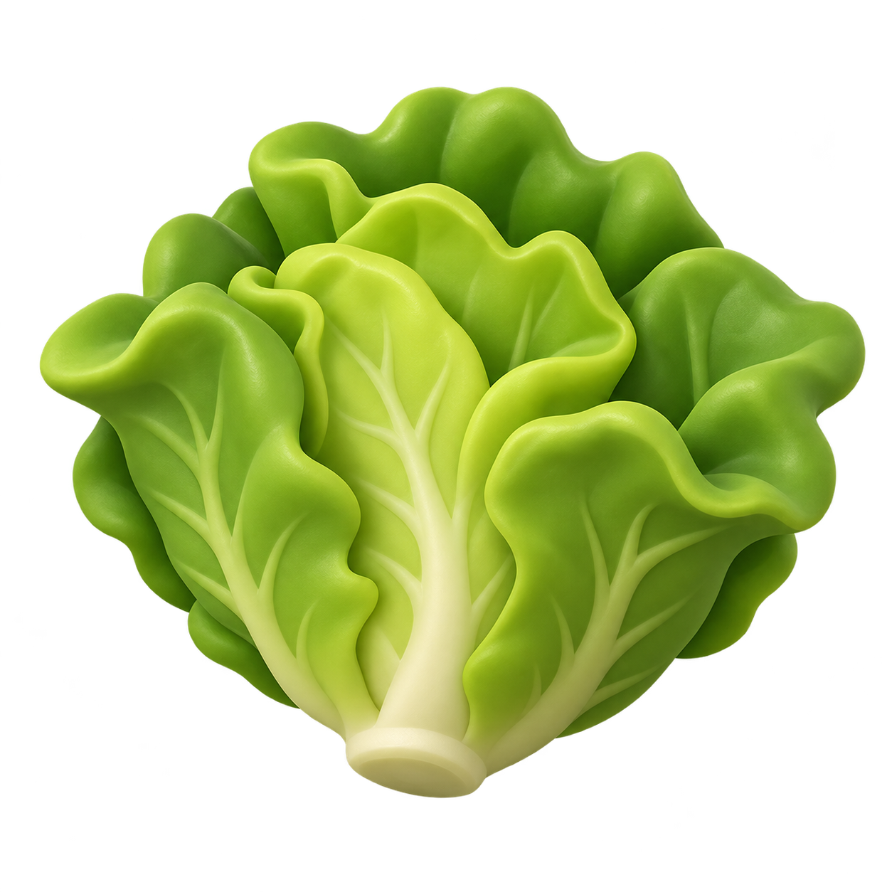

# COOKED OUT! ビジュアル開発 第9ラウンド

- 作成日: 2026-09-11
- 対象: 共通食材供給箱の上面写真カードとUnity接続
- 状態: `style_version 1` 実装候補。レタス一種で基準を検証済み
- 生成方法: Codex内蔵画像生成。手作業の画素修正なし

## 1. 採用仕様

- 食材供給箱の本体造形は共通化する
- 上面へ角丸の明るい写真台を置き、食材一個の写真を大きく表示する
- プレイヤーが空手で箱へ向き、ACTIONを押すと対応する未加工食材を一個持つ
- 手が埋まっている場合は食材を生成せず、既存の持ち物を維持する
- 供給成功時は上面写真カードを短くパルスさせ、入力への即時反応を返す
- 写真カードと生成食材は、グリッド配置の同じ`ContentId`から決定する

既存作品から採用するのは「写真で中身を識別し、一操作で一個取り出す」という一般的な操作文法だけとする。箱の形、プラム／クリーム配色、角丸写真台、画像、反応はCOOKED OUT! 用に制作する。

## 2. レタス写真カード



評価:

| 項目 | 結果 |
|---|---|
| 小画面の輪郭 | 葉の大きな外周と淡色の芯で判別可能 |
| 既存料理との同作品性 | 玩具的な3D、大きな色面、暖色光が一致 |
| 背景 | 透過。Unity側のクリーム色写真台へ重ねる |
| 文字依存 | なし |
| 人間・ロゴ・既存UI | なし |

## 3. Unity接続

- `GridPlacement.ContentId`へ供給食材IDを保持
- 食材供給箱で`ContentId`が空の場合はグリッド検証エラー
- `KitchenSession.TakeRawIngredient(string)`で指定IDの未加工食材を生成
- `InteractableStation`は同じIDを写真表示と供給処理へ使用
- レタス画像は`Resources/IngredientSourceCards`からロード
- 今後の食材追加は、グリッドの`ContentId`と画像リソース対応を追加し、箱ロジックを複製しない

## 4. 生成プロンプト

```text
Use case: stylized-concept
Asset type: Unity game texture for the ingredient photograph card mounted on top of an ingredient supply crate
Primary request: create one isolated raw green leaf-lettuce ingredient image, immediately readable from a fixed high-angle kitchen camera
Input images: approved COOKED OUT! equipment style reference and approved food style reference
Subject: a single compact head of fresh green leaf lettuce, formed from 5 to 7 large rounded overlapping leaves with one pale central stem; chunky and toy-like, not finely detailed
Style/medium: polished stylized 3D product render, soft molded-plastic/clay feel, large simple color planes, matching the references
Composition/framing: centered square icon, near-top-down three-quarter view, full ingredient visible, generous transparent padding, strong clean silhouette
Lighting/mood: soft warm studio light from upper left with restrained highlights
Color palette: fresh leaf green and yellow-green, subtle darker green leaf separations
Materials/textures: smooth matte toy-food surface, very shallow leaf veins only
Constraints: genuinely transparent background and alpha; exactly one lettuce; no container, box, plate, border, card, label, typography, human, animal, chef, logo, trademark, watermark, UI, cast shadow outside the ingredient
Avoid: photorealism, tiny details, scattered leaf fragments, gradients that muddy the silhouette, resemblance to any specific existing game asset
```

## 5. 入力・修正・検証値

- 入力: `ART-EQUIP-001`、`ART-FOOD-002`
- 出力: `Assets/_CookedOut/Art/Resources/IngredientSourceCards/ingredient_lettuce_source_card_sv1.png`
- 生成後の手作業画素修正: なし
- 画像: 1254×1254 RGBA PNG
- SHA-256: `19eb32c382ed039efda68f58a0790b3c8c8ba5e96e62a0000d20a4b2f170411b`
- Unity EditMode: 25/25成功
- Unity PlayMode: 11/11成功
