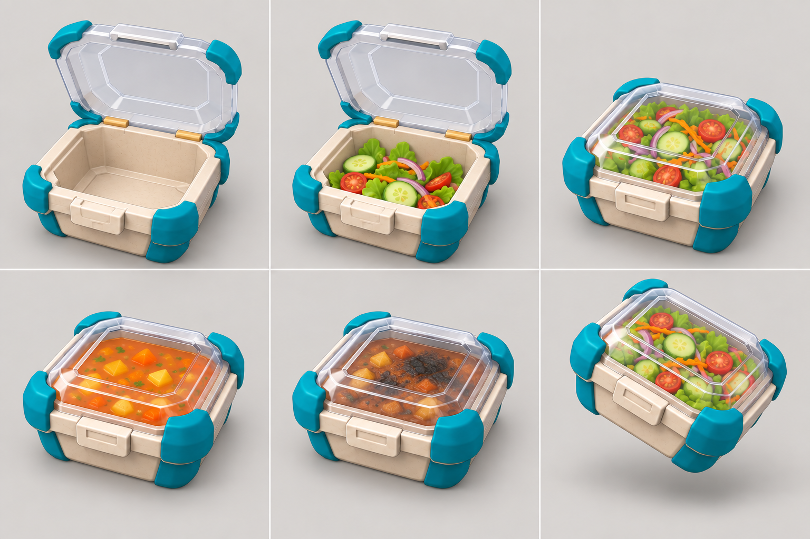

# COOKED OUT! ビジュアル開発 第11ラウンド

- 更新日: 2026-09-11
- 対象: 共通配達容器6状態とUnity縦切り実装
- 状態: `style_version 1` 3D制作資料の承認候補、Unity簡易3D実装済み
- 生成方式: Codex組み込み画像生成。既存容器、設備、Chapter 1キーアートを参照

## 1. 成果物



- 1536×1024 PNG
- 同一の深型角形容器、クリーム本体、青緑の四隅ガード、黄土色ヒンジ、前面ラッチを全状態で固定
- 上段: 空・全開、組立中・全開、完成サラダ・閉蓋
- 下段: 完成スープ・閉蓋、焦げ・閉蓋、投擲中・閉蓋
- 汁物も内ボウルを追加せず、共通容器自体へ入れる

## 2. 評価

| 評価軸 | 結果 | 判定 |
|---|---|---|
| 同一外形 | 6セルで本体、角当て、ヒンジ、ラッチの構成が一致 | 合格 |
| 開閉差 | 開蓋は後方へ完全に逃げ、閉蓋は本体へ密着 | 合格 |
| 食品可読性 | サラダ、スープ、焦げを大きな色面で識別可能 | 合格 |
| 共通容器 | 汁物専用の別容器や内ボウルを作っていない | 合格 |
| 実装変換 | 同一Unity階層の`Lid Pivot`回転だけで開閉可能 | 合格 |
| 既存作品との差別化 | 固有UI、配置、容器形状の複製なし | 合格 |

画像内のパースや寸法は3D実装の正本ではない。Unity実装ではセル寸法、手持ちソケット、衝突規則を正とし、画像からは形状言語と状態差だけを採用する。

## 3. Unity実装への対応

`WorldItemVisualFactory`から共通の`DeliveryContainerVisual`を生成する。

| ドメイン状態 | 蓋 | 中身 |
|---|---|---|
| `Components.Count == 0` | 108度全開 | 空 |
| `Components.Count > 0 && !IsComplete` | 108度全開 | 食材部品を表示 |
| `IsComplete` | 閉じる | 完成レシピの大形状を表示 |

本体、四隅ガード、ヒンジ、ラッチ、透明蓋は同じ階層を共有する。蓋は後方ヒンジ位置の`Lid Pivot`を回転し、完成サラダ、完成スープ、投擲中で別Prefabを作らない。透明蓋はUnity URPの透過Materialを使う。

## 4. 生成プロンプト

```text
Use case: stylized-concept
Asset type: 3D modeling reference sheet for a Unity gameplay prefab
Primary request: Create one precise six-state design sheet for the approved COOKED OUT! universal delivery container, preserving its original identity from the reference image.
Input images: Image 1 is the container identity and shape reference; Image 2 is the shared equipment material and palette reference; Image 3 is the gameplay-scale and style reference.
Scene/backdrop: neutral warm light-gray studio background.
Subject: the exact same deep rectangular cream-colored container in all six cells, with four chunky teal corner guards, one small ochre hinge assembly at the rear, one cream front latch, and one clear rigid transparent lid. No inner bowl.
Style/medium: polished toy-like 3D product design sheet, matte molded body, softly beveled edges, clean production-ready shapes, low detail density.
Composition/framing: 3 columns by 2 rows, equal cells, identical camera at an elevated front three-quarter angle, identical scale and lighting. Top row: empty/incomplete with lid fully open behind the container; salad in progress with lid fully open; completed salad with lid closed and food visible. Bottom row: completed soup with lid closed and liquid visible without an inner bowl; scorched failed meal with lid closed and a small darkened food area but no flames; airborne thrown completed salad with lid closed, same container tilted slightly while preserving shape. Keep every container fully inside its cell.
Lighting/mood: soft neutral studio light and subtle contact shadows.
Color palette: warm cream body, dark charcoal lower seam, teal corner guards, small ochre hinges, color-block food.
Materials/textures: matte injection-molded body and guards, transparent lid with restrained reflections and clearly visible edges.
Constraints: open lid must rotate from the rear hinge to at least 105 degrees and never cover the food; every closed lid must sit flush and visibly latched; all six states use the same dimensions and parts; food uses large simple shapes; no humans or characters.
Avoid: text, labels, letters, numbers, UI, arrows, logos, watermarks, exploded view, technical dimension marks, cultural motifs, photorealism, tiny garnish detail, separate soup bowl, changed container silhouette, copied game props.
```

## 5. 検証

- 現行統合確認 EditMode: 31/31成功
- 現行統合確認 PlayMode: 23/23成功
- 追加テスト: 空容器の全開蓋、共通本体と四隅ガード、完成容器の閉蓋、完成料理表示
- SHA-256: `eb9fb7d6559f1c1d7b1376bc3696e703db1e6ced6110bada30e9b0cdbceccd65`

## 6. 次工程

次は1-1用のレタス未加工・切り済み・完成サラダの3状態資料を作り、現在の球・円柱グレーボックスを大きな葉形状へ置き換える。その後、カピバラ三面図と共通料理人体へ進む。
