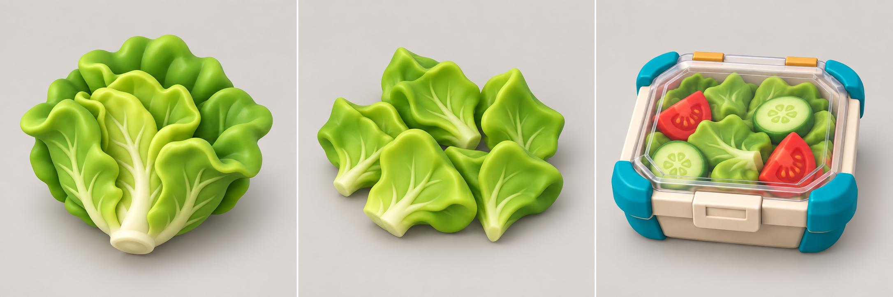

# COOKED OUT! ビジュアル開発 第12ラウンド

- 更新日: 2026-09-11
- 対象: チュートリアル1-1のレタス3状態
- 状態: `style_version 1` 3D制作資料の承認候補、Unity簡易3D実装済み
- 生成方式: Codex組み込み画像生成。レタス写真カード、料理シート、共通容器6状態を参照

## 1. 成果物



- 2172×724 PNG
- 左: 未加工のレタス一玉。6〜8枚の大きな葉と短い芯
- 中: 切り済み。細切りではなく5つの大きな葉片
- 右: 共通容器内の完成サラダ。主役の葉片に大きなトマト2個、キュウリ2個を加え、透明蓋を閉じる

## 2. 評価

| 評価軸 | 結果 | 判定 |
|---|---|---|
| 同一食材性 | 三状態で黄緑の葉色、厚さ、丸い葉縁を維持 | 合格 |
| 状態差 | 一玉、5葉片、容器詰めをシルエットで判別可能 | 合格 |
| 遠景可読性 | 細切りや小さな装飾を避け、大きな葉片を使用 | 合格 |
| 容器規則 | 完成品だけ閉蓋し、承認済み容器外形を維持 | 合格 |
| Unity変換 | 球一個ではなく、複数の大形状Primitiveへ直接対応可能 | 合格 |

生成画像は葉の輪郭・枚数・色面を定める造形資料であり、ポリゴン数、UV、寸法の正本ではない。

## 3. Unity実装への対応

| 状態 | Unity簡易3D |
|---|---|
| 未加工 | 7個の扁平な葉形状と1個の淡色コア |
| 切り済み | 5個の扁平な葉片を重ねた低い山 |
| 完成サラダ | 容器内に5葉片、トマト2、キュウリ2。透明蓋は閉じる |

食材状態は既存の`IngredientPreparation`、完成状態は`DeliveryContainer.IsComplete`を正とする。見た目側は状態を独自保持しない。

## 4. 生成プロンプト

```text
Use case: stylized-concept
Asset type: 3D modeling reference sheet for Unity gameplay food assets
Primary request: Create one precise three-state modeling sheet for the COOKED OUT! lettuce progression used in tutorial 1-1.
Input images: Image 1 is the approved whole-lettuce identity reference; Image 2 is the approved recipe-family food simplification reference; Image 3 is the approved universal container identity reference.
Scene/backdrop: neutral warm light-gray studio background.
Subject: the same bright green butter-lettuce identity shown in three production states. Left: one whole raw lettuce head, compact and round, made from six to eight large overlapping leaf lobes with a pale short core. Center: chopped lettuce as five large readable curled leaf chunks, not tiny shreds, spread in a compact pile. Right: completed green salad inside the exact approved cream rectangular container with four teal corner guards, ochre rear hinges and a clear lid CLOSED; the food should remain visible through the lid and consist mainly of the same five large lettuce chunks with only two large red tomato wedges and two pale-green cucumber rounds as secondary color blocks.
Style/medium: polished toy-like 3D modeling reference, soft bevels, matte molded surfaces, low detail density, mobile-game readability.
Composition/framing: one horizontal row of three equal cells, identical elevated front three-quarter camera, identical object scale relationship and lighting, every object fully inside its cell. No captions.
Lighting/mood: soft neutral studio light with subtle contact shadows.
Color palette: lime and leaf green, pale cream core, restrained red tomato and pale cucumber; container remains cream, teal and ochre.
Materials/textures: smooth hand-shaped toy clay with very subtle leaf veins only; transparent lid with restrained reflections.
Constraints: large shapes only; whole and chopped states must clearly share the same leaf color and thickness; the chopped form must read from a distant fixed kitchen camera; completed container lid is closed and flush; no separate bowl; no humans or characters.
Avoid: text, labels, letters, numbers, UI, arrows, logos, watermarks, tiny shredded lettuce, photorealism, excessive veins, garnish confetti, changed container shape, open lid on the completed meal, copied game food assets.
```

## 5. 検証

- EditMode: 31/31成功
- PlayMode: 23/23成功
- 追加テスト: 未加工7葉、切り済み5葉、完成サラダ5葉の階層と状態対応
- SHA-256: `7021ffd671face3b8da2476c38f9143366127b0b12c13177e384fbcf13e4926c`

## 6. 次工程

次はカピバラの正面・側面・背面と表情差を生成し、共通料理人体と種固有頭部を分離したUnity階層へ置き換える。
