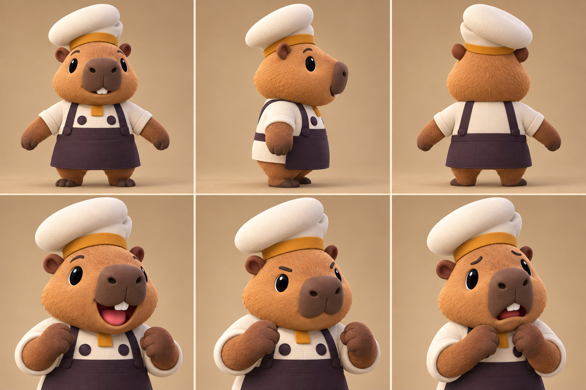

# COOKED OUT! ビジュアル開発 第13ラウンド

- 更新日: 2026-09-11
- 対象: 初期キャラクター「カピバラ」の三面図・表情・Unity階層
- 状態: `style_version 1` 3D制作資料の承認候補、Unity簡易3D実装済み
- 生成方式: Codex組み込み画像生成。承認方向の初期12体・候補A v2を参照

## 1. 成果物



- 1536×1024 PNG
- 上段: 正面、左側面、背面の全身造形資料
- 下段: 喜び、集中、困りの胸上表情資料
- 共通制服と種固有形状を同一シート内で分けて確認できる

## 2. 比較・評価

| 評価軸 | 候補A v2との比較 | 判定 |
|---|---|---|
| 顔の主役性 | 約2頭身を維持し、大きい顔と前へ張り出す口吻を最優先 | 合格 |
| 種固有性 | 小さな丸耳、太い前腕、ほぼ目立たない尻尾、直方体寄りの口吻を維持 | 合格 |
| 共通衣装 | 低い非対称ウェッジ帽、黄土帯、クリーム上衣、濃プラムの留め具とエプロンを維持 | 合格 |
| 三面整合 | 帽子の傾き、エプロン背面、頭部奥行きを正面・側面・背面で確認可能 | 合格 |
| 表情差 | 口、眉、腕の寄せ方で喜び・集中・困りを識別可能 | 合格 |
| 禁止事項 | 人間、白手袋、種別の職業服、既存作品の固有UI・配置を含まない | 合格 |

候補A v2と同じ作品に見える。画像は形状・材質・表情の基準であり、骨格寸法、当たり判定、UV、ポリゴン数の正本ではない。

## 3. Unity実装への対応

`Player Visual Root`の下を次の責務へ分離した。

| Unity階層 | 責務 |
|---|---|
| `Character Motion Root` | 見た目だけの上下動・傾き。論理座標と当たり判定から分離 |
| `Common Cook Body` | クリーム上衣、濃プラムのエプロンと留め具、黄土ネックタブ |
| `Capybara Limbs` | 毛色を持つ種固有の前腕と脚 |
| `Capybara Head` | 大形状の顔、直方体寄りの口吻、小耳、目、鼻、前歯 |
| `Common Wedge Chef Cap` | 全キャラクター共通の低い非対称帽と黄土帯 |
| `Held Item Anchor` | ゲームロジックが参照する共通手持ち位置 |

`AnimalChefMotion`が入力とプレイヤー状態から待機、歩行、運搬、作業、乗車のポーズを選ぶ。歩行では左右の腕脚を交互に動かし、作業では両腕、頭、集中眉、帽子を連動させる。運搬では両腕を容器へ寄せる。

当たり判定、移動、グリッド座標、手持ち処理は変更していない。`Held Item Anchor`は`Character Motion Root`の外に固定し、見た目の上下動が料理の操作位置へ伝播しない。今後の動物差し替えでは種固有メッシュとピボットだけを変更し、能力と作業位置は共通に保つ。

本番Prefabは`Resources/Characters/CapybaraChef`から読み込み、全バインド、Skinned Mesh、LODを検査する。欠落・不正時はgrayboxへ安全に戻す。寸法、骨、LOD、テクスチャ、納品パスは[キャラクター3D本番制作仕様](CHARACTER_3D_PRODUCTION_SPEC.md)を参照する。

## 4. 生成プロンプト

```text
Create one polished 3D character modeling and expression reference sheet for the COOKED OUT! game, style_version 1, using the FIRST portrait (capybara chef) in the supplied approved 4x3 roster sheet as the identity and style reference.

ASSET TYPE: stylized 3D character turnaround/model-sheet concept, landscape 3:2 sheet.
LAYOUT: exactly six clean equal cells in a 3 columns x 2 rows grid, thin warm-cream gutters, no written labels, no numbers, no logos, no UI.
TOP ROW: full-body capybara chef, orthographic-like FRONT view; exact LEFT SIDE profile; exact BACK view. Neutral A-pose with short forearms slightly away from torso and tiny feet visible. Same scale and baseline in all three cells.
BOTTOM ROW: chest-up 3/4 views of the exact same character: cheerful open-mouth smile; focused determined working face; gently worried/overwhelmed face. Keep identity, proportions, materials, camera, and lighting absolutely consistent across all cells.

CHARACTER IDENTITY:
- non-human capybara only, approximately two heads tall, very large face as the visual priority
- warm caramel-brown short plush fur, small round species-correct ears, tiny dark eyes with broad friendly brows
- tall blocky rectangular capybara muzzle projecting forward, darker taupe-brown muzzle pad, rounded dark nose, two small white front incisors only when mouth opens
- short thick capybara forearms and tiny legs, no human hands, no gloves, no human skin, no human character
- species-specific compact tail should be essentially absent/not prominent

APPROVED COMMON COOK UNIFORM — preserve exactly:
- distinctive low asymmetrical soft wedge chef cap, NOT a tall toque and NOT a classic mushroom/puffy chef hat
- one broad rounded ivory crown leaning to the character's left, one shallow rear fold, narrow ochre-gold cap band worn high
- warm-cream wrap-front short cook jacket
- two oversized round dark-plum fastening discs on the chest
- short squared ochre neck tab
- dark-plum apron bib and simple lower apron
- exposed capybara-fur forearms, no gloves

VISUAL STYLE:
- original toy-like premium 3D animation-game character, large readable shapes, restrained detail, softly beveled forms
- subtle plush fur only on animal surfaces; smooth woven-cloth cap/uniform; matte materials; no photorealism
- warm neutral tan studio background, soft upper-left key light, mild contact shadow
- front/side/back proportions must be usable by a 3D modeler; avoid perspective distortion and dramatic posing
- coherent with a cheerful cooperative kitchen game, but do not reproduce any existing game's character, costume, UI, layout, or color arrangement.

STRICT NEGATIVES: no humans, no extra characters, no props, no cooking tools, no food, no text, no labels, no UI, no watermark, no tall chef toque, no mushroom chef hat, no red neckerchief, no blue-and-white costume, no gloves, no five-finger human hands, no duplicated limbs, no inconsistent costume between cells, no cropped feet in top row.
```

## 5. 検証

- 画像SHA-256: `9d3961de154e0e317db9aef35367dcfd7a02e82bd655c6574a858519ed27653e`
- 生成画像の設備・人物座標をゲーム実装仕様として使用していない
- EditMode: 31/31成功
- PlayMode: 24/24成功
- 追加確認: カピバラ種ID、共通制服、種固有頭部・四肢、共通帽、手持ちソケットの階層と参照関係
- 追加確認: 入力に応じた待機・歩行・作業・運搬ポーズの遷移と、アニメーション中の固定手持ち座標

## 6. 次工程

次は1-2で使うニンジンとタマネギの食材状態資料を生成し、写真カードの色だけでなく供給物の形でも識別できるUnity簡易3Dへ置き換える。
