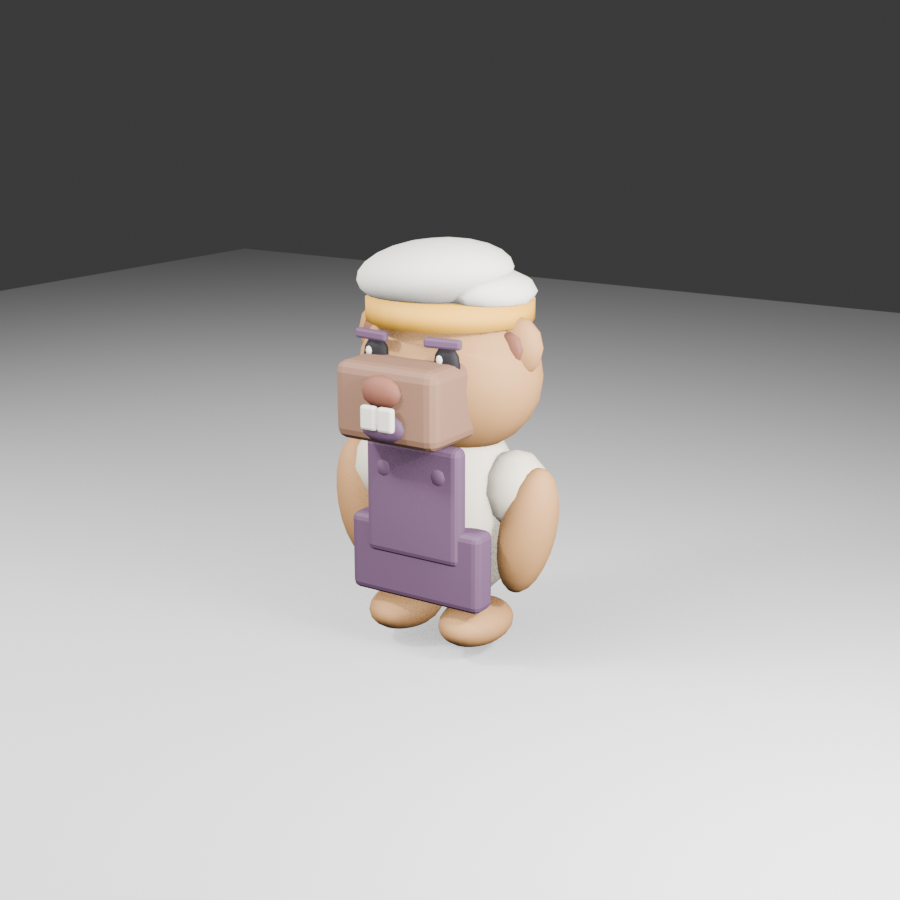

# COOKED OUT! ビジュアル開発 第14ラウンド

- 更新日: 2026-09-11
- 対象: カピバラ料理人のBlender本番3D候補とUnity Prefab
- 状態: `style_version 1` 本番候補v1。Unity統合後、[第15ラウンド](VISUAL_DEVELOPMENT_ROUND_15.md)のポップ改修v2に更新済み
- 制作方式: Blender 5.2.1 LTSをCodexの手続き型生成スクリプトから実行
- 入力資料: [第13ラウンド](VISUAL_DEVELOPMENT_ROUND_13.md)の三面図・表情

## 1. 成果物



| 種別 | パス |
|---|---|
| Blender編集正本 | `art-source/characters/capybara/CapybaraChef.blend` |
| 再生成スクリプト | `tools/blender/generate_capybara.py` |
| Unity取込FBX | `Assets/_CookedOut/Art/Characters/Capybara/CapybaraChef_Model.fbx` |
| Unity本番Prefab | `Assets/_CookedOut/Art/Resources/Characters/CapybaraChef.prefab` |
| URP材質 | `Assets/_CookedOut/Art/Characters/Capybara/Materials/` |

## 2. 比較・評価

| 評価軸 | 第13ラウンドとの比較 | 判定 |
|---|---|---|
| 顔の主役性 | 胴体より大きい頭部と前へ張り出す口吻を維持 | 合格 |
| 種固有性 | 小耳、太い前腕、目立たない尻尾、二本の前歯を維持 | 合格 |
| 共通衣装 | クリーム上衣、黄土帯・ネックタブ、濃プラムのエプロンと留め具を維持 | 合格 |
| 帽子 | 低い二段形状と左寄りのクラウンを維持。最終造形で膨らみを少し抑える余地あり | 条件付き合格 |
| 遠景可読性 | 口吻、帽子、エプロンが大きな形と色面で識別可能 | 合格 |
| 表面品質 | URP Litの色・粗さは設定済み。毛・布の微細表現とUVテクスチャは未承認 | 継続 |
| 独自性 | 人間、白手袋、既存作品固有の衣装・UI・配色を使用しない | 合格 |

同じ作品として成立する本番候補である。形状とリグはゲームへ接続できるが、出荷承認前に固定厨房カメラとiPhone実機で帽子の輪郭、材質、LOD切替を目視確認する。

## 3. 3D仕様

| 項目 | 結果 |
|---|---:|
| LOD0 | 6,404 triangles |
| LOD1 | 4,244 triangles |
| LOD2 | 2,836 triangles |
| 変形骨 | 10 |
| Skinned Mesh | 3、各LOD 1個 |
| URP Lit材質 | 8 |
| 全高 | 約1.85 Unity units |

LOD0 20,000以下、LOD1 10,000以下、LOD2 3,000以下の制作予算をすべて満たす。骨は共通のroot、body、head、cap、左右腕、左右脚、左右眉で構成する。

## 4. Unity統合

- FBX取込設定を自動化し、アニメーションなし、Generic rig、Medium mesh compressionとする
- Unity用URP Lit材質を生成し、FBXの材質名から再割当する
- LOD0 `0.55`、LOD1 `0.25`、LOD2 `0.08`のLODGroupをPrefabへ設定する
- `AnimalChefVisual`へ本番フラグと全リグ参照を保存する
- `Held Item Anchor`をMotion Root外の`(0, 1.28, 0.48)`へ固定する
- 起動時は本番Prefabを優先し、欠落・不正時だけgrayboxへ戻す

## 5. 再生成設定

自然言語プロンプトから直接3D化せず、第13ラウンドを目視基準として、次の再現可能なコマンドとPythonスクリプトで大形状を構築した。

```bash
/Applications/Blender.app/Contents/MacOS/Blender \
  --background \
  --python tools/blender/generate_capybara.py \
  -- \
  --blend art-source/characters/capybara/CapybaraChef.blend \
  --fbx Assets/_CookedOut/Art/Characters/Capybara/CapybaraChef_Model.fbx \
  --preview /tmp/cookedout-blender-preview/capybara_front_3q.png
```

Unity Prefab再構築:

```text
COOKED OUT! > Build Capybara Production Prefab
```

## 6. 検証

- Unity本番Prefab validator: 合格
- カピバラ本番Prefabのロード、Skinned Mesh 3個、LODGroup、リグバインド、固定手持ち座標のPlayModeテスト: 成功
- 最新全体テスト: EditMode 33/33成功、PlayMode 24/25成功
- PlayMode残り1件は1-3バイク追従カメラの遷移距離テストであり、キャラクター本番Prefabのテストは成功
- PNG SHA-256: `d90c64aebeb9c242d04f35c83ab3f13fcd038f0c5977a3facf88433d6232f9b7`
- FBX SHA-256: `3323f73a01cd430e176f19d2b8bf0b9fea00b507d2ce99542139c8c14fad8546`
- Blend SHA-256: `02b4938c6feb1746d7fe0a9da6a3d49939b0f2486f5d173c5ddfcfa8b44e3e1a`
- Prefab SHA-256: `84c63635d6f45440a208e20c35410c2f3d2283af966e4ca4afcd8d900d9ff803`

## 7. 次の承認ゲート

1. Unity Game Viewで正面・背面・手持ち・作業中の輪郭を確認
2. iPhone実機で4体表示、30 fps、LOD切替、材質を確認
3. 帽子の膨らみと毛・布表現を出荷品質へ調整
4. カピバラを基準に残り11動物へ共通骨格を展開
