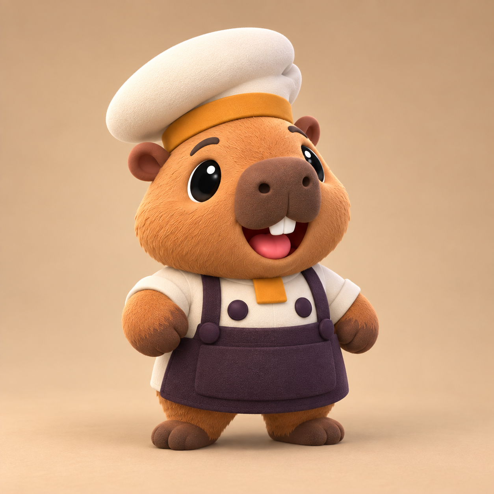
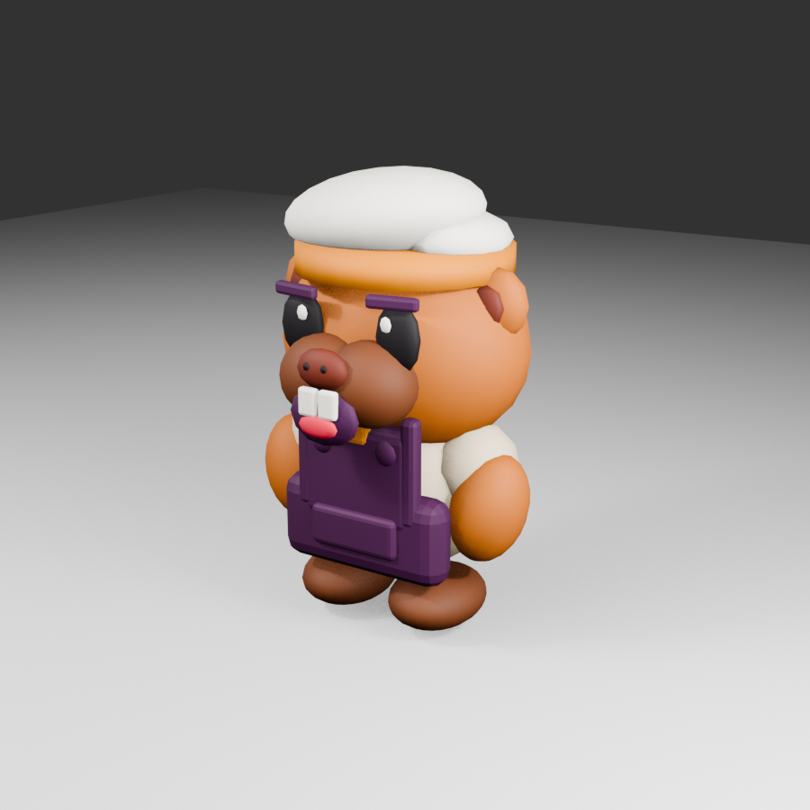

# COOKED OUT! ビジュアル開発 第15ラウンド

- 更新日: 2026-09-11
- 対象: カピバラ料理人の「かわいい・ポップ」方向への改修
- 状態: `style_version 1` ポップ改修v2。[第16ラウンド](VISUAL_DEVELOPMENT_ROUND_16.md)の閉じ口v3へ更新済み
- 制作方式: Codex内蔵画像生成による改修基準作成、Blender 5.2.1 LTSによる手続き型3D再生成
- 入力: 第7ラウンド候補A v2、第13ラウンド三面図・表情、第14ラウンドBlender v1

## 1. 成果物

### 改修基準



### Blender／Unity反映結果



| 種別 | パス |
|---|---|
| 改修基準画像 | `docs/art/concepts/capybara_chef_sv1_pop_revision_target_v2.png` |
| Blenderレンダー | `docs/art/concepts/capybara_chef_sv1_blender_model_preview_v2.png` |
| Blender編集正本 | `art-source/characters/capybara/CapybaraChef.blend` |
| 再生成スクリプト | `tools/blender/generate_capybara.py` |
| Unity取込FBX | `Assets/_CookedOut/Art/Characters/Capybara/CapybaraChef_Model.fbx` |
| Unity本番Prefab | `Assets/_CookedOut/Art/Resources/Characters/CapybaraChef.prefab` |

## 2. v1との比較・評価

| 評価軸 | v1 | v2 | 判定 |
|---|---|---|---|
| 顔の主役性 | 胴が縦長で目が細い | 頭を拡大し、胴を低く、黒目を約45%拡大 | 改善 |
| 表情 | 前歯は読めるが口が小さい | 縦長の笑顔、舌、鼻孔、強いキャッチライト | 改善 |
| 手足 | 腕が長く細い | 短く太い腕、大きい丸足 | 改善 |
| 衣装 | 前掛けが板状 | 面取り増加、肩ひもとポケット追加 | 改善 |
| 色面 | 毛・黄土・濃紫が淡い | キャラメル橙、黄土、濃紫の彩度と明度差を強化 | 改善 |
| 帽子 | 高さと左右差が弱い | 低く幅広い非対称ウェッジを維持 | 合格 |
| 独自性 | 固有作品の複製なし | 候補Aの固有制服を維持し、既存作品固有表現を追加しない | 合格 |

既存作品の固有キャラクター、衣装、UI、配置、配色は複製していない。「大きい顔」「短い手足」「丸い面取り」「大きな色面」「強い表情」という一般的な可愛さと遠景可読性だけを強めた。

## 3. 画像生成プロンプト

使用方式: Codex内蔵 `imagegen`。第14ラウンドの現行3D、第13ラウンド三面図、第7ラウンド候補A v2を画像入力した。

```text
Create one polished 3D character revision target for the original game COOKED OUT!, using the first image as the current model to improve and the second/third images only as internal approved identity references.

Asset type: stylized 3D modeling target / character look-development render.
Subject: one non-human capybara chef, full body, three-quarter front view, centered, clean warm beige studio background, soft grounded shadow. No text, no UI, no props, no extra characters.

Keep the approved original identity: species-specific capybara face with small round ears, broad blocky muzzle, centered brown nose, two visible incisors; cream wrap chef jacket, two oversized deep-plum buttons, deep-plum soft cloth apron, small squared ochre neck tab; low asymmetrical wedge-shaped cream chef cap with an ochre band. No gloves and no human hands.

Make it substantially cuter and more pop while remaining an original design:
- roughly 1.8 heads tall; the head is 55–60% of total visual height
- squat pear-shaped torso, very short thick arms and legs, slightly oversized rounded feet
- much larger glossy oval black eyes with bright catchlights, expressive curved brows, plump cheeks
- broader, rounder, heavily beveled two-lobed rectangular muzzle with less forward projection
- joyful open smile with a small pink tongue and two incisors, instantly readable at thumbnail size
- richer caramel-orange fur; warm cream; saturated ochre accent; very deep eggplant-plum clothing; strong clean color separation
- matte toy-like 3D surfaces with subtle plush softness, rounded bevels, broad shapes, no fine hair strands
- apron must look like a thick soft fabric volume, not a rigid rectangular plate
- cap sits low, wide, and playfully off-center; it must not become a tall traditional toque or a mushroom shape
- silhouette must remain clear from a fixed elevated game camera.

Do not imitate or reproduce any existing game's named character, exact costume, UI, layout, trademarked palette, or signature composition. No humans. No logos. The result should feel like a distinct original family-friendly cooperative cooking game character.
```

## 4. Blender／Unity反映内容

- 頭部幅と高さを拡大し、胴体を低くした
- 目、キャッチライト、口、舌、鼻孔を独立した大形状で構成した
- 口吻を単一の角箱から左右二つの丸いローブへ変更した
- 腕を短く太くし、足を大きくして約2頭身の安定した輪郭へ寄せた
- エプロンの面取りを増やし、肩ひもと前ポケットを追加した
- 毛、口吻、クリーム、黄土、濃紫、舌の色を再調整した
- Unity側に9種のURP Lit材質を決定的に再生成した
- LOD2では鼻孔、舌、キャッチライト、エプロン小部品を省略して遠景予算を守った

## 5. 3D仕様と検証

| 項目 | 結果 |
|---|---:|
| LOD0 | 7,972 triangles |
| LOD1 | 5,124 triangles |
| LOD2 | 2,808 triangles |
| 変形骨 | 10 |
| Skinned Mesh | 3、各LOD 1個 |
| URP Lit材質 | 9 |
| Unity EditMode | 35/35成功 |
| Unity PlayMode | 25/25成功 |

LOD0 20,000以下、LOD1 10,000以下、LOD2 3,000以下の予算をすべて満たす。テストはメインEditorとの競合を避けた隔離プロジェクトでUnity 6000.3.24f1を使って実行した。

## 6. ハッシュ

- 改修基準PNG: `a6747fde0f4f3ba90cf3f7afffe1dee0c5db4ed24f1b66ed6abdd66054e6dcac`
- BlenderレンダーPNG: `54309e3b6ced71bd9c79d051ab1d5bc79b36fd5fe49d985934bacd3417f13199`
- Blend: `719162d56b3230127f454dd695533c9b4cff3a40263d36ff4a635ce767157f23`
- FBX: `486548e358d7f51d9311694d52982bda6a936dbb0e10ebcf73ed2d60f1a49c91`
- Prefab: `b19039f3680c3cec7eaed36baeb16dc8b0a1a780d85f325682771de7df9204f6`

## 7. 次の承認ゲート

1. Unity Game Viewの固定俯瞰で顔、帽子、前掛けの最小表示を確認する
2. iPhone実機で4体表示、LOD切替、30 fpsを確認する
3. 本v2を残る11動物へ展開する共通体型基準として承認する
4. 毛と布の微細表現は実機負荷確認後に追加し、輪郭と色面を変えない
