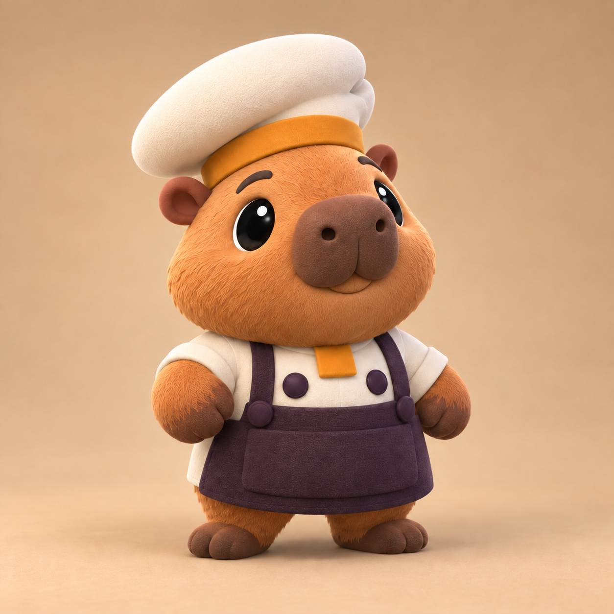
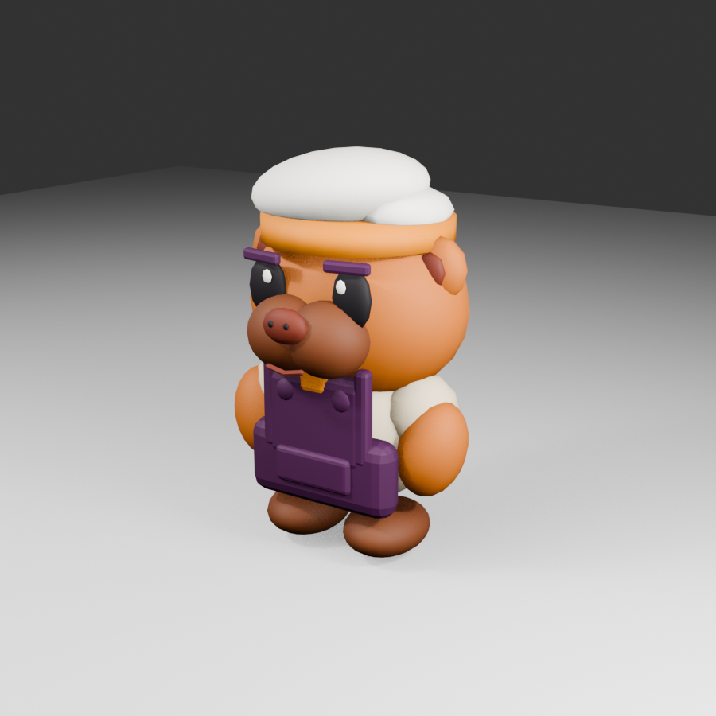

# COOKED OUT! ビジュアル開発 第16ラウンド

- 更新日: 2026-09-11
- 対象: カピバラ料理人の閉じ口・歯なし改修
- 状態: `style_version 1` ポップ改修v3。Unity統合済み、出荷承認と実機確認は未実施
- 制作方式: Codex内蔵画像生成による口元編集、Blender 5.2.1 LTSによる手続き型3D再生成
- 入力: [第15ラウンド](VISUAL_DEVELOPMENT_ROUND_15.md)のポップ改修v2

## 1. 成果物

### 閉じ口の改修基準



### Blender／Unity反映結果



| 種別 | パス |
|---|---|
| 閉じ口基準画像 | `docs/art/concepts/capybara_chef_sv1_closed_mouth_target_v3.png` |
| Blenderレンダー | `docs/art/concepts/capybara_chef_sv1_blender_model_preview_v3.png` |
| Blender編集正本 | `art-source/characters/capybara/CapybaraChef.blend` |
| Unity取込FBX | `Assets/_CookedOut/Art/Characters/Capybara/CapybaraChef_Model.fbx` |
| Unity本番Prefab | `Assets/_CookedOut/Art/Resources/Characters/CapybaraChef.prefab` |

## 2. 比較・判断

| 評価軸 | v2 | v3 | 判定 |
|---|---|---|---|
| 口元 | 赤い口内、舌、二本の前歯 | 口を完全に閉じ、浅い笑顔線だけを残す | 採用 |
| 印象 | 元気だが口元のコントラストが強い | 穏やかで、黒目と帽子が主役 | 改善 |
| 遠景 | 歯が白い記号として強く出る | 口元が顔の輪郭へなじむ | 改善 |
| 種固有性 | 前歯に依存 | 小耳、広い二葉口吻、鼻、体型でカピバラを識別 | 維持 |
| 独自性 | 既存作品固有表現なし | 口元以外を固定し、固有作品の要素を追加しない | 合格 |

カピバラらしさを前歯へ依存させず、耳、口吻、鼻、輪郭で表現する。通常時は閉じ口を正とし、大きな口や歯を使う表情差分は採用せず、必要になった場合も別の表情承認を通す。

## 3. 画像編集プロンプト

使用方式: Codex内蔵 `imagegen`、`precise-object-edit`。第15ラウンドの改修基準画像を編集対象とした。

```text
Use case: precise-object-edit
Asset type: COOKED OUT! 3D character modeling target revision
Input images: Image 1 is the approved capybara chef revision target and the edit target.
Primary request: change only the mouth expression. Close the mouth completely. Remove all visible teeth, incisors, tongue, red mouth interior, and open-mouth gap. Replace them with a very small, gentle closed-mouth smile line centered just below the two-lobed muzzle, with relaxed round cheeks. The expression should feel calm, friendly, cute, and safe rather than excited.
Constraints: preserve the exact capybara identity, head and body proportions, pose, eyes, eyebrows, ears, nose, muzzle shape, chef cap, ochre band, cream jacket, deep-plum apron, buttons, colors, materials, lighting, camera angle, framing, background, and shadow. Do not redesign any other part. No humans, no text, no UI, no props, no logos, no watermark. Do not reproduce any existing game's named character or signature costume.
```

## 4. Blender／Unity反映

- 開いた口、赤い口内、舌、二本の前歯を全LODから削除した
- LOD0とLOD1にだけ、口吻の下へ左右二片の浅い閉じ笑顔線を追加した
- LOD2は口線も省略し、目、鼻、口吻、帽子の大形状だけで読む
- 舌用マテリアルを生成対象とUnityプロジェクトから削除し、使用材質を8種へ戻した
- 骨、スキン、LOD切替、手持ちソケット、衣装、色は変更していない

## 5. 3D仕様と検証

| 項目 | 結果 |
|---|---:|
| LOD0 | 7,732 triangles |
| LOD1 | 4,884 triangles |
| LOD2 | 2,472 triangles |
| 変形骨 | 10 |
| Skinned Mesh | 3、各LOD 1個 |
| URP Lit材質 | 8 |
| Unity EditMode | 36/36成功 |
| Unity PlayMode | 26/26成功 |

## 6. ハッシュ

- 閉じ口基準PNG: `37b7524a77e3a6c1743f6638752be5ae803d956363105071bd2083aab90bf1c4`
- BlenderレンダーPNG: `5271d351e29874504bf823b5a2051cd81f97afd1ed5d6916bc3be7c103f09a39`
- Blend: `748692410e4a0069e2b3fdc61c25472b19559bf7258f40693379dcda34678c5f`
- FBX: `00d7b236c69b5589e2aff008c76533dc6c3b351bb452844fb7a643c12d072aa1`
- Prefab: `70fef4808e8dbeb9091adc679a1dd5ecf9ee94d254b5f168b2f757fc0d9095b8`

## 7. 次の承認ゲート

1. Unity固定俯瞰で閉じ笑顔線がノイズにならないことを確認する
2. iPhone実機で4体表示、LOD切替、30 fpsを確認する
3. v3を残る11動物の通常表情基準として承認する
