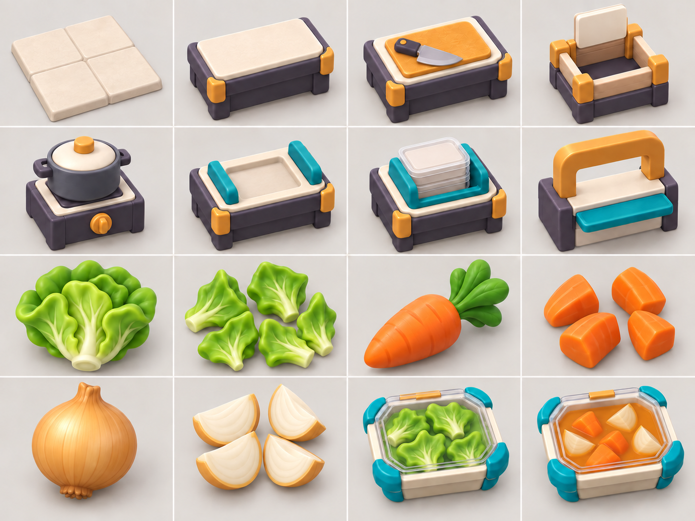
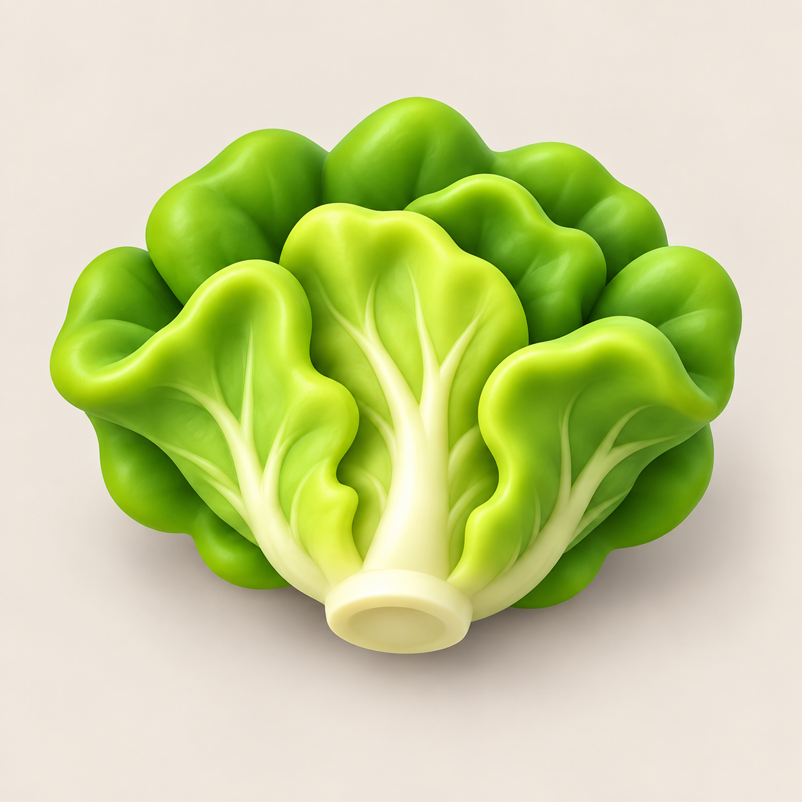
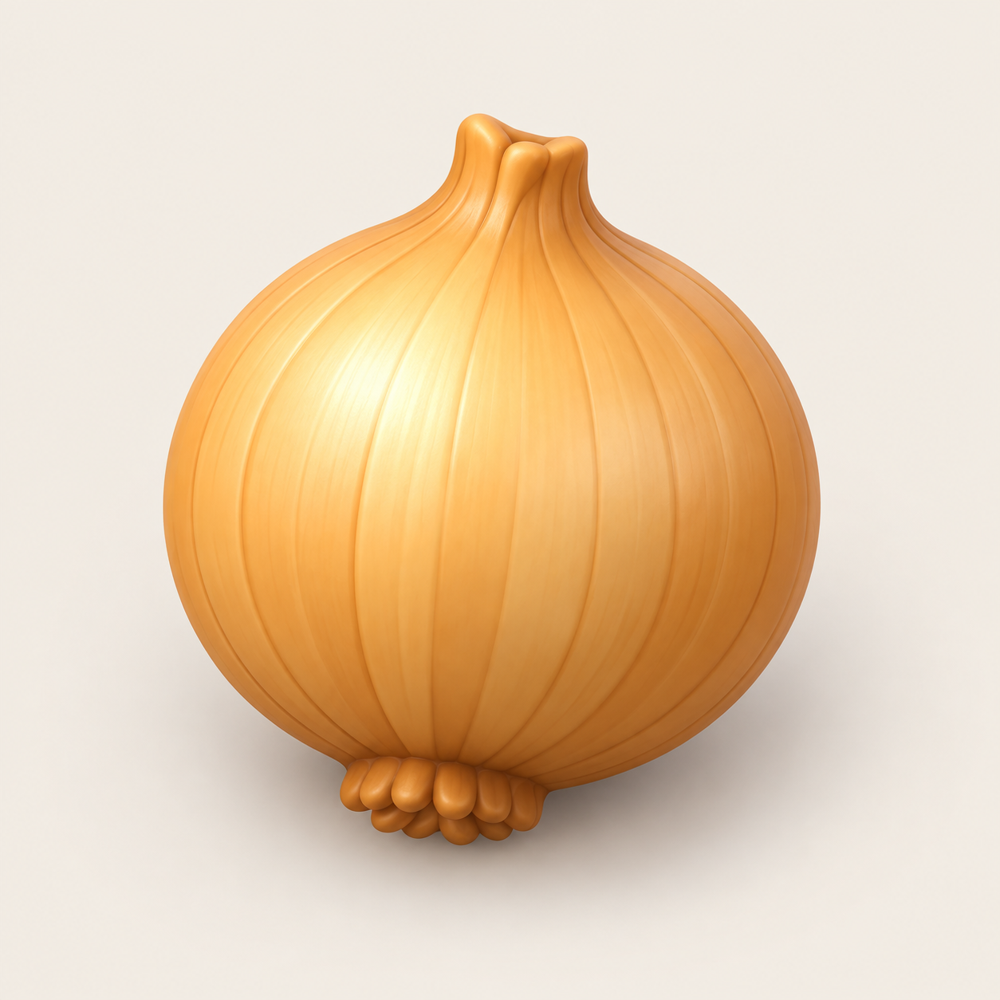
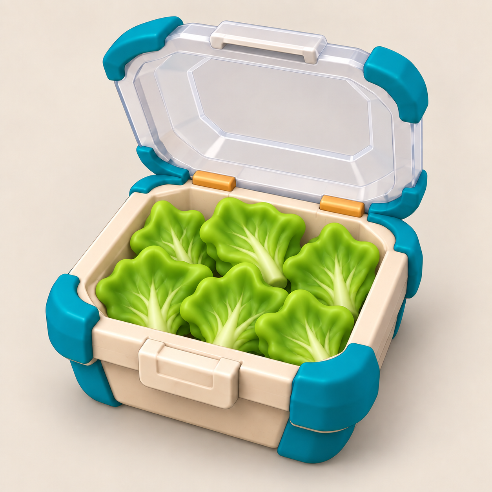
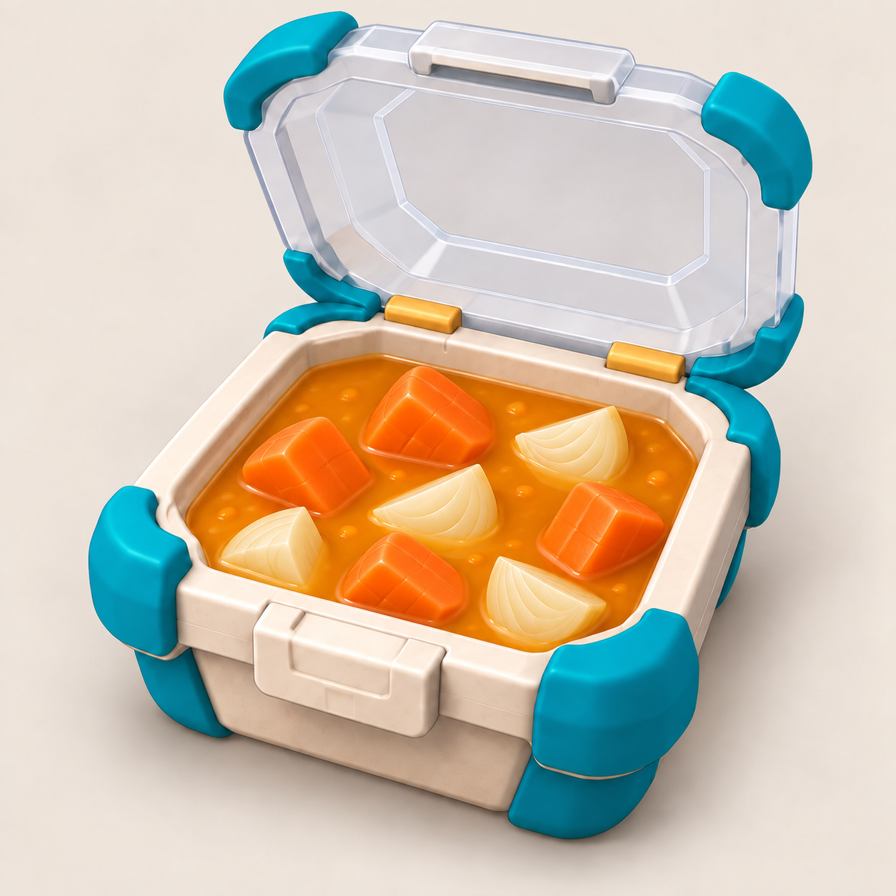

# COOKED OUT! ビジュアル開発 第17ラウンド

- 更新日: 2026-09-11
- 対象: 1-1〜1-3の厨房設備、食材供給カード、未調理／調理済み食材、注文票画像
- 状態: `style_version 1`のP0比較ラウンド完了、Unity統合済み。製品用FBX化と実機承認は未実施
- 制作方式: Codex内蔵`imagegen`による新規生成と局所修正、Unityプリミティブによる固定俯瞰用3D反映
- 正本: ゲーム内容と設備座標はゲームデザイン文書およびグリッドデータを正とし、生成画像の配置を実装仕様にしない

## 1. 比較ラウンド成果物

### P0設備・食材状態マスター



4×4の順序は、床／標準台／まな板／食材箱、鍋／組立台／容器供給／提供口、レタス未加工／切り済み／にんじん未加工／切り済み、玉ねぎ未加工／切り済み／完成サラダ／完成スープ。完成料理はゲーム内状態なので透明蓋を閉じる。

### 食材箱上面カード

| レタス | にんじん | 玉ねぎ |
|---|---|---|
|  |  |  |

### 注文票用・全開蓋画像

| レタスサラダ | 野菜スープ |
|---|---|
|  |  |

注文票は蓋を完全に開く。1-1は切ったレタスだけ、1-2／1-3はにんじんと玉ねぎだけを表示し、ゲームデータに存在しない材料を描かない。

## 2. 比較・評価

| 評価軸 | 第8・11・12ラウンド | 第17ラウンド | 判定 |
|---|---|---|---|
| 同作品性 | 設備、容器、レタスを個別シートで確認 | 16セルへ同時配置し、クリーム／プラム／ティール／黄土を固定 | 合格 |
| 小画面識別 | レタス中心 | レタス、にんじん、玉ねぎを輪郭と大色面で分離 | 合格 |
| 設備共通性 | 16設備の広い候補 | 1-1〜1-3で必要な8種へ共通土台を適用 | 合格 |
| 食材箱 | レタスだけ本画像 | 3食材を同じカメラ・背景・縮尺で個別化 | 合格 |
| 容器状態 | 開閉基準を定義 | 注文票は全開、完成品3Dは閉蓋 | 合格 |
| レシピ一致 | 初稿に未登録の具が混入 | 局所修正で1-1、1-2／1-3の実材料だけへ限定 | 合格 |
| 独自性 | 既存作品固有要素を避けた候補 | 固有キャラクター、衣装、UI、配置、配色を追加していない | 合格 |

このラウンドを大量生成前の比較ゲートとする。設備、食材、料理が同じ丸い玩具的3D、同じ材質密度、同じ色体系で成立したため、以後はこのマスターを固定アンカーとして一資産ずつ生成する。

## 3. 保存用生成プロンプト

使用方式はCodex内蔵`imagegen`。以下は生成時の指示内容を来歴用に整形した最終プロンプトである。

### 3.1 P0マスターシート

```text
Use case: concept-art / asset-design sheet
Create one exact 4-by-4 contact sheet for COOKED OUT! style_version 1. Every cell contains one isolated toy-like rounded 3D asset, shown with the same three-quarter high camera, neutral warm studio background, soft bright light, matte material, broad color planes, and no labels.
Row 1: square cream floor tile module; standard deep-plum counter with cream worktop and ochre corner guards; chopping station with large ochre board and simple knife; common ingredient source crate with dark inset and blank upright photo-card holder.
Row 2: compact pot plus dedicated heat base; recessed assembly counter with teal rails; stack-style common rectangular delivery-container dispenser; serving hatch with ochre arch and teal ledge.
Row 3: whole lettuce; four or five large chopped lettuce clusters; whole carrot with broad green leaves; four large chopped carrot chunks.
Row 4: whole golden onion; four large pale onion wedges; completed lettuce-only food in the common rectangular container with the transparent lid fully CLOSED; orange carrot-and-onion soup in the same container with the transparent lid fully CLOSED.
Palette: cream worktops and floor, deep plum structures, teal functional contact surfaces, ochre controls and guards, bright food colors. Keep silhouettes simple and readable at small size. No people, humans, animals, characters, hands, text, letters, numbers, UI, logos, watermark, or proprietary game elements. The sheet is an art reference only; equipment coordinates are not implementation data.
```

### 3.2 食材箱上面カード

食材名だけを`whole lettuce`、`whole carrot with broad green leaves`、`whole golden onion`へ差し替え、各カードを個別生成した。

```text
Use case: game-asset / ingredient-source photo card
Create one centered isolated [INGREDIENT] for COOKED OUT! style_version 1, matching the approved P0 master sheet. Rounded chunky toy-like 3D, large unmistakable silhouette, bright matte color, very low detail, soft neutral studio light, warm off-white background, square composition, generous clear margin. The ingredient must fill roughly 72 percent of the frame and remain readable on a small horizontal-mobile HUD and on top of a 3D source crate. No container, plate, box, hands, people, humans, animals, characters, face, text, letters, numbers, icons, UI, logo, or watermark. Do not imitate a proprietary game's asset.
```

### 3.3 注文票画像

```text
Use case: game-asset / order-ticket food image
Create one isolated common rectangular cream delivery container with teal corner guards and ochre hinges for COOKED OUT! style_version 1. Show the transparent lid hinged at the back and FULLY OPEN, with an obvious clear gap above the food. Use the same three-quarter high camera, object scale, bright soft light, warm off-white background, rounded chunky toy-like 3D materials, and broad color planes as the P0 master sheet.
For lettuce salad, show ONLY five or six large chopped bright-green lettuce clusters. For vegetable soup, show ONLY simple orange broth, three or four large orange carrot chunks, and three or four large pale cream onion wedges. Do not show any unlisted ingredient or garnish. The food must remain legible at small order-ticket size. No hands, people, humans, animals, characters, text, letters, numbers, UI, logo, or watermark. Do not reproduce any existing game's proprietary UI, layout, or palette.
```

## 4. レシピ一致の局所修正

初稿ではレタスサラダにトマトときゅうり、野菜スープに緑の具が混入した。次の`precise-object-edit`で、容器、全開蓋、カメラ、照明、背景、材質を固定し、具だけを正本へ合わせた。マスターシートも下段右2セルだけを同じ規則で修正した。

```text
Use case: precise-object-edit
Preserve the exact container or sheet layout, camera, lighting, framing, background, materials, colors, and rounded toy-like 3D style. Change only the food contents. Lettuce recipe: keep only large chopped lettuce leaf clusters and remove tomato, cucumber, garnish, seeds, and every non-lettuce ingredient. Soup recipe: keep only orange soup, large orange carrot chunks, and large pale onion wedges; remove green vegetables, yellow cubes, herbs, peas, garnish, and every other ingredient. Preserve the lid rule: order-ticket images fully open; gameplay completed-food reference fully closed. No humans, characters, text, UI, logos, or watermark.
```

## 5. Unity反映

- `KitchenArtPalette`に床、壁、土台、天板、機能面、安全色、3食材、スープの共通色を集約
- グリッド配置は変更せず、食材箱、まな板、鍋熱源、組立台、容器供給、提供口、ゴミ箱、積込／回収設備へ見た目専用子オブジェクトを追加
- 装飾子オブジェクトのColliderは除去し、従来の`Station Body`だけを物理判定に使用
- レタス、にんじん、玉ねぎの未加工／切り済みを大きな形で区別
- 鍋と完成スープへ実際の投入食材に対応するにんじん塊・玉ねぎ片を表示
- 完成サラダはレシピ通りレタスだけを表示
- 3食材箱の上面カードを`ContentId`と同じResource名から読み込み、操作で同じ生食材を供給
- HUD左上の注文画像へ全開蓋PNGを接続。ゲーム内完成容器の蓋は従来通り閉じる
- Unity用PNGだけ1254pxから512pxへ決定的に縮小。コンセプト正本は元解像度を保持

## 6. 検証

| 項目 | 結果 |
|---|---:|
| Unity EditMode | 36/36成功 |
| Unity PlayMode | 29/29成功 |
| 食材箱カードとContentId | レタス／にんじん／玉ねぎで一致 |
| 注文票画像 | 1-1レタス、1-2／1-3スープを自動確認 |
| 設備装飾 | 天板、まな板、ナイフ、熱源、操作部、箱凹部を自動確認 |
| レシピ外材料 | 完成サラダのトマト／きゅうりが0個であることを自動確認 |

## 7. ハッシュ

- P0マスター: `285c54470f7d117062f1e13aae14a82b6ac1728cf02582b5762544317e5e4641`
- レタスカード正本: `20eb4f960f840f90332cd68cbb46c6b0a903cce351e7cc2f019f9ae04e4f9f27`
- にんじんカード正本: `45800b3c07cc2c1628b94b83257d8fa7f7aab61285e1e582433c7e4a68b54e98`
- 玉ねぎカード正本: `5330d6841be87c23edcbbedcdf98034e2a20a4b2d31b3326350514fd1be0f45f`
- レタス注文票正本: `1d929fc2718cc99b2d19990bcde98618a433d38de8af69fb3a27589a87322c80`
- スープ注文票正本: `fcb4185cf2dbeeee23f47b3665d471ee34a2633f741c021988c93e596ae55076`

## 8. 次のゲート

1. Unity固定俯瞰とiPhone実機で、設備と食材が文字なしでも識別できるか確認する
2. P0設備をBlenderの共通一セル寸法へ置き換える場合も、論理ルート、Item Anchor、Colliderを維持する
3. 1-5以降へ進む前に、トマト等の追加食材を個別カード／未加工／切り済みの三点セットで追加する
4. 36系統の個別注文票は系統代表を固定し、一注文一生成でレシピ外材料0を確認してからUnityへ登録する
