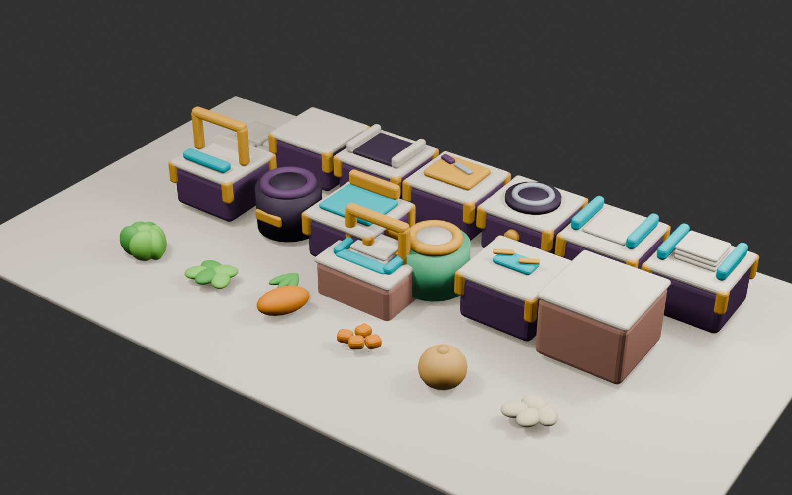

# COOKED OUT! ビジュアル開発 第18ラウンド

- 更新日: 2026-09-11
- 対象: 1-1〜1-3の床・壁、厨房設備、レタス／にんじん／玉ねぎの未加工・切り済み状態
- 状態: `style_version 1`の製品用3D承認候補をUnityへ統合済み。固定俯瞰とiPhone実機での最終美術承認は未実施
- 制作方式: Blender 5.2.1 LTS上の決定的な手続き型モデリング、FBX書き出し、Unity Editor builderによるURP Prefab化
- 正本: 設備座標、占有セル、Collider、食材IDはグリッド／ゲームデータを正とし、生成画像と3Dモデルの配置を実装仕様にしない

## 1. 比較ラウンド成果物

### 製品用3D候補プレビュー



同じカメラ、照明、背景で全20資産を並べ、クリーム、濃いプラム、ティール、黄土色と、食材固有色が一つの作品として見えるかを比較した。プレビュー内の配置は一覧性のためのもので、ステージ配置には使用しない。

| 分類 | 資産 | 数 |
|---|---|---:|
| 地形 | 床A、床B、壁 | 3 |
| 設備 | 標準台、食材箱、まな板、鍋熱源、組立台、容器供給、提供口、ゴミ箱、バイク積込、配達地点、回収箱 | 11 |
| 食材 | レタス、にんじん、玉ねぎの未加工／切り済み | 6 |
| 合計 | FBXおよびResources Prefab | 20 |

完成サラダ、完成スープ、鍋の内容、共通配達容器はゲーム状態に応じて内容物や蓋が変化するため、現行の動的3D表示を維持した。注文票では透明蓋を完全に開き、ゲーム内完成容器では閉じる既存規則も変更していない。

## 2. 第17ラウンドとの比較・評価

| 評価軸 | 第17ラウンド | 第18ラウンド | 判定 |
|---|---|---|---|
| 用途 | 画像比較とUnity簡易3D | 編集可能なBlender正本、FBX、Unity Prefab | 合格 |
| 同作品性 | 一枚のマスターシートで確認 | 全20モデルを同一材質、面取り、照明で再比較 | 合格 |
| 小画面識別 | 大形状と色面を定義 | 道具の輪郭、機能面、食材断面を立体で分離 | 合格 |
| 寸法 | 画像上の相対寸法 | 1セル1.6 mを共通基準として再生成可能 | 合格 |
| 性能 | Unityプリミティブ中心 | 1資産6 Renderer以下、12,000 triangles以下 | 合格 |
| 実装分離 | 論理ルートと装飾を分離 | ColliderなしのVisual Prefabだけを既存論理設備へ追加 | 合格 |
| フォールバック | 簡易3Dを直接表示 | Prefab欠損・不正時だけ簡易3Dへ戻る | 合格 |
| 独自性 | 固有作品要素を避けた比較案 | 人間、キャラクター、文字、UI、既存作品固有配置を追加していない | 合格 |

厨房、設備、食材は、丸い角、大きな色面、低い情報密度、明るい玩具的材質という同じ造形文法で成立した。第17ラウンドの比較ゲートを通過したP0群だけを3D化しており、未承認の大量資産へは展開していない。

## 3. 保存用制作指示

このラウンドは画像生成ではなく、`tools/blender/generate_kitchen_assets.py`へ次の制作指示を固定した手続き型モデリングである。

```text
Use case: production-candidate / modular low-poly 3D kitchen assets
Create a coherent set of rounded, chunky, toy-like 3D assets for COOKED OUT! style_version 1.
Use a nominal square kitchen cell of 1.6 meters. Keep silhouettes readable from a fixed high three-quarter gameplay camera. Use broad matte color planes: cream tops and walls, deep-plum structures, teal functional contact surfaces, ochre controls and guards, and saturated ingredient colors. Use softened bevels and simple forms; avoid tiny decoration, photorealism, text, logos, humans, characters, hands, and proprietary game elements.

Terrain: two subtle floor variants and one modular wall.
Stations: counter, common ingredient source crate with a recessed top and card holder, chopping board, pot heat source, assembly counter, container dispenser, serving hatch, trash bin, bike loading dock, delivery point, and recovery bin.
Ingredients: whole and chopped lettuce, carrot, and onion. Raw and chopped states must differ by both silhouette and exposed color plane.

Export every asset as a separate FBX. Join geometry by material before export. Do not include gameplay colliders, lights, cameras, animation, UI, or stage coordinates. Preserve the existing logical station root, Item Anchor, grid footprint, content ID, and collider when Unity attaches the visual prefab.
```

## 4. Blender／Unity制作構成

- 編集正本: `art-source/kitchen/KitchenProductionAssets.blend`
- 再生成スクリプト: `tools/blender/generate_kitchen_assets.py`
- 一括生成コマンド: `./scripts/build_kitchen_assets.sh`
- FBX: `Assets/_CookedOut/Art/KitchenProduction/Models`の20件
- 共通URP Lit材質: `Assets/_CookedOut/Art/KitchenProduction/Materials`の15件
- Unity Prefab: `Assets/_CookedOut/Art/Resources/KitchenProduction`の20件
- Unity builder: `Assets/_CookedOut/Scripts/Editor/KitchenProductionPrefabBuilder.cs`
- ランタイム読込と検査: `Assets/_CookedOut/Scripts/Presentation/KitchenProductionAssets.cs`

Unityでは`COOKED OUT! > Build Kitchen Production Prefabs`でFBXから共有材質とResources Prefabを再構築できる。Prefabには資産キー、分類、基準寸法を持つ`KitchenProductionAsset`だけを追加し、Colliderは含めない。既存の`Station Body`、床Collider、Item Anchor、設備コンポーネントはそのまま残し、描画だけを製品用候補へ切り替える。

## 5. 最適化基準

- 書き出し前に同一材質の部品を結合し、20 Prefabすべてを6 MeshRenderer以下に制限
- 各Prefabを12,000 triangles以下に制限
- 20 FBX合計925,152 bytes
- 15種の共通材質を複数Prefabで再利用
- Blenderの静的FBXはメートル値をセンチメートル単位で保持するため、FBX importerの`globalScale`を100に固定して1 Unity unit = 1 mへ復元
- FBX importerではanimation、blend shape、camera、light、read/writeを無効化し、Mesh CompressionをMediumに設定
- 静的地形・設備のbatchingやLOD追加は、固定俯瞰の実機Profiler結果を見て判断する

初回統合時は`globalScale = 1`のため全モデルが意図寸法の100分の1で表示され、既存Rendererだけが無効になって透明に見えた。`globalScale = 100`で全20 FBXを再importし、Prefabを再構築した。さらに、Mesh、Material、Shader、alpha、Visual Boundsをランタイムで検査し、小さすぎる／大きすぎる／描画不能なPrefabでは既存Rendererを無効にせず、見える簡易3Dへフォールバックするよう修正した。

縮尺修正後、静的FBXの形状がBlenderのZ-upのままUnityへ入り、床と設備がX軸方向へ90度倒れていることをGameビューで確認した。Prefab builderでモデルVisual RootだけをX軸`-90°`回転してUnity Y-upへ変換した。論理ルート、グリッド、Collider、Item Anchorの回転は変更していない。床A／Bについて、高さが横幅・奥行きの30%未満であることを自動検査する。

## 6. 検証

| 項目 | 結果 |
|---|---:|
| Unity EditMode | 39/39成功 |
| Unity PlayMode | 32/32成功 |
| Resources Prefab | 20/20読込・キー／分類検査成功 |
| Collider分離 | 20/20のVisual PrefabでColliderなし |
| Renderer予算 | 20/20で6以下 |
| Triangle予算 | 20/20で12,000以下 |
| Unity実寸Bounds | 20/20で基準寸法の25%以上、300%以下 |
| Unity Y-up | 床A／Bが水平であることを自動確認 |
| グリッド／論理設備 | 座標、占有、Collider、Item Anchorを変更なし |
| 食材状態 | 3食材の未加工／切り済みを別Prefabで表示 |
| 欠損時 | 既存の手続き型簡易3Dへフォールバック |

テストは開いているUnity EditorとLibraryを競合させないため、隔離複製上のUnity 6000.3.24f1で実行した。

## 7. ハッシュ

- Blender編集正本: `26c59de820da99f97dd56ec613b0958eafb728cc962cd79919305837ebd42ebc`
- 比較プレビュー: `72d01a9f64849338e1f1fe4318716b59a8c865e752b8525a2aed3708842fccb5`
- Blender生成スクリプト: `570a9428bbac33f2fc09293aa2c36a781b6ac4fb7e052eaddc19be1d85e2e8b3`
- 一括生成スクリプト: `f29a45cf170080d4d5ec8ba9b80e27b4de1f0e3a165799bfa5e6ffa4ca610449`

各FBXの生成元は同じBlender編集正本と生成スクリプトであり、個別ファイルの来歴はUnity `.meta`とGitの変更履歴で追跡する。

## 8. 次のゲート

1. Unityの1-1〜1-3を固定俯瞰で目視し、設備が文字なしでも区別でき、プレイヤーや手持ち品を隠さないか確認する
2. iPhone実機で4体同時表示を想定した30 fps、draw call、memory、発熱を計測する
3. 実機で問題が出た資産だけLOD、texture atlas、static batchingを追加する
4. 完成容器、鍋内容、加熱／焦げ状態は動的表示のまま、次の料理資産ラウンドで共通メッシュ部品へ段階移行する
5. 1-5以降の新食材は、食材箱カード、未加工3D、必要な中間状態3D、注文票を一組として追加する
