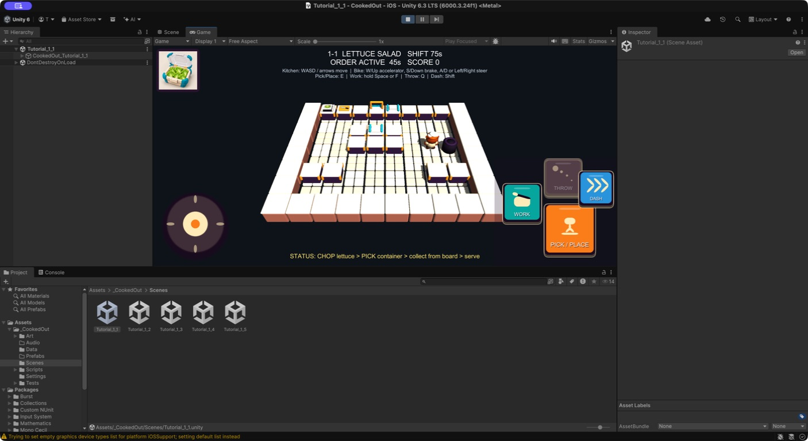

# ビジュアル開発 第19ラウンド — 厨房操作UI `style_version 1`

- 実施日: 2026-09-11
- 対象: 厨房の固定仮想スティック、取る／置く、作業、投げる、ダッシュ
- 状態: Unity実装候補。Editor確認済み、iPhone実機承認待ち
- 正本: `docs/game-design/08_kitchen_controls_and_interaction_contract.md`、`docs/game-design/17_ui_screen_architecture_and_hud_layout.md`

## 1. 比較ラウンド

| 観点 | 旧仮UI | 候補A（採用） |
|---|---|---|
| シルエット | 四角い文字ボタンと四角いスティック | 丸角の厚いボタン、円形スティック、大小差のある固定配置 |
| 視認 | ラベル中心 | ピクト＋短いラベル。取る／置くを最大ボタンにする |
| 状態 | 押下・使用不可が弱い | 押下時93%縮小、色変化、使用不可時48%不透明度 |
| 安全領域 | 画面端基準 | `Screen.safeArea`へ全HUDを追従 |
| 同作品性 | 仮配色 | 厨房・容器と共通のクリーム、黄土、青緑、プラムを使用 |

候補Aは、顔や料理を邪魔しない濃い外枠、玩具的な厚み、色だけに依存しないピクトを共通語彙とした。既存作品固有のボタン形状、UI配置、配色は参照・複製していない。

## 2. 制作ブリーフ

画像生成プロンプトは使用していない。単純な枠とピクトは画像生成よりUnity UIを正とするマスター台帳の規則に従い、次のブリーフからコードネイティブで制作した。

> 横持ちモバイル厨房用の、明るく玩具的で独自性のある操作UI。左下に円形固定スティック、右下に取る／置くを最大として、作業を左上、投げるを上、ダッシュを右端へ固定する。クリームのピクトと濃いプラムの外枠を共有し、黄土、青緑、紫、青で機能を区別する。文字が読めなくても形で判別でき、使用不可でも位置と意味を残す。既存ゲーム固有のUI、配置、形状、配色を再現しない。

## 3. Unity反映

- `KitchenHudVisuals.cs`でアンチエイリアス付き丸角矩形／円スプライトと全ピクトを実行時生成する
- `TutorialSceneBootstrap.cs`で1920×1080基準のCanvas ScalerとSafe Areaを適用する
- 左スティックは直径300、ノブ118。右側は取る／置く230、作業174、投げる168、ダッシュ156を固定する
- ボタン名と入力コールバックは維持し、ゲームロジックは変更しない
- 投げられる所持品がない時、または鍋／フライパン所持時は投げるボタンを48%表示のまま操作不可にする
- 配達操作、降車、再開にも同じボタン外装とピクト生成器を再利用する
- 出荷用のラスターUI画像は追加していない。記録JPEGはUnity Editorでの実装確認画像のみである

## 4. 評価

- 合格: 四行動が常時同じ位置にあり、取る／置くが最大
- 合格: スティックとボタンの形が一目で分離される
- 合格: ピクト、短いラベル、色の三重符号化になっている
- 合格: 料理・設備のクリーム／プラム／黄土／青緑と同作品に見える
- 合格: 押下と使用不可の状態差が自動テストで確認できる
- 保留: Dynamic Island、ホームインジケータ、1〜4人表示、注文2件／5件時の指遮蔽は実機確認が必要

## 5. 検証

- Unity 6000.3.24f1で`Tutorial_1_1`をPlayし、向き、配置、無効状態を目視確認
- EditMode 40/40、PlayMode 33/33成功
- C# compile error、`NullReferenceException`、`MissingComponentException`なし
- 記録画像 SHA-256: `3f88d7179e7a44506af7156716cdb222ab2a2d47ea197889b820fbbed955d867`

次の承認ゲートは横持ちiPhone実機での親指到達性と安全領域であり、そこでサイズだけを調整する。四ボタンの役割と相対配置は変更しない。
