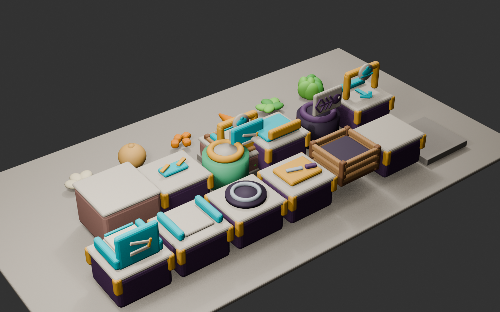
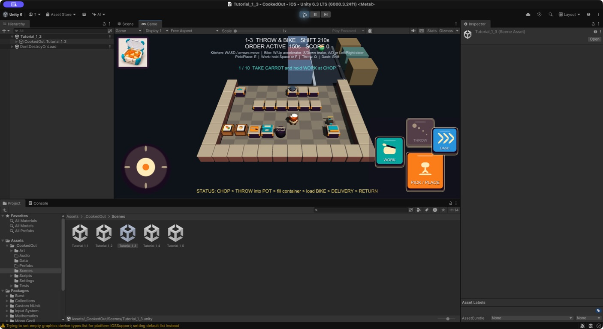

# ビジュアル開発 第20ラウンド — 厨房視認性とノンバーバル設備

- 更新日: 2026-09-11
- 対象: 未加工にんじん、床、標準作業台、食材供給箱、容器供給口、提供口、ゴミ箱
- 状態: `style_version 1`の3D修正版をUnityへ統合済み。iPhone実機承認待ち
- 制作方式: Blender 5.2.1 LTSの決定的手続き型モデリング、FBX書き出し、Unity Resources Prefab再構築

## 1. 修正版比較



| 対象 | v1の問題 | v2の修正 | 判定 |
|---|---|---|---|
| 未加工にんじん | 楕円体に近く、芋のように見える | 太い肩、細い先端、丸い肩、三枚の葉で輪郭を再構築 | 合格 |
| 床 | 四分割タイルの間とセル境界から暗い背景が見える | 1.6 mセルに対して1.64 mの一枚板を使い、隣接セルをわずかに重ねる | 合格 |
| 床・作業台 | 明度が高く、設備と食材が埋もれる | 暖色グレー／トープへ落とし、照明と環境光も抑える | 合格 |
| 食材供給 | 標準作業台と同じ紫台＋白天板に見える | 木製スラット、濃色の角柱、暗い内箱を持つ独立木箱へ変更 | 合格 |
| 容器供給 | 白い板の積層だけで用途が弱い | ティールの縦型マガジン、容器三段、開蓋容器ピクトを追加 | 合格 |
| 提供口 | アーチだけで用途が曖昧 | 皿＋クロッシュと、受渡し方向を示す大きな立体矢印を追加 | 合格 |
| ゴミ箱 | 円筒と色だけで判別する | 高いクリーム色バッジに魚の骨の立体ピクトを追加 | 合格 |

文字、ロゴ、人間、手の図は使わず、大きな輪郭、設備固有の構造、立体ピクトを優先した。色は補助情報であり、木箱、マガジン、アーチ、円筒という外形だけでも区別できる。

## 2. 保存用制作指示

このラウンドはラスター画像生成ではなく、既存の3D編集正本を修正した。`tools/blender/generate_kitchen_assets.py`へ次の指示を固定している。

```text
Revise the COOKED OUT! style_version 1 kitchen production set for fixed high-angle mobile play.
Make raw carrot unmistakably tapered with a broad shoulder, pointed tip, and large leafy top.
Replace quartered floor geometry with a continuous slightly overlapping tile so the world void can never show through seams.
Lower floor and worktop brightness to calm warm taupe values while preserving ingredient and action-color contrast.
Make ingredient sources freestanding wooden slat crates, not recolored work counters.
Make the disposable-container source a vertical magazine with a visible stack and open-container relief.
Make the serving hatch show a plate/cloche and a large directional arrow.
Make the trash bin show a large raised fish-skeleton badge.
Communicate without text, logos, human figures, hands, or color alone. Preserve the logical grid, station roots, colliders, item anchors, and content IDs.
```

## 3. 実装内容

- 床A/Bを4分割メッシュから各1枚の1.64 m角メッシュへ変更
- 床色を`(0.40, 0.36, 0.31)`／`(0.48, 0.43, 0.36)`、天板色を`(0.67, 0.60, 0.49)`へ変更
- Unityの主光源を1.35から1.08、環境光を約0.4から約0.28へ調整
- 木、濃木、使い捨て容器の3共通材質を追加し、長い材質名を優先する割当へ修正した。これにより`MAT_WoodDark`や`MAT_LettuceDark`が短い名前へ誤統合されない
- Blender編集正本、20 FBX、19共有URP材質、20 Resources Prefabを再生成
- FBXは見た目専用でColliderなし。設備座標、占有セル、`Item Anchor`、操作、食材IDは変更していない
- Prefab欠損時のUnity簡易表示も、床の連続性、落ち着いた色、木箱を維持する

## 4. Unity固定俯瞰確認



`Tutorial_1_1`〜`1-3`と`1-5`をGameビューで確認した。床から暗い奈落が見えるセル間隙は解消し、食材箱は写真カード付き木箱として標準台から分離した。容器供給、提供、ゴミ箱は固定俯瞰でも形とピクトを保持する。

## 5. 検証

- EditMode 40/40成功
- PlayMode 34/34成功
- 新規テストで床A/Bの両辺が1.6 m以上、床材の最大RGBが0.55未満、にんじんの水平長短比が1.6超であることを確認
- 木箱材質、容器材質、提供口とゴミ箱のピクト用材質、高いサイン輪郭をPrefab上で確認
- compile error、`NullReferenceException`、`MissingComponentException`なし

## 6. ハッシュ

- Blender編集正本: `70cba1769c3af093b256795d2b6b9248a87959744363d25e363fa8b3cce097b8`
- Blender比較プレビュー: `f778121e4def67fd85109a608edcdc643cf03a3d0505c756ae020da748f28d7e`
- Unity Editor確認画像: `d2c3e1f782b3f79577bb76ca28e882a42864581b0aca6a68fb6b57bdaf537f0b`
- Blender生成スクリプト: `442bc2dc1b7c6cfcd99a7f1fb080d023b1af185852613244c3816d8285c5ad60`
- FBX 20件のハッシュ一覧に対するSHA-256: `091de3b43c301a58bc775c53c9c7045bdf9eedaec6ee97c8533396e365f66546`

次のゲートは横持ちiPhone実機で、魚骨・容器・提供矢印が通常プレイ距離でも読めるかを確認すること。必要なら論理配置を変えず、ピクトだけをさらに大きくする。
