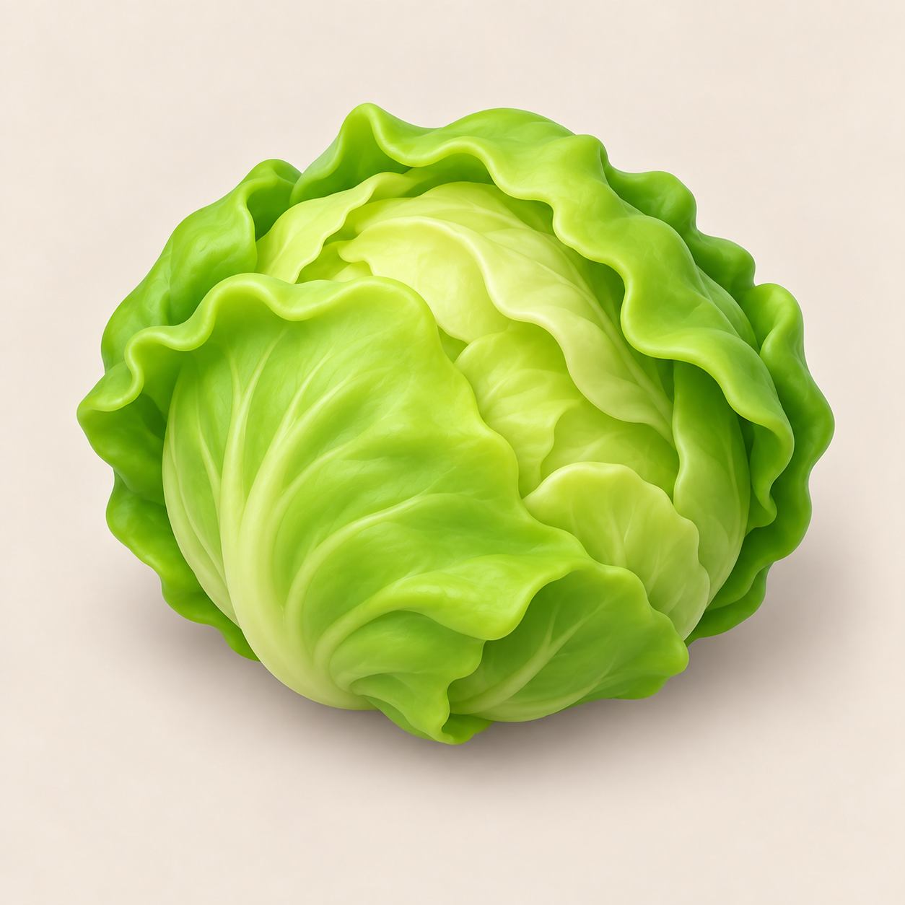
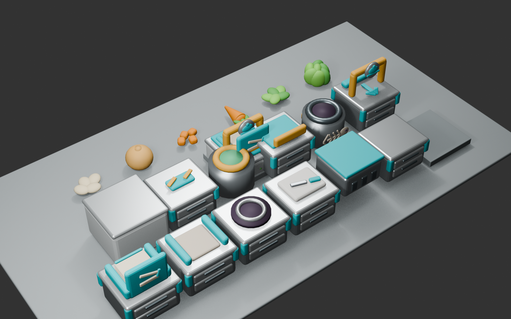

# ビジュアル開発 第22ラウンド — 食材識別と調理フィードバック

- 更新日: 2026-09-11
- 対象: レタス供給カード、まな板、ゴミ箱、鍋／フライパン内容表示、投擲軌道、歩行速度
- 状態: `style_version 1`の修正版をUnityへ統合済み。iPhone実機承認待ち
- 制作方式: OpenAI画像編集、Blender 5.2.1 LTSの決定的手続き型モデリング、Unity動的3D表示

## 1. 比較と評価

### レタス供給カード

| 候補 | 小サイズでの読み | 問題 | 判定 |
|---|---|---|---|
| 旧 `sv2` | 縦に伸びる葉と白い芯が主役 | チンゲンサイ／ロメインの束に見え、結球レタスとして弱い | 差し替え |
| 新 `sv3` | 丸い外形と重なる波形の葉が主役 | 128 px相当でも一個のレタスとして読める | 採用 |



同じ背景、余白、玩具的3Dの語彙は維持し、食材本体だけを結球レタスへ変更した。人間、文字、ロゴ、容器は入れていない。

### 設備



| 対象 | 修正前 | 修正後 | 判定 |
|---|---|---|---|
| まな板 | オレンジで調理設備の警告色に近い | 暖かいアイボリー白。金属天板とは明度差を残す | 合格 |
| ゴミ箱 | 魚骨が本体上の高い看板に載る | 魚骨を円筒本体のカメラ側側面へ直接固定 | 合格 |
| 鍋／フライパン | 中の小さい実物だけで材料を読む | 調理物の上に、小型アイボリー台＋食材色形状の3Dアイコンを追加 | 合格 |

## 2. 画像編集プロンプト

```text
COOKED OUT! original game asset revision, style_version 1. Edit the referenced square ingredient source-card image.
Replace only the vegetable depiction with one unmistakable whole head of iceberg lettuce: a compact round ball silhouette,
many broad overlapping ruffled leafy layers wrapping inward, pale yellow-green heart mostly hidden, no long white stalks,
no cut stem facing the viewer, no bok choy, no romaine, no cabbage, no loose bouquet.
Cute chunky toy-like 3D, simplified large shapes and clear green color planes, soft matte surface with restrained highlights,
readable at 128 px. Keep the same warm cream background, grounding shadow and generous margins.
No container, hands, character, text, logo, watermark or border. Do not imitate any proprietary game's exact asset.
```

- 入力: `ingredient_lettuce_source_card_sv1_round17_v1.png`
- 生成元: `/Users/takuto/.codex/generated_images/01a08e75-2758-79f1-a2ac-4f8c83d22c0d/exec-dac469df-ec5c-4e73-8bfb-74f83b3270f0.png`
- Unity用処理: 1254×1254の生成PNGを決定的に512×512へ縮小。手作業の画素修正なし

## 3. Unity実装

- レタス供給カードだけを`ingredient_lettuce_source_card_sv3`へ更新。にんじん、玉ねぎ、未知食材の参照規則は維持
- まな板専用材質`MAT_BoardIvory`を追加。FBXの古い材質スロット名が残っても、生成オブジェクト名を優先して正しい共有材質へ割り当てる
- 鍋は最大3材料、フライパンは現在の1材料を、調理物の上の小型3Dバッジで表示。材料が空なら表示しない
- 投擲弧の頂点加算を2.2 mから0.82 mへ下げ、飛行時間を0.44秒、横回転250度/秒、ロール95度/秒へ抑えた。投擲距離、補助半径、着地先判定は変更していない
- 通常歩行を4.1から4.45へ約8.5%上げた。ダッシュ速度、衝突減速、グリッド、設備座標、Colliderは変更していない

## 4. 検証

- EditMode 40/40成功
- PlayMode 39/39成功
- 新規／更新テストで、レタス`sv3`参照、白まな板材質、ゴミ箱の低い本体側面ピクト、鍋・フライパンの食材アイコン、0.82 m未満級の低軌道、歩行速度4.45を確認
- Blender比較画像で、魚骨が高い看板ではなく円筒側面にあり、まな板が暖かい白であることを確認
- compile error、`NullReferenceException`、`MissingComponentException`なし

## 5. ハッシュ

- レタス生成原寸: `ad24f1f87f2700eb3e3aeaf78c4a09d877288b1d41cdf7c451d05c2d4abf09cb`
- レタスUnity 512 px: `05406c21e540412758a7d068b8c40893ddd9e1298fde1d3b08836c6297c6c811`
- Blender比較プレビュー: `9e3bd3fbeb95c14e4412d19496353f23b39d0422ad6109de7b6fc140b12a8b69`
- Blender編集正本: `92df4c6362787febd6c409b3bda540575c2b1c6bb950f0fa49846090e9eeed47`
- Blender生成スクリプト: `05b128776c21ee039e8acd54b9309ac616e4aad0ec299bff41bdc5049454c25a`
- FBX 20件のハッシュ一覧に対するSHA-256: `73bb9059a72bb9386296dd4f52848a61eef6afbb13b99c9cb7119bef64e22ae7`

次の承認ゲートは横持ちiPhone実機で、レタス供給カードと調理器具上の小型アイコンが通常プレイ距離でも識別できるかを確認すること。
