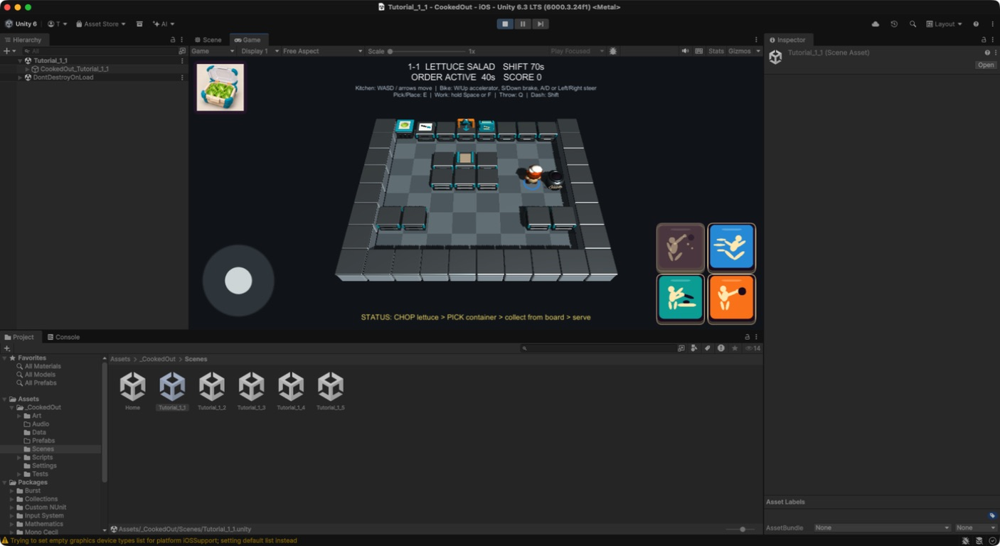

# ビジュアル開発 第23ラウンド — ホテル厨房3D・固定カメラ・操作フィードバック

- 更新日: 2026-09-11
- 対象: 厨房設備3D、厨房固定カメラ、厨房操作UI、プレイヤー識別／操作フィードバック
- 状態: `style_version 1`の実装候補をUnityへ統合済み。横持ちiPhone実機承認待ち
- 制作方式: Blender 5.2.1 LTSの決定的手続き型モデリング、UnityコードネイティブUI／動的3D
- 除外: 画像生成アセット、ゲームロジック、グリッド座標、設備Collider、Item Anchor、レシピデータ、企画正本

## 1. 比較と評価

| 対象 | 修正前 | 今回の実装 | 評価 |
|---|---|---|---|
| 基本作業台と設備 | クリーム／木／濃色を主役にした設備 | 明暗3段階のステンレス、白い天板、ティールの保護部品を共通語彙にした清潔で玩具的なホテル厨房機器 | 固定俯瞰で設備群が同系統に見え、機能色も残る |
| 作業台側面 | 面の分割が小さく、遠景では箱に見えやすい | 前後面に大きな二段引き出しと太い取手を追加 | Gameビューでも作業台の向きと側面が読める |
| 固定カメラ | 設備側面の情報がやや優先される俯角 | 高さ方向を強めた`(0, 1.20, -0.82)`比率、FOV 48° | 下向き内積0.80超を維持し、10×8厨房全体とキャラクターを表示 |
| 行動ボタン | 寸法差と文字ラベルを含む配置 | Safe Area右下に172 px正方形の2×2。左上THROW、右上DASH、左下WORK、右下PICK | 全ボタン同寸。文字を除き、既存役割と入力コールバックを維持 |
| 行動ピクト | 道具中心の記号 | 共通の単純な人型を核に、掴む／走る／包丁で切る／投げる姿勢で区別 | ノンバーバルで、既存作品固有のUIを複製しない |
| 移動スティック | 複数の装飾リング | 半透明ベースとノブだけ | pointer追跡、固定中心、入力値の契約を維持 |
| プレイヤー識別 | キャラクター本体だけ | 足元の半透明リング。1P青、2P赤、3P緑、4P黄。ソロは1P青 | 本体の見た目を変えず俯瞰識別を補助 |
| 動作フィードバック | 入力状態と見た目が直接結び付きやすい | ダッシュ中だけ後方3本の軽量ストリーク。WORKが実際に進んだフレームだけ切る姿勢 | 中断、完了、対象喪失で作業姿勢を即リセット。手持ちソケットと工程データは不変 |

## 2. 保存用制作指示／実装ブリーフ

```text
COOKED OUT! original style_version 1 implementation. Treat this round as kitchen 3D, camera and code-native UI work,
separate from raster image asset production. Build a clean, toy-like hotel-kitchen family from simplified stainless-steel
appliances. Use large readable cabinet drawers and handles on counter sides, restrained teal safety accents, broad forms,
soft bevels and material reuse. Preserve every authoritative grid coordinate, station collider, Item Anchor, recipe datum,
input role and callback. Use no proprietary game's exact equipment, icon silhouette, layout treatment or palette.

For the fixed kitchen view, move modestly toward overhead while keeping the full playable range, characters and equipment
identifiable. In the bottom-right Safe Area, use four equal square buttons in a 2x2 matrix: THROW top-left, DASH top-right,
WORK bottom-left, PICK bottom-right. Ship the four buttons without text labels; communicate with a unified simple humanoid
action-pict family. Reduce the bottom-left joystick to one translucent base and one knob without changing pointer tracking.
Add a translucent player ring (1 blue, 2 red, 3 green, 4 yellow), a low-cost trail visible only during dash, and a chopping
pose only while work genuinely advances. Keep presentation-only objects collider-free and outside logical item sockets.
```

## 3. Blender／Unity反映

- `tools/blender/generate_kitchen_assets.py`を正として、`KitchenProductionAssets.blend`と20 FBXを再生成
- `MAT_Steel`、`MAT_SteelLight`、`MAT_SteelDark`を共有材質へ追加し、Unity側でもmetallic／smoothnessを決定的に設定
- 20件の`Resources/KitchenProduction` PrefabをEditor builderで再構築。Visual PrefabにはColliderを追加していない
- ランタイムfallbackにも同じステンレス、引き出し、天板の語彙を適用
- 厨房カメラ、Safe Area UI、ピクト、スティックを`TutorialSceneBootstrap`／`KitchenHudVisuals`で更新
- 足元リングとダッシュストリークは表示専用コンポーネントとして追加
- 作業モーションの条件を「WORK入力中」から「対象のWorkが実際に成功したフレーム」へ狭めた。工程進捗、選択、手持ち位置には触れていない

## 4. 固定俯瞰での確認




Unity 6000.3.24f1の`Tutorial_1_1` Gameビューで、次を確認した。

- 厨房全域がフレーム内にあり、設備、通路、キャラクターが識別できる
- ステンレス設備の大きな引き出しと機能色が固定俯瞰で読める
- 右下2×2が同寸、指定順、文字なしの人型ピクトになっている
- 左下スティックがベースとノブだけになり、Safe Area内にある
- ソロプレイヤーの青い足元リングが床上で見える
- 画面下のcompile error表示はなく、Play開始／停止が正常に完了する

ダッシュストリークと切断モーションは瞬間表示のため、表示条件／解除条件をPlayModeテストでも固定した。

## 5. 自動検証

- EditMode: 40/40成功
- PlayMode: 39/39成功
- 実行環境: 現在の作業ツリーを`Library`等を除いてクリーン複製し、Unity 6000.3.24f1 batch modeで全件実行
- 追加／更新した検証: 20 Prefabと共有材質、低背ゴミ箱ピクト、固定カメラ俯角、正方形2×2の順序／同寸／文字なし、人型ピクト、簡素スティック、足元色、ダッシュ時のみの表示、無効WORK／完了／中断時の作業姿勢解除
- compile error、テスト失敗なし

ゲームロジック、グリッド座標、設備Collider、Item Anchor、レシピデータ、企画正本は変更していない。

## 6. ハッシュ

- Blender比較プレビュー: `9e3bd3fbeb95c14e4412d19496353f23b39d0422ad6109de7b6fc140b12a8b69`
- Unity Gameビュー証跡: `548750f9c56f80b6692e016bf3497e84458746dd18fe55bfe8e7f3cbd357e086`
- Blender編集正本: `92df4c6362787febd6c409b3bda540575c2b1c6bb950f0fa49846090e9eeed47`
- Blender生成スクリプト: `05b128776c21ee039e8acd54b9309ac616e4aad0ec299bff41bdc5049454c25a`
- FBX 20件のハッシュ一覧に対するSHA-256: `73bb9059a72bb9386296dd4f52848a61eef6afbb13b99c9cb7119bef64e22ae7`

## 7. 実機承認ゲート

- 横持ちiPhoneのノッチ／Home Indicatorを含むSafe Area追従と、左右親指の到達性
- 4ボタン同時入力、スティックpointer追跡、指を外したときの復帰
- ダッシュストリークと短い切断動作が30 fps端末でも過剰点滅せず読めること
- 2〜4人表示時の青／赤／緑／黄リングの識別性と色覚多様性への補助要否
- 20 Prefab、半透明リング／ストリークを含むdraw call、GPU時間、memory、30 fps維持

