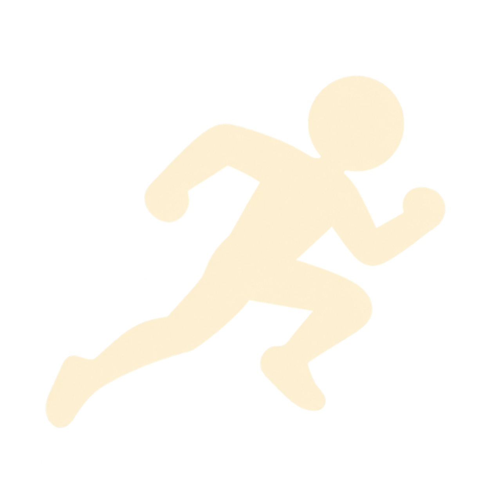
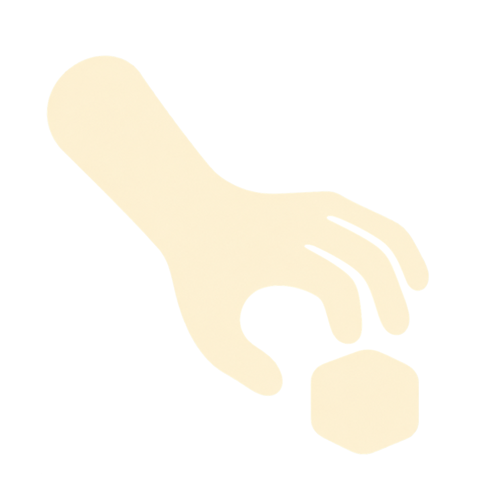
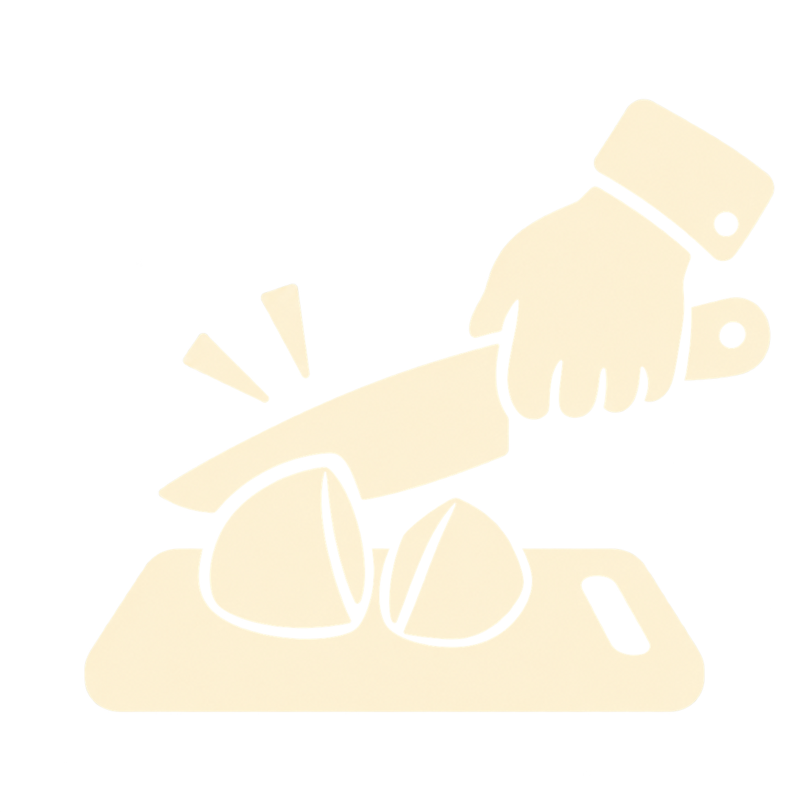
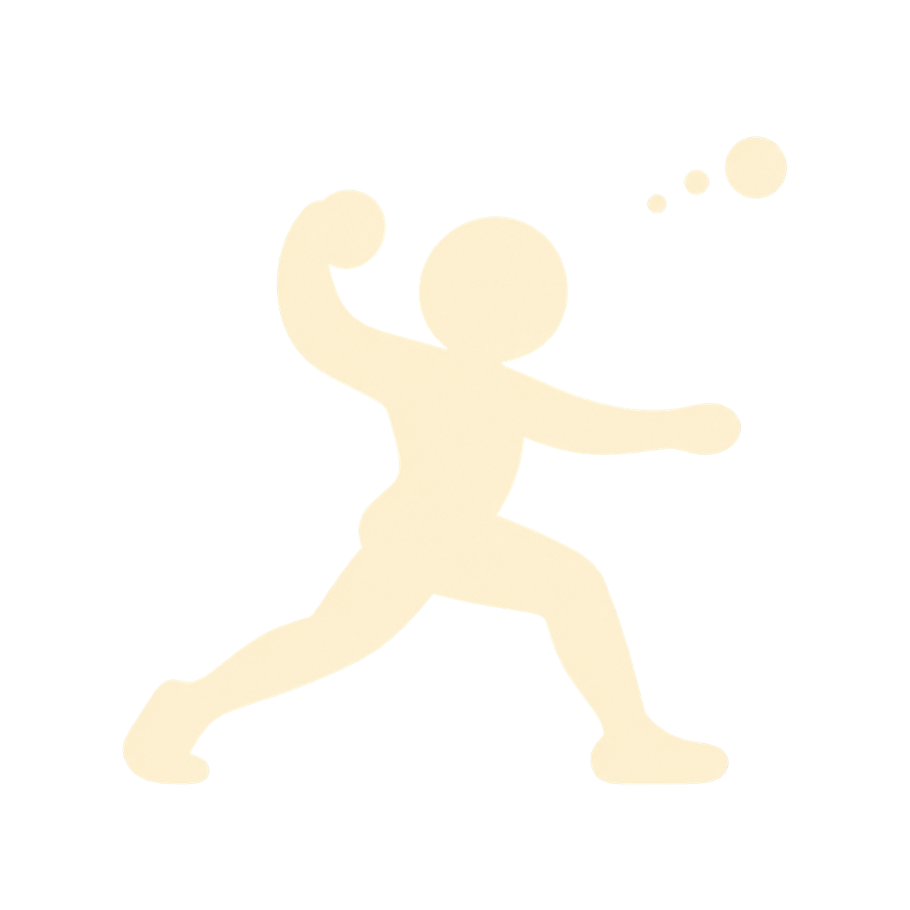
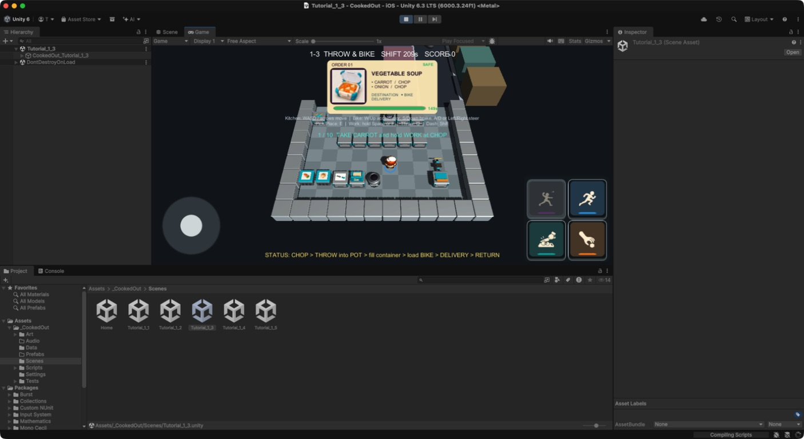

# ビジュアル開発 第24ラウンド — 行動シルエットUIと明色ステンレス厨房

- 更新日: 2026-09-11
- 対象: `DASH`／`PICK`／`WORK`／`THROW`の行動ピクト、ホテル厨房のステンレス色、完成した鍋・フライパンから配達容器への移し替え
- 状態: `style_version 1`の新規画像をUnityへ統合済み。横持ちiPhone実機承認待ち
- 制作方式: OpenAI画像生成、Blender 5.2.1 LTSの決定的手続き型モデリング、Unity Runtime UI
- 除外: 人間キャラクター、既存作品固有のキャラクター／衣装／UI／配置／配色、企画正本、グリッド座標

## 1. 参照の扱い

ユーザー提供の4点は、行動の意味と重心だけを読む第三者参照とした。画像ファイルを複製、切り抜き、トレースせず、各ピクトを別の輪郭、比率、手足の曲率で新規生成した。

| 行動 | 読み取った意味 | 新規設計で変えた点 |
|---|---|---|
| `DASH` | 前傾して右へ走る | 頭を大きくし、腕脚を太い丸形にまとめた玩具的ランナー |
| `PICK` | 開いた手で下方を掴む | 手首から先を短くし、指を丸い3本形状へ単純化 |
| `WORK` | まな板と包丁 | 人物を置かず、傾いた包丁、野菜、楕円まな板の3要素へ整理 |
| `THROW` | 踏み込んで投げる | 大きい頭、幅広い脚、後方へ残る腕で独自の弧を作った |

参照URL:

- `DASH`: <https://thumb.silhouette-ac.com/84/8411d4014a0e3b451497b31c912d689b_w.jpeg>
- `PICK`: <https://previews.123rf.com/images/gigisomplak/gigisomplak1812/gigisomplak181200003/114975014-silhouette-of-hand-pick-or-grab-something.jpg>
- `WORK`: <https://thumb.ac-illust.com/91/91ca82ae216e98a7c4b9787498d3d963_w.jpeg>
- `THROW`: <https://encrypted-tbn0.gstatic.com/images?q=tbn:ANd9GcSJ-f9JT5RM3UHQEJHAAvm-ysHoCMIuCTRT3nC05AXBdgHNaM1v40zOje2k&s=10>
- 厨房色: <https://media.istockphoto.com/id/683955146/ja/%E3%83%99%E3%82%AF%E3%82%BF%E3%83%BC/%E3%83%AC%E3%82%B9%E3%83%88%E3%83%A9%E3%83%B3%E3%81%AE%E3%82%AD%E3%83%83%E3%83%81%E3%83%B3-%E3%82%A4%E3%83%B3%E3%83%86%E3%83%AA%E3%82%A2%E3%81%A7%E3%81%99%E7%AD%89%E5%B0%BA%E6%80%A7.jpg?s=612x612&w=0&k=20&c=My_HnPGsai9fGzX9C0qm5BPGAtwJTogAG9zjOCkcPj4=>

## 2. 画像比較と採用

| 行動 | 画像 | 小サイズでの読み | 判定 |
|---|---|---|---|
| `DASH` |  | 前傾、上げた膝、後ろ脚の三点で即読できる | 採用 |
| `PICK` |  | 手の向きと開いた三本指が主役になる | 採用 |
| `WORK` |  | 包丁、野菜、まな板が重ならず読める | 採用 |
| `THROW` |  | 振りかぶりと踏み込みが走り姿勢と混同しない | 採用 |

4点は、暖かいアイボリー単色、太い丸形、細部を減らした面、同程度の余白で統一した。Unityでは各PNGを512×512 RGBAへ決定的に縮小し、ボタン面の色タブだけで役割色を補助する。



## 3. 画像生成プロンプト

共通条件:

```text
COOKED OUT! original action pictogram for style_version 1. Create one new flat silhouette icon on a fully transparent background.
Use one solid warm ivory color #FFF4D6, chunky rounded toy-like geometry, generous clear margin, strong readability at 96 px,
no text, no letters, no button frame, no panel, no outline, no shadow, no logo, no watermark. Use the supplied stock image only
as a semantic reference for the action; do not copy, trace, reproduce, or closely imitate its exact silhouette, anatomy, proportions,
clothing, layout, or visual treatment. Do not reproduce any proprietary game's icon or UI.
```

行動別追記:

```text
DASH: A cute simplified figure running quickly to the right, large round head, strong forward lean, one high bent knee,
one rear leg extended and two compact counter-swinging arms. Make the pose distinct from throwing.

PICK: A single chunky forearm and open hand reaching downward to grasp an object, rounded palm, three clearly separated
rounded fingers and one thumb. No object and no human body.

WORK: A chunky kitchen knife cutting one small vegetable on a simple oval cutting board. Separate the three large shapes,
avoid realistic fingers, blood, sharp detail or a human figure.

THROW: A cute simplified figure in a wide forward step throwing to the right, large round head, one arm raised behind the head,
the other arm counterbalancing, broad planted front leg and stretched rear leg. Make the pose distinct from running.
```

- 生成元: `/Users/takuto/.codex/generated_images/01a08e75-2758-79f1-a2ac-4f8c83d22c0d/`
- 人手修正: 原寸PNGの画素修正なし。Unity用のみ決定的な512×512縮小

## 4. ステンレス厨房の色修正

第三者参照から「明るい中立グレー、白に近い天板、弱いコントラスト」だけを抽出した。設備形状、引き出し、識別部品、グリッド配置は既存のCOOKED OUT!設計を維持している。


- 金属は3段階の明色グレーへ変更し、metallicを0.48、roughnessを0.42へ調整
- 床は設備より一段暗い青みの低いグレーとし、床と設備が白飛びしない差を確保
- ティールの機能色、木箱、食材色、アイボリーまな板は維持
- `KitchenProductionAssets.blend`、20 FBX、20 Resources Prefabを再生成
- 画像内の設備座標は実装仕様にせず、ステージのグリッドデータを正とする

## 5. Unity実装

- 旧コード生成の人物ピクトを削除し、`Resources/ActionIcons`の4画像をRuntime Spriteとして読み込む方式へ置換
- 右下2×2は、左上`THROW`、右上`DASH`、左下`WORK`、右下`PICK`を維持。全ボタン同寸、文字なし
- 面は濃いチャコール、細い鋼色アウトライン、下端の役割色タブへ再設計。旧グロス装飾は廃止
- 完成した鍋／フライパンがコンロ上または作業台上にあるとき、配達容器を持って対象へ合わせると内容物を移せる
- 配達容器が作業台上にあるとき、完成した鍋／フライパンを持って容器へ合わせても同じ移し替えができる
- 移し替え成功時は容器を満たし、鍋／フライパンを空にする。失敗理由は既存ドメイン規則を表示し、両アイテムを失わない

## 6. 検証

- EditMode 40/40成功
- PlayMode 42/42成功
- 鍋とフライパンについて「作業台上の調理器具＋手持ち容器」と「作業台上の容器＋手持ち調理器具」の両方向を自動検証
- 既存のコンロ上からの移し替えテストも継続成功
- Unity Gameビューで4画像の透明背景、縦横比、2×2順序、旧人物パーツの不存在、色タブを確認
- Blenderプレビューで床、設備、天板の明度差と食材／機能色の識別を確認

## 7. ハッシュ

- `DASH`原寸: `7cba65a5e6596621bfac63cb19b48b10e1b6af76ec3d66157c5e725c6a69682b`
- `PICK`原寸: `973327db6d6fb4fe64bfc5509170658640c6c5782aade35cf980d570a934af40`
- `WORK`原寸: `02cf7dd14c79ce0c72664fb2d261fbb5661e9019e6ba4aacb7fd15858a664502`
- `THROW`原寸: `d7ec56a0858dd663f262de9380bc26cdab5ef8bab0eaa20900af790850f88dac`
- Unity用512 px: `DASH 3a0152a30d3889e9b51bbdf66a7f2b7526cd1def9ea02d92b9f0da5084e8f225`、`PICK a67b7281ee6e718e58d0d6263857bbd9503e1bbb51f913003b0885d9afef88eb`、`WORK 5e4d5a42ef7deaaba1c4d623fbdc0977e7473002c48652cd31df875492e9e9a0`、`THROW d73b81906dcfc2a7ab78f19bedd52e069726c4b589c940062d06233110f8c25e`
- Unity Gameビュー証跡: `96b4cead88e67952667d23fdc83a4ffc371bcb17373bbae6a10541f6b3c0abf3`
- Blender比較プレビュー: `f5c96b74efb07499a3986234ecbd03b59b381750419b9b27a0216b7a8516ab25`
- Blender編集正本: `65822ff9013359d7374a94d4a909a0bcb175730aada20214bcd46e9b27256ba1`
- Blender生成スクリプト: `af66925dd0e9d5764aea09da364ab0a2b5964c2985fb80e7ba316d933c21ea91`
- FBX 20件のハッシュ一覧に対するSHA-256: `cf85dc40baa1fbb26a0ee6f1151ae5c87051c4fc9314d8cd46d9c5f015038993`

次の承認ゲートは横持ちiPhone実機で、96 px前後の4シルエットが親指の遮蔽下でも誤読されず、明色ステンレス設備と床の境界が通常輝度で見えることを確認する。
