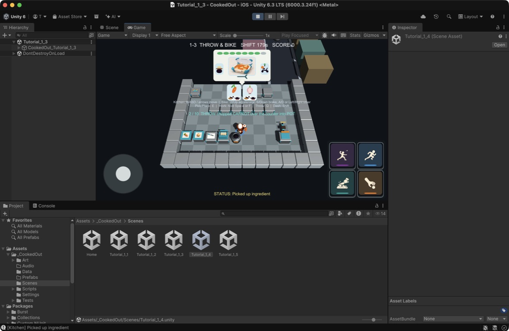

# ビジュアル開発 第25ラウンド — 原料一覧と設備前方向

- 更新日: 2026-09-11
- 対象: ワールドアイテム上の原料表示、設備Visual Root、原料箱、容器供給設備
- 状態: Unity統合済み。横持ちiPhone実機承認待ち
- 非変更範囲: レシピ、工程判定、グリッド座標、`GridDirection`値、設備Collider、Item Anchor

## 1. 修正内容

| 指摘 | 修正 |
|---|---|
| 鍋／フライパンの原料表示が小さい | 原料バッジを直径0.50 mへ拡大。中心を±0.30 mへ置く2×2配置とし、4個でも1.6 mの1グリッド内へ収めた |
| 加工品で元原料が分からない | 切断済み／加熱済みの単品には元原料1個、材料入り容器には現在の構成原料一覧を上部表示。未加工の生原料と空容器には表示しない |
| 原料箱／容器などの向きが逆 | 設備の論理ルートは回さず、`Station Visual Orientation`だけを既存`GridDirection`へ合わせた。製品Prefabの基準前面はlocal -Z |
| 容器置き場所が分かりにくい | 容器供給設備を、後部ラック、暗色ピックアップベイ、手前へ張り出すティールの取り出しリップ、積層した空容器へ再設計 |

原料表示は既存の食材色と形状ピクトを再利用する。内容物やレシピを増減せず、表示側が既存の`IngredientItem`、鍋内容、フライパン内容、容器Componentsを読むだけとした。

## 2. 向きの実装規則

Blender製品設備と手続き型fallbackの前面をlocal -Zへ統一した。配置時はVisual Rootだけを次の角度で回す。

| `GridDirection` | Visual yaw | 前面 |
|---|---:|---|
| South | 0° | -Z |
| North | 180° | +Z |
| East | -90° | +X |
| West | 90° | -X |

`Station Body`、Collider、Item Anchor、station本体Transformはidentityを維持する。

## 3. 制作確認

- Blender 5.2.1 LTSで編集正本、20 FBX、比較プレビューを再生成
- Unity 6000.3.24f1で20 Resources Prefabを再構築
- `Tutorial_1_3` Gameビューで、North向きの原料箱／容器供給設備とSouth向きの鍋設備が互いに180°異なる正しい前面を持つことを確認
- 未加工の手持ち原料には冗長な原料バッジが出ないことをGameビューで確認
- 加工済み単品、鍋4原料、完成容器4原料の上部表示はPlayModeテストで確認

## 4. 自動検証

- EditMode: 40/40成功
- PlayMode: 44/44成功
- 追加検証: 生原料は表示なし、加工済み単品は元原料1個、4原料は2×2、全バッジが1グリッド内、完成容器も4原料を保持
- North／South両向きのVisual Root、station／Item Anchorのidentity維持を検証
- ContainerDispenserのRenderer数は既存モバイル予算6以下を維持

## 5. ハッシュ

- Blenderプレビュー: `7d83f4d25ac30f421e8c4ab8029e35fbc6cf7df543ccdd2d9ca03e48bc1df1eb`
- Unity Gameビュー証跡: `80911aa09ab7ee51d5ab317c108d67f7dc42cd4a2133162ff41292967d24a936`
- Blender編集正本: `af50061f043e3337ba3b95aad612f521e02a54dfaf3337b0257713c6aebe7557`
- Blender生成スクリプト: `8558f08a246a4de6aa9f8d3253b45cc68fc5bbd867126ccaf559aa1a7082c7af`
- FBX 20件のハッシュ一覧に対するSHA-256: `73508bf74c01c815688ffd11c64a63b48d3640e33878692bedfd3fe5c0ecfba5`

## 6. 実機確認ゲート

- 通常プレイ距離で2×2原料一覧の色と形が識別できること
- 背の高いキャラクターが手持ち品の原料一覧を過度に隠さないこと
- North／South設備の取り出し側がタッチ操作時の接近方向と一致すること
- 4バッジ表示時のdraw call、overdraw、30 fps維持

