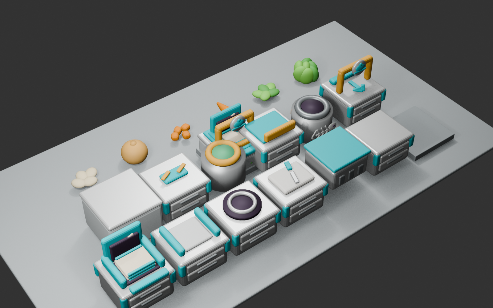

# ビジュアル開発 第28ラウンド — 高速切断と包丁方向修正

- 更新日: 2026-09-11
- 対象: 包丁の切断テンポ、まな板上の包丁方向、切断所要時間
- 状態: 第30ラウンドのプレイヤー方向追従・振幅拡大により更新
- 非変更範囲: レシピ構成、設備Collider、Item Anchor、グリッド座標

## 1. 比較と評価

| 項目 | 第27ラウンド | 第28ラウンド | 評価 |
|---|---:|---:|---|
| 切断周期 | 1.8回/秒 | 5.4回/秒 | 直前の3倍へ高速化し、3秒間の作業中に連続切断が見える |
| 切断所要時間 | 0.75秒 | 3.0秒 | 短い一押しで完了せず、長押し作業として読める |
| 包丁方向 | 旧方向 | まな板中心基準で90°回転 | 刃と振り下ろし面を正しい向きへ修正 |
| 最大上昇量／角度 | 0.30 m／62° | 維持 | 上下動の読みやすさを維持 |

切断テンポとゲーム内作業時間は別の値として管理する。5.4回/秒の包丁アニメーションを約3秒続けても、ドメイン側の進捗が3秒へ達するまでは切断完了にしない。

## 2. 実装ブリーフ

> 包丁アニメーションを直前版の約3倍へ高速化する。食材の切断完了には約3秒の連続作業を必要とする。包丁はまな板中央を基準に90°回転し、柄元の支点も同じ回転で移動させて刃をまな板上へ保つ。新しい刃方向から振り下ろし軸を計算し、上下幅と持ち上げ角は維持する。設備Collider、Item Anchor、グリッド座標は変更しない。

今回は画像生成を行っていない。Blenderの手続き型3D再生成とUnityコードの調整で制作した。

## 3. 方向修正

Blender側では、柄元ピボットをまな板中央の周りに90°回転させた。

| 設定 | 旧 | 新 |
|---|---:|---:|
| Blender XY位置 | `(-0.45, 0.197)` | `(-0.197, -0.45)` |
| Blender Z回転 | `-18°` | `72°` |
| Unity Prefab Z回転 | `18°` | `-72°` |

角度差はいずれも90°である。製品FBXを利用できない場合のUnity fallbackも、XZ位置を`(-0.18, -0.44)`、Y回転を`108°`へ変更した。

## 4. Unity実装

- `ChoppingKnifeMotion.CutsPerSecond`を1.8から5.4へ変更
- `IngredientItem.RequiredChopSeconds`を0.75秒から3.0秒へ変更
- 上下移動0.30 mと持ち上げ角62°は維持
- 包丁の現在方向から回転軸を再計算する既存処理を維持
- Blender編集正本、20 FBX、20 Resources Prefabを再生成

## 5. 自動検証

- EditMode: 41/41成功
- PlayMode: 46/46成功
- 切断所要時間が3.0秒であることをEditModeテストで固定
- 1回のモーションが約0.185秒であることをPlayModeテストで固定
- まな板ローカル空間で包丁軸が旧X方向ではなく新Z方向を主成分に持つことをPlayModeテストで確認
- 空のまな板では動かず、有効作業中だけ動作し、完了後に初期姿勢へ戻ることを確認
- 最新のUnityコンパイルログに`error CS`、`NullReferenceException`、`MissingComponentException`なし

## 6. ハッシュ

- Blenderプレビュー: `17db5ec214ce3995fe89caa9db40d1e9abd4774851c0025b21ab8fd4305794bb`
- Blender編集正本: `65a484d4bbed740c37a526fdce8279f4761837cea142c8f37de05c4cfcd08798`
- Blender生成スクリプト: `bc42a05ad5d4081ac1b288cde75e226db6d18c1ea4fc3fec2bc07e72bd30a421`
- ChoppingBoard FBX: `98340607586ba04bade8fdbfb85f9b46067186bf06a1305c8de2ade08b44a7bf`
- ChoppingBoard Unity Prefab: `4cb2a005c6ffc3788a0fda633801a20106d650b746c0568c1c15240c9c74f3a0`
- Unityモーション実装: `1ae6b2bad6268bda5e4cc22ac9748be974db8ad9433af25f2b2b7bc43ca9f2bd`
- 食材工程実装: `e62ba4366e3d27b2ec08a27bd445bcebed4c5b35bcbc25e0d90039de2f82b50f`
- FBX 20件のハッシュ一覧に対するSHA-256: `6cb0ebb8049a4599e33c9cce530cb43ec1a79a153378964137eb6c3c66b3a9e1`

## 7. 実機確認ゲート

- 5.4回/秒でも包丁が震えているだけに見えず、切り上げと切り下ろしを認識できること
- 3秒間の長押しが操作テンポとして長すぎないこと
- 新しい90°方向が厨房内の接近方向と合っていること
- 4人プレイ時も30 fpsと既存描画予算を維持すること
