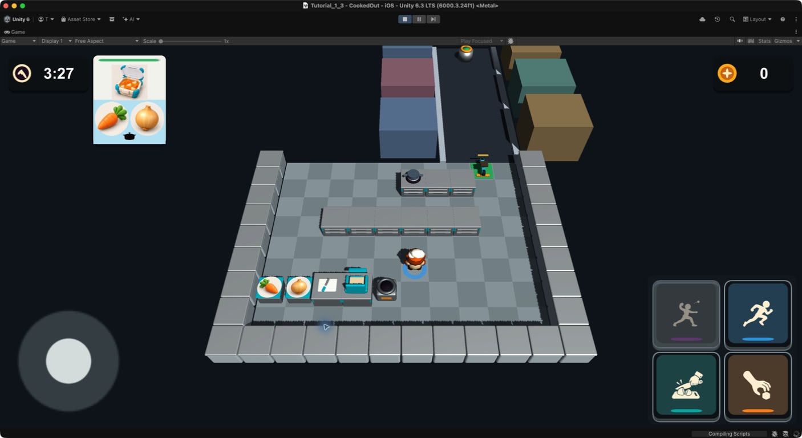

# ビジュアル開発 第31ラウンド — ダッシュ煙・容器蓋・注文票・バイク後退

- 更新日: 2026-09-12
- 対象: プレイヤーフィードバック、完成容器、注文票、配達操作UI
- 状態: Unity統合済み。横持ちiPhone実機承認待ち
- 非変更範囲: ダッシュ速度／時間、プレイヤーCollider、料理内容、レシピ、設備Collider、Item Anchor、グリッド座標

## 1. 比較と評価

| 項目 | 変更前 | 第31ラウンド | 評価 |
|---|---:|---:|---|
| ダッシュ後方演出 | 青い速度線3本 | 速度線3本＋半透明煙玉5個 | 固定俯瞰でも加速方向と瞬発感を読める |
| プレイヤー床リング | 外半径0.62 m、線幅0.15 m | 外半径0.70 m、線幅0.255 m | 半径を少し広げ、線幅を正確に1.7倍化 |
| 完成容器の蓋 | 透明板＋前縁のみ | 透明度18%の窓、四辺フレーム、取っ手 | 蓋として読め、中身も確認できる |
| 注文票の原料写真 | 128 px | 90 px | 約29.7%縮小 |
| 注文票の完成品写真 | 120 px | 132 px | 10%拡大 |
| バイク下降入力 | ブレーキ | 後退 | 前進を止めた後、最高3.2 m/sで後退 |
| 下降ボタン | ブレーキの二本線 | 下矢印 | 文字に依存せず移動方向を伝える |

## 2. 実装ブリーフ

> ダッシュ中はキャラクター背後へ軽い煙を発生させ、既存速度線と併用する。床リングは色と非干渉性を保ったまま少し広げ、線幅を1.7倍にする。完成容器は透明な中央窓、四辺フレーム、取っ手を備え、中身が蓋を突き抜けず見える高さへ収める。注文票は原料写真だけを約30%縮小し、完成品写真だけを10%拡大する。バイクの下降入力は停止専用ブレーキから後退へ変更し、ボタンは下矢印ピクトにする。

画像生成は行っていない。既存のUnityプリミティブ、透明材質、コード生成UIだけで構成した。

## 3. Unity実装

- ダッシュ煙は5個のColliderなし半透明Sphereを位相差で拡大・後方移動・フェードさせる
- ダッシュ終了時は煙Rootを非表示にし、ダッシュ判定や速度には影響させない
- リング外半径を0.70 m、内半径を0.445 mとして線幅0.255 mを確保
- 完成容器の食材Rootを0.30 mへ下げ、透明窓より下へ収める。未完成容器の表示高さは従来通り
- 注文票の原料マスクを90 px、原料画像を92 px、完成品画像を132 pxへ変更。既存の注文票全体70%スケール適用後は原料マスク63 px相当となり、変更前の89.6 px相当から約30%縮小
- `BikeControl.Reverse`を下降入力へ割り当て、前進中は13 m/s²で制動、停止後は6 m/s²で後退加速する
- 後退ボタンは`KitchenActionIcon.Reverse`の下矢印を表示し、入力の押下／解除追跡を維持

## 4. Gameビュー確認

- `Tutorial_1_3` Gameビューで、完成品写真が原料写真より強く見える新しい大小関係を確認
- プレイヤー床リングの外径と線幅が固定俯瞰で読めることを確認
- ダッシュ煙、完成蓋、後退移動、下矢印はPlayMode回帰テストで状態と階層を確認

## 5. 自動検証

- EditMode全体: 44/44成功
- PlayMode全体: 49/49成功
- ダッシュ煙5個、Colliderなし、ダッシュ時だけ表示
- リング外半径0.70 m、線幅0.255 m
- 完成容器の閉蓋、透明度20%以下、四辺フレーム、取っ手、中身の蓋下収容
- 原料写真90 px、完成品写真132 px
- タッチ下降入力、前進制動、負速度への遷移、実際の後方移動、最高後退速度、下矢印ピクト

## 6. ハッシュ

- Gameビュー証跡: `d77feae0fd7be1fe5037404a683ee0a046b869e5e0d494fbf389cb9288d4ecdf`
- プレイヤーフィードバック: `794cdc8753978b5b07ddf4c4da3ed18a26ee197256b6f83255ccf0f4b6d95bc1`
- バイク走行: `2652dae758f2beb6fb9edd652fa149184d4c64de203ec9e5c1f756b4ecab3e95`
- 注文票／ピクト: `fbf043389965df57f772e9e4f84a3692a3cbd27c6691232b384acb287b6069da`
- 完成容器: `b0c03b042ad8cdf4e70cfe8e7a71c9ffbc05db16995fe5099fba6b0abef7b283`
- 入力Router: `60e0871569cadba93e23f0b0bbf66d00414f00eef308c9384e1fa50ac48d753a`
- HUD構築: `36001c8bc26f6497f05951b82f109fe118ddcaef028f960b73c36ef74ba8016a`
- PlayModeテスト: `57c25b0ee365948d3f2318b8e6dc5a321da4251e666a3e94edf3f94f31ee7b91`
- EditMode結果XML: `c8cf7cdedb2c4161e566e5af07b99629e8dc1a8a025fddf94b299f6e66cd2a94`
- PlayMode結果XML: `b01ebfc96a1e1caf8490a264b702da1ebaeda9bf8ba7a1025da45f4b19b33aac`

## 7. 実機確認ゲート

- 煙5個が4人同時ダッシュ時もちらつかず30 fpsを維持すること
- 太くした床リングが狭い通路や設備選択表示を隠しすぎないこと
- 完成容器の透明窓越しに各料理の色と形が識別できること
- 原料90 pxが最小対応iPhoneで識別でき、完成品132 pxが票からはみ出さないこと
- 後退ボタン長押しと左右操舵の同時タッチ、前進から後退への切替感を確認すること
