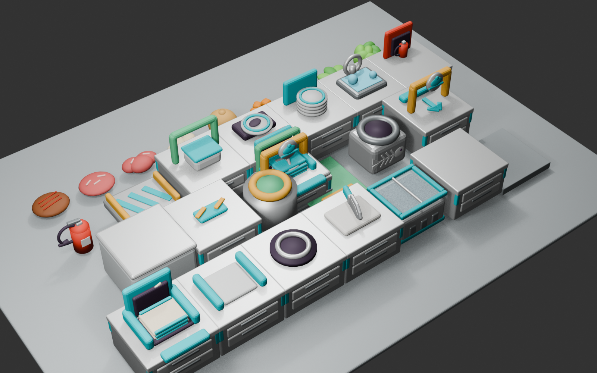

# Visual Development Round 33 — 冷凍ケース・カット刻み・連続注文

## 1. 反映内容

- 原料箱を、接地した断熱キャビネット、冷却槽、ティール色の外周、中央レール、2枚の透明スライド蓋を持つ冷凍ケースへ変更
- ケース上の`IngredientSourceCards`円形表示を従来の75%（1.34 mから1.005 m）へ縮小し、ガラス蓋の直上へ接地
- まな板上の包丁は柄と刃を少し重ね、待機時にも一体の道具として見える形状へ修正
- カットを0.25秒ごとの離散処理へ変更。1カットごとに進捗を1段進め、ゲージをまな板上方へ配置
- ゴミ箱を投擲先として受け付け、近い投擲軌道だけを既存補正で吸着して破棄
- 全チュートリアルを時間制営業へ変更。初期1件、15秒間隔、最大5件の注文票をタイマー右側から並べ、1皿提供では終了しない
- 失効票は0.65秒の横揺れ、縮小、フェード後に注文列から除去

## 2. 制作正本

3D変更は`tools/blender/generate_kitchen_assets.py`を正として、Blender編集正本、20 FBX、20 Unity Resources Prefabを再生成した。透明蓋には専用`MAT_Glass`を追加し、URP透明サーフェスとしてUnity側で再構築する。

## 3. 検証

- EditMode: 44/44成功
- PlayMode: 49/49成功
- 確認対象: 連続注文、最大表示数、提供後の営業継続、失効票退場、0.25秒カット刻み、投擲ゴミ箱、原料写真寸法と接地、全既存チュートリアル

## 4. ハッシュ

- Blenderプレビュー: `83dc43ea53b028b1aa631f1abd21a4e81fae65de5186e5a0644ad67802c78b00`
- Blender編集正本: `a5e2b430a5f408e2a44b301df0560df8ee66a857f241bb1b0b90a5ce8d6c94a0`
- Blender生成スクリプト: `5db48d67d4d6fd64641fb4c56623d2979c4079485e6e1fcfee67ec6ee89c22b2`
- IngredientCrate FBX: `3af77c0f99a8f34ce04230e3ba73f1452bb9769993c1407fe95eeb11c793f31c`
- ChoppingBoard FBX: `d097315fc7da005aea45cc0ba2e70cf087090464799aa2989b877516d8889fda`
