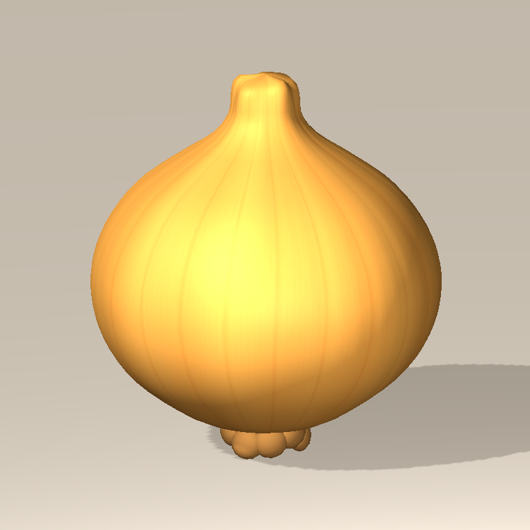

# 第44ラウンド: 添付たまねぎ画像の3D化とUnityアニメーション

- 日付: 2026-09-13
- style_version: 1
- 入力正本: `concepts/onion_user_reference_20260913.png`（ユーザー添付を原寸保存）
- 実装: `Resources/KitchenProduction/OnionRaw.prefab`を差し替え済み
- 状態: Unity描画とPlayMode 55/55成功。ユーザーによる造形の見た目確認待ち

## 制作ブリーフ

> 添付の金色の玉ねぎを形状・色の基準にする。ふくらんだ丸い胴体から細い首までを一続きの滑らかなメッシュにし、薄い縦の皮筋と繊維、丸い首先、短く折り重なった根を再現する。元画像を平面へ貼る方式ではなく、どの方向からも厚みと陰影がある立体にする。新しい人間、顔、文字、装飾は付けない。ゲーム内では生成時に0.6秒だけ小さく弾んで静止し、確認用には4秒の一周回転アニメーションを別に持つ。

1枚の静止画から見えない背面・底面は、見える側の形状を基に補完した。元画像と画素単位で同一のレンダリングや、画像に存在しない動作の復元を意味しない。

## 比較・修正

| 比較対象 | 以前 | 今回 |
| --- | --- | --- |
| 輪郭 | 球、独立した茎3個、外付けの太い筋 | 胴体、肩、首を一体化した回転面メッシュ |
| 縦筋 | 8本のチューブ | 22本の浅い溝と専用UVの金色の皮筋 |
| 根 | 小さな球 | 9個の丸い根と中心部を短く折り重ねた立体 |
| マテリアル | 共通の単色 | 1024px専用アルベド、適度な光沢、根用材質 |
| 初稿評価 | 赤すぎる皮と強い繊維、角張った首 | sRGB二重変換を解消し、繊維を減らして首先に細かい頂点列を追加 |
| アニメーション | 静止Prefab | 0.6秒の小さな弾みと静止、確認用4秒回転クリップ |

## アセットと再生成

- Blender編集正本: `art-source/kitchen/OnionReference.blend`
- 生成定義: `tools/blender/onion_reference.py`
- FBX: `Assets/_CookedOut/Art/KitchenProduction/Models/OnionRaw.fbx`
- Unity実装Prefab: `Assets/_CookedOut/Art/Resources/KitchenProduction/OnionRaw.prefab`
- テクスチャ: `Assets/_CookedOut/Art/KitchenProduction/Textures/onion_reference_skin_sv1.png`
- クリップ: `Assets/_CookedOut/Art/KitchenProduction/Animations/OnionSettle.anim`、`OnionTurntable.anim`
- 元のPrefabとFBXのGUIDは維持。生玉ねぎを箱から取り出す既存経路で自動適用される。
- 11,648三角形、2 MeshRenderer、2材質。1資産12,000三角形の制約内。
- パッケージ: Unity標準 `com.unity.modules.animation@1.0.0` をPackage Manager APIで有効化。
- `generate_kitchen_assets.py`も同じ玉ねぎ生成関数を使うため、厨房全体の再生成時に以前の形へ戻らない。

```sh
/Applications/Blender.app/Contents/MacOS/Blender --background --python tools/blender/onion_reference.py
```

続けてUnityメニュー `COOKED OUT! > Build Reference Onion Prefab` を実行。確認用画像・フレームは `COOKED OUT! > Capture Reference Onion Preview` で生成する。`tools/build_onion_animation_preview.py`でUnity描画フレームをGIFへまとめる。

ゲーム内では`OnionSettle`だけが自動再生される。回転を確認する場合はPrefabのAnimationコンポーネントで`OnionTurntable`を再生する。どちらも`Onion Presentation`という見た目専用の子Transformだけを動かす。

## 検証

- Unity 6000.3.24f1、接続先 `/Users/takuto/development/CookedOut` でPrefabを実生成。
- 現在のC#コンパイルエラー: 0。Animationモジュール不足による初回エラーは有効化後に解消。
- 全PlayModeテスト55件成功（16.68秒）。原料箱、切断、鍋、運搬、提供の既存経路を含む。
- 新規テストは実際のゲーム内生成経路で玉ねぎを作り、アニメーション途中の形状変化、0.6秒後の原形復帰、再生終了、アイテム位置・方向不変を検証。
- 画面外でアニメーションが止まらないようAlwaysAnimateにし、短い一度きりの再生が完了することを確認。
- Unityに実装したPrefabと`.anim`を使って静止画と75フレームの動画用画像を描画。
- 確認用シーンは一時的に開いて破棄し、元のアクティブシーンへ復帰する。制作プレビューの照明は厨房シーンへ保存しない。
- 新しいiOSビルド・物理端末での描画確認はこのラウンドでは未実施。

## プレビュー




Blenderの前面・側面・背面は `concepts/onion_reference_sv1_blender_{front,side,back}_v1.png`。

## SHA-256

- 入力画像: `f923d05ba5474c7b16998d520f1b4112cb3c9dd632c32e2c9430fab5b510167a`
- FBX: `43daa24451094cfb29cb05bddca01d73c9977450256d44ed26125d8cedc4fee9`
- Prefab: `9e7bcb2384b9cda3941abdd3434af5a98ed33aef5c7f06cc3f823f8b13b0a451`
- アルベド: `e5208f7c70b76c0188b7eea80ee61cadcc7d9b2e52a14c61824bad725427a765`
- Blender: `eb450fce2d764a6b2b3af1d822c9c46d23a69a903c27c79be37c855acd35102b`
- Settle clip: `34acb1209858bb74dc1da4aa9ecc21671c69e29a5e352d147fdeed267875a97e`
- Turntable clip: `88278ef24dff1563a72d5568bc92308e8305587955e3da8b05545c06425f6105`
