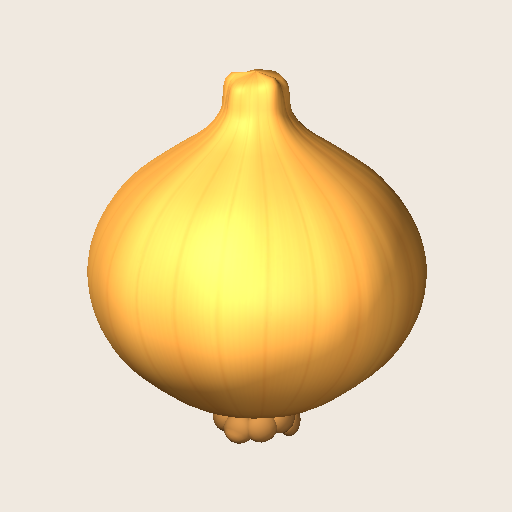

# 第45ラウンド: 3D玉ねぎに合わせたIngredientSourceCards更新

- 日付: 2026-09-13
- style_version: 1
- 新アイコン: `Assets/_CookedOut/Art/Resources/IngredientSourceCards/ingredient_onion_source_card_sv3.png`
- 元画像: `Assets/_CookedOut/Art/Resources/IngredientSourceCards/ingredient_onion_source_card_sv2.png`（画像・metaとも変更なし）

## 制作ブリーフと比較

> 第44ラウンドで実装した玉ねぎPrefabをそのまま撮影し、輪郭・金色の皮・縦筋・根が同じに見える512×512の原料カードを作る。既存カードに合わせた暖色の白背景に中央配置する。元の玉ねぎ画像は上書きせず、sv3を追加して参照を切り替える。

| 対象 | 旧sv2 | 新sv3 |
| --- | --- | --- |
| 玉ねぎ | 3Dモデル制作時の参考イラスト | 実装済みOnionRaw PrefabのUnity直接描画 |
| 保存 | 元のファイル名とGUIDを維持 | 別ファイル・別GUIDで追加 |
| 使用箇所 | 保存用 | 原料箱、注文票、加工品・鍋・料理上の含有原料表示 |

評価: 3Dモデルと同じメッシュ・テクスチャ・材質から描画することで、別の玉ねぎの形が表示される差を解消した。カードでは床と長い落ち影を外し、白丸へ収めた時も輪郭を読みやすくした。

## 実装と再生成

- `OnionReferencePreview.BuildSourceCard`にカード専用の512px撮影・Unityインポート処理を追加。
- Unityメニュー: `COOKED OUT! > Build Reference Onion Source Card`。
- 制作記録用の同一PNG: `docs/art/concepts/ingredient_onion_source_card_sv3_unity_v1.png`。
- `TutorialSceneBootstrap`、`KitchenHudVisuals`、`WorldItems`の玉ねぎ参照をsv3に統一。
- 原料箱・注文票・複数原料表示の既存テストの期待する画像名をsv3へ更新。
- 実行中の原料箱1箇所、注文票5枚、ワールド表示の材質2個も更新。

## 検証

- Unityでsv2・sv3両方のResourcesロードが成功。sv3は512×512。
- 新しく生成した加工済み玉ねぎの含有原料表示がsv3を使用することを実行中のUnityで確認。
- 原料箱1箇所・注文票5枚のテクスチャ参照がsv3に揃っていることを確認。
- 元PNGのSHA-256は変更前後とも `f923d05ba5474c7b16998d520f1b4112cb3c9dd632c32e2c9430fab5b510167a`。
- 元metaのSHA-256は変更前後とも `fedbbfb842477b0e6d6000846d36ac4c9f20576dd16fded5f3bf318aa1f895cb`。
- 新PNGのSHA-256: `c5492b4ef6cb13b4ce220a3cd1d24b9b61b5451a530783710805af450b3712cf`。
- このラウンドでは実行中の表示と新規生成経路を検証。全PlayModeテストの再実行は行っていない。

