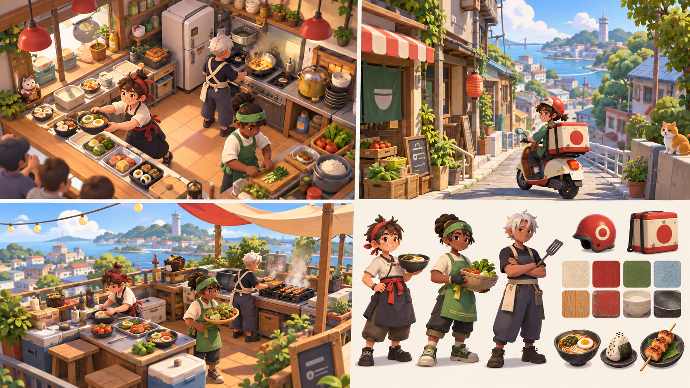
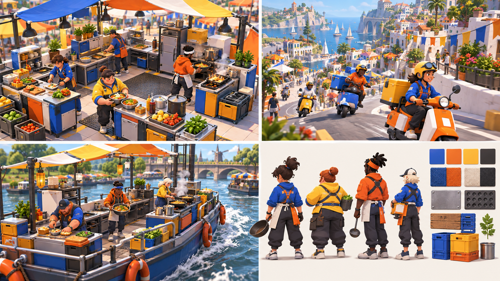
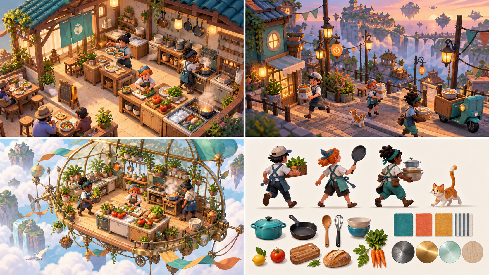

# COOKED OUT! 世界観ムードボード 第1ラウンド

- 作成日: 2026-09-11
- 状態: 不採用。ユーザー判断により、3案とも求めるゲームデザインから離れていた
- 生成方法: Codex内蔵画像生成
- 共通目的: 通常世界と出張営業の現実度、色、材質、キャラクター方向を比較する

## A. 明るい日常の町



### 強み

- 本店を育てるソロ長期モードと相性がよい
- 食材、木、金属、布の温かさが伝わりやすい
- 初心者や家族が入りやすい

### 課題

- 出張営業の驚きが弱くなりやすい
- 一部に店内客のような描写があるため、本店の外部配達専用仕様にはそのまま使えない
- 赤い円形意匠など、特定地域を連想させる要素は最終案で除く

### 生成プロンプト

```text
Use case: stylized-concept
Asset type: world-building moodboard for an original iOS cooperative cooking action game
Primary request: Direction A, a warm everyday neighborhood world where a tiny independent restaurant serves a compact modern Japanese-inspired town; show four visually coherent vignettes in one landscape moodboard: the home kitchen during a cheerful rush, a cozy street used for scooter delivery, a sunny rooftop pop-up kitchen, and original cook silhouettes/material swatches
Scene/backdrop: clean presentation board with four image panels, no captions
Subject: readable compact kitchens, real foods, delivery scooters, friendly original cooks with distinctive practical outfits and proportions
Style/medium: polished stylized 3D game concept render, rounded large forms, low-density detail, matte tactile materials, strong silhouettes, designed for a small phone screen
Composition/framing: 16:9 landscape, four balanced panels, kitchen shown from a high three-quarter gameplay-readable angle
Lighting/mood: bright late-morning sunlight, welcoming, playful, energetic but grounded
Color palette: warm cream, tomato red, leafy green, pale sky blue, natural wood
Materials/textures: painted metal, matte ceramic, canvas awnings, light wood, subtle wear
Constraints: original visual identity; no text, logo, watermark, trademarks; no resemblance to any specific existing cooking game characters, UI, kitchen layout, or costumes; cooking stations and ingredients must read clearly at thumbnail size
Avoid: copied chef designs, generic tall white chef hats, overly childish nursery look, photorealism, cluttered tiny props, dark dramatic lighting
```

## B. 移動型フードイベント



### 強み

- 出張営業、バイク配達、役割分担が一枚で伝わる
- 青、橙、黄による設備の識別性が高い
- モジュール設備はアップデートで厨房を追加する設計と相性がよい

### 課題

- 本店の落ち着きや長期成長感はAより弱い
- 全ステージをイベント会場風にすると、特殊厨房との差が薄くなる
- 色数と人物数は実機画面で削減が必要

### 生成プロンプト

```text
Use case: stylized-concept
Asset type: world-building moodboard for an original iOS cooperative cooking action game
Primary request: Direction B, a bold traveling food-event world built around temporary kitchens and lively delivery; show four visually coherent vignettes in one landscape moodboard: a modular festival kitchen in active service, a vivid city route with scooters, a river-barge outing kitchen with the background in motion but stable kitchen floor, and original cook silhouettes/material swatches
Scene/backdrop: clean presentation board with four image panels, no captions
Subject: modular counters, folding canopies, containers, real foods, delivery scooters, friendly original cooks wearing practical colorful work jackets rather than traditional chef uniforms
Style/medium: polished stylized 3D game concept render, chunky geometric silhouettes, modular toy-like construction without looking like children's toys, matte materials, high gameplay readability
Composition/framing: 16:9 landscape, four balanced panels, kitchens shown from a high three-quarter fixed-camera view
Lighting/mood: clear festival daylight, kinetic, social, upbeat, controlled visual chaos
Color palette: cobalt blue, tangerine, lemon yellow, off-white, charcoal accents
Materials/textures: powder-coated metal, rubber, canvas, reusable plastic crates, painted wood
Constraints: original visual identity; no text, logo, watermark, trademarks; no resemblance to any specific existing cooking game characters, UI, kitchen layout, vehicle, or costumes; large readable stations and strong color separation
Avoid: copied chef designs, generic tall white chef hats, carnival clichés, excessive neon, photorealism, visual clutter, dark lighting
```

## C. 日常から不思議な出張厨房へ



### 強み

- 空中厨房など、出張営業の記憶に残る驚きを最も強く出せる
- 現実の料理器具と非現実の舞台を対比できる
- 通常営業と出張営業の役割を視覚的に分けやすい

### 課題

- 町まで浮島化しており、現状想定よりファンタジーが強い
- 真鍮、ガラス、植物を多用すると、設備状態の視認性を損ねる可能性がある
- 一部に店内客のような描写があるため、そのまま本店仕様にはできない

### 生成プロンプト

```text
Use case: stylized-concept
Asset type: world-building moodboard for an original iOS cooperative cooking action game
Primary request: Direction C, a grounded town that occasionally opens into delightfully impossible outing kitchens; show four visually coherent vignettes in one landscape moodboard: the modest home restaurant, a compact delivery street at dusk, a flying greenhouse kitchen drifting above clouds with a stable fixed floor, and original cook silhouettes/material swatches
Scene/backdrop: clean presentation board with four image panels, no captions
Subject: real foods and familiar kitchen equipment contrasted with whimsical architecture, floating utility cables and wind ribbons, friendly original cooks in short aprons and distinct workwear
Style/medium: polished stylized 3D game concept render, soft sculpted forms, whimsical engineering, matte materials, high readability for a small mobile display
Composition/framing: 16:9 landscape, four balanced panels, kitchen shown from a high three-quarter gameplay-readable angle
Lighting/mood: optimistic golden-hour light, airy wonder, humorous danger without fear
Color palette: turquoise, coral, warm mustard, cloud white, deep navy accents
Materials/textures: painted brass, frosted greenhouse glass, soft fabric, pale wood, enamel cookware
Constraints: original visual identity; no text, logo, watermark, trademarks; no resemblance to any specific existing cooking game characters, UI, kitchen layout, airship, or costumes; readable stations, safe family-friendly tone
Avoid: copied chef designs, generic tall white chef hats, steampunk overload, fantasy weapons, photorealism, dark peril, cluttered details
```

## 比較と推奨

| 方向 | 本店の親しみ | 出張営業の驚き | 配達の見せやすさ | 小画面での識別 | 現行仕様との相性 |
|---|---:|---:|---:|---:|---:|
| A | 高 | 低〜中 | 中 | 中〜高 | 高 |
| B | 中 | 高 | 高 | 高 | 高 |
| C | 中 | 非常に高い | 中 | 中 | 中〜高 |

第一推奨は一案だけに統一するのではなく、次のハイブリッドとする。

- 通常営業・町・本店の基礎: Aの温かく日常的な世界
- 厨房設備の形と識別色: Bのモジュール式、青・橙・黄の高い視認性
- 出張営業の舞台: Bの川・イベントと、Cの空中厨房等の非現実要素
- 非現実要素は主に出張営業へ限定し、通常の町まで浮島化しない
- キャラクターは3案をそのまま採用せず、選定後にCOOKED OUT!独自の頭身、輪郭、衣装へ作り直す

## 次の判断

以下から基準方向を一つ選ぶ。

- A: 日常性を最優先
- B: 出張営業・配達・視認性を最優先
- C: 非現実的な特殊厨房を最優先
- D: 推奨ハイブリッド。通常世界=A、設備=B、出張営業=B+C

選定後、同じアート規則を使って、料理人キャラクター3案、共通配達容器3案、ステージ1-1完成イメージを生成する。

## 結果

2026-09-11、3案とも不採用となった。主な問題は、人物がアニメ調で、生活・観光背景の比重が高く、実際の固定俯瞰型ゲーム画面、玩具的な厨房、太く単純な形、協力時の混乱の読みやすさから離れていたこと。この結果を受け、[第2ラウンド](WORLD_MOODBOARD_ROUND_02.md)ではゲームプレイ画面そのものを中心に再生成した。
