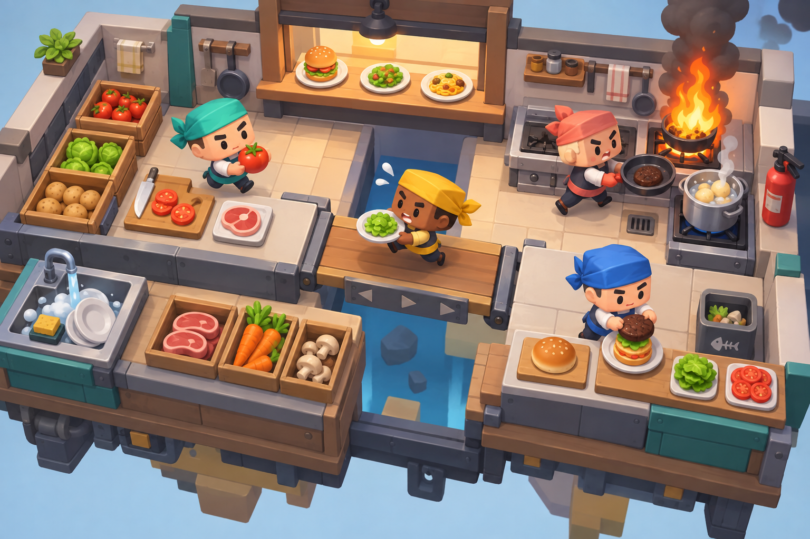
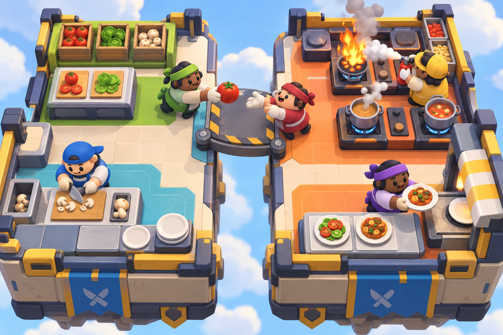
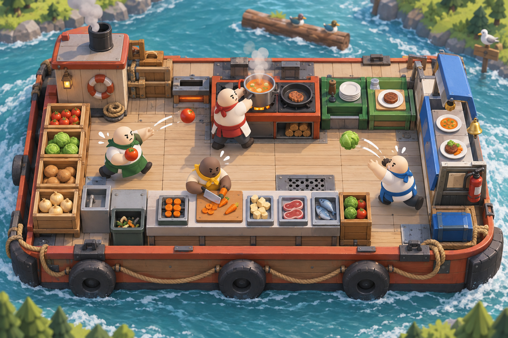

# COOKED OUT! 世界観ムードボード 第2ラウンド

- 作成日: 2026-09-11
- 状態: 比較用。製品採用アートではない
- 生成方法: Codex内蔵画像生成
- 修正目的: 第1ラウンドのアニメ調・背景中心の表現を廃し、固定俯瞰、玩具的な厨房、誇張された体型、大きな設備と食材、協力時の混乱が一目で読める方向へ寄せる
- 知的財産上の境界: 特定作品のキャラクター、衣装、厨房配置、UI、プロップ、配色は複製せず、一般的な可読性とデフォルメ原則だけを参照する

## A. 角丸ブロック厨房



- 長所: 固定俯瞰、設備の大きさ、材料状態、火災、橋ギミックが読みやすい。キャラクターもバンダナ中心で差別化しやすい
- 課題: まだ汎用モバイルゲーム的な質感がある。完成版では顔、胴体、手、輪郭にCOOKED OUT!固有の造形規則が必要
- 推奨用途: 最終アートの独自性を作る基礎

### 生成プロンプト

```text
Use case: stylized-concept
Asset type: revised visual-direction board for an original cooperative cooking action game
Primary request: create an actual gameplay-like view of four cooks chaotically preparing real food together in one compact kitchen; emphasize instantly readable cooperative actions, stations, hazards, and ingredient handoffs
Scene/backdrop: a self-contained miniature kitchen platform with counters forming clear lanes, ingredient crates, chopping boards, two stoves, serving hatch, sink, extinguisher, and a small gap crossed by a moving counter; minimal abstract background
Subject: four original cooks with rounded-square heads, compact torsos, very short limbs, mitten-like hands, expressive eyebrows, simple facial features, colored bandanas and practical short aprons; no traditional chef hats
Style/medium: polished colorful stylized 3D game render, chunky toy-diorama geometry, soft bevels, clean matte materials, simple shapes, playful physical comedy, production-friendly low-detail modeling
Composition/framing: fixed high three-quarter orthographic gameplay camera, entire kitchen visible, no cinematic close-up, characters clearly separated
Lighting/mood: bright soft studio daylight, cheerful controlled chaos
Color palette: warm neutral counters with clear teal, coral, mustard, and blue functional accents
Materials/textures: matte painted wood, enamel cookware, brushed metal, fabric accents; very low texture noise
Constraints: original designs; high readability on a phone screen; visually distinct raw, chopped, cooked, and burned food; no UI, text, logo, watermark, trademarks; no copying any specific existing character, costume, kitchen layout, prop design, or color scheme
Avoid: anime faces, realistic humans, detailed scenery, depth of field, cinematic concept art, tall chef hats, restaurant customers, tiny clutter, glossy mobile-ad rendering
```

## B. 色分けモジュール厨房



- 長所: 3案中もっとも作業区画、役割、危険、投げ渡しが読みやすい。小画面用の色面設計として優秀
- 課題: キャラクター体型、白い手、厨房の外周処理などの類似度が高いため、最終製品へそのまま採用しない
- 推奨用途: 視認性、カメラ距離、設備サイズ、作業区画色の評価基準

### 生成プロンプト

```text
Use case: stylized-concept
Asset type: revised visual-direction board for an original cooperative cooking action game
Primary request: create an actual gameplay-like view of four cooks in a frantic compact kitchen, passing ingredients, chopping, stirring, and extinguishing a small harmless pan fire; prioritize clear cooperative comedy and readable workflows
Scene/backdrop: a floating but structurally stable square kitchen stage, bold counter islands, two separated work zones connected by a short rotating bridge, ingredient crates and serving hatch; simple sky backdrop only
Subject: four original cooks with soft bean-shaped bodies, broad heads, short legs, oversized hands, button-like eyes, bold readable expressions, caps or headbands, practical color-block work jackets and aprons; no traditional chef hats
Style/medium: stylized 3D video game screenshot, tactile soft-rubber figures and chunky modular kitchen pieces, simplified animation-film proportions, strong silhouettes, restrained detail
Composition/framing: fixed high three-quarter near-orthographic camera showing the full level boundary and every station; action poses remain readable
Lighting/mood: bright neutral daylight, funny urgency, safe family-friendly chaos
Color palette: cream stage base, aqua work zone, orange hot zone, lime ingredient zone, dark navy outlines and shadows
Materials/textures: satin rubber characters, matte plastic station shells, brushed metal worktops, minimal texture
Constraints: original visual identity; readable at small iPhone size; clear spatial lanes and collision spaces; no UI, text, logo, watermark, trademarks; no copying any particular game's characters, costumes, kitchen layout, props, or palette
Avoid: anime illustration, realistic anatomy, elaborate fantasy scenery, steampunk, detailed city backgrounds, depth of field, tall chef hats, diners, excessive props
```

## C. 川を進む出張厨房



- 長所: 厨房全体を固定床として扱い、背景だけが移動する「移動厨房」の仕様をよく表している。投げる動作と役割分担も読みやすい
- 課題: キャラクターの顔と体型が単純すぎ、既存作品との差別化が弱い。背景の被写界深度も実ゲーム画面では抑える必要がある
- 推奨用途: 出張営業の画面構図と、動く背景・固定厨房の関係

### 生成プロンプト

```text
Use case: stylized-concept
Asset type: revised visual-direction board for an original cooperative cooking action game
Primary request: show a frantic riverside outing kitchen as an actual fixed-camera game level, with four cooks preparing meals while the kitchen stays stable and the river background moves; focus on teamwork, throwing ingredients, timer pressure implied through poses, and slapstick near-misses
Scene/backdrop: compact kitchen platform mounted on a flat working barge, clear counter grid, ingredient boxes, chopping boards, stove, pot, pan, serving hatch and extinguisher; river and distant simple banks remain secondary
Subject: four original cooks with rounded pebble heads, stout barrel torsos, stubby legs, oversized forearms, simple dot-and-brow expressions, distinct colored neckerchiefs and waist aprons; no traditional chef hats
Style/medium: clean stylized 3D game screenshot, miniature tabletop-diorama look, bold rounded geometry, large props, diffuse matte shading, low-poly production-friendly detail, playful physical comedy
Composition/framing: fixed high three-quarter orthographic gameplay camera, complete kitchen footprint visible, barge occupies most of frame, no character portrait panel
Lighting/mood: crisp cheerful midday light, busy but not visually noisy
Color palette: pale timber and off-white base, turquoise water, red-orange heat equipment, green preparation equipment, blue service equipment
Materials/textures: lightly painted timber, simple metal, rubber bumpers, flat fabric; minimal surface noise
Constraints: original designs and original stage layout; readable on a phone screen; raw and processed foods have different silhouettes; no UI, text, logo, watermark, trademarks; no copying any specific existing character, costume, prop, vehicle, kitchen, or color arrangement
Avoid: anime faces, realistic rendering, picturesque travel poster composition, detailed background town, depth of field, tall chef hats, diners, intricate decoration, glossy plastic sheen
```

## 現時点の推奨

3案から一枚をそのまま採用しない。

- 独自性の基礎: A
- ゲーム画面の可読性基準: B
- 出張営業の構図基準: C
- 次のキャラクター設計では、B/Cの丸い料理人を直接使わず、Aからさらに独自の頭部輪郭、体型、手、衣装、移動シルエットを定義する
- 厨房はB程度まで単純化しつつ、外周形状、設備筐体、区画色、提供口の造形をCOOKED OUT!独自にする

次の判断は「第2ラウンドの読み味を基準にしてよいか」。承認後、独自性を強化した料理人キャラクター3案へ進む。
