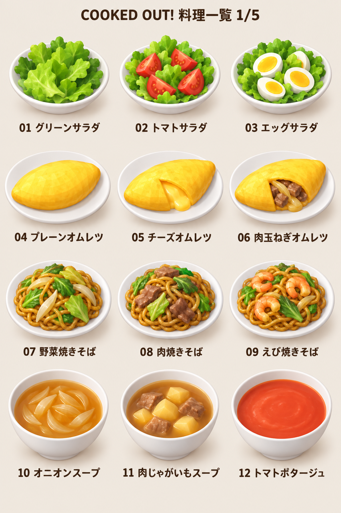
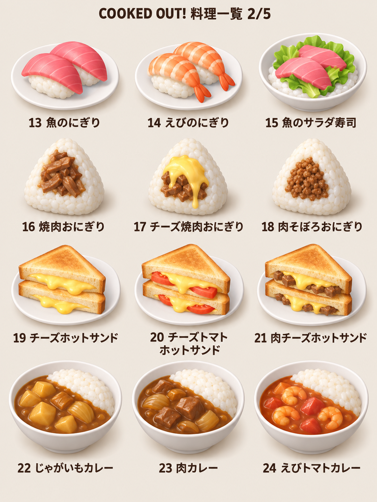
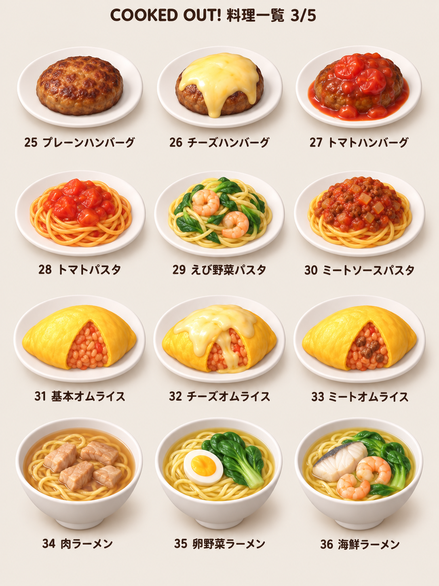
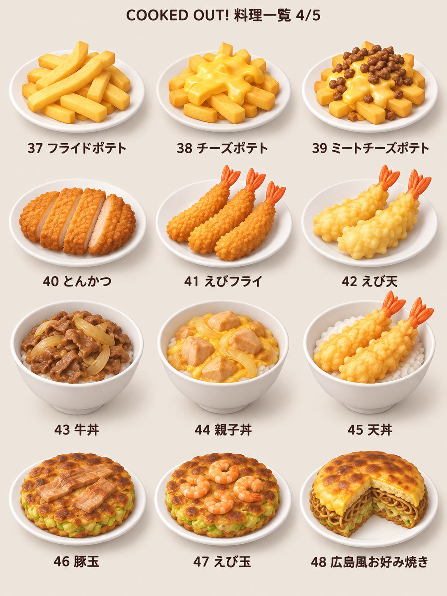
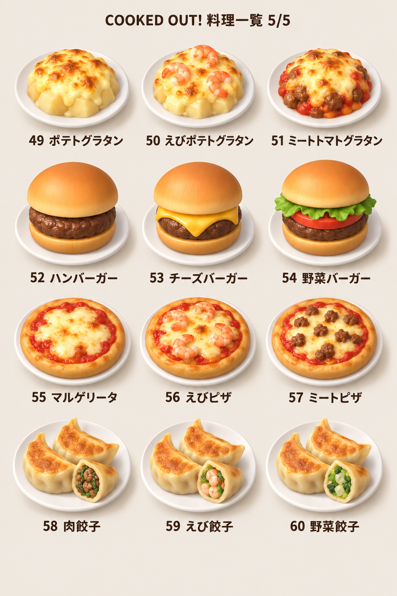

# 全60品・たまねぎ参照スタイルの料理画像一覧 v1

制作日：2026-09-14。

- ユーザーのたまねぎ画像をスタイル参照として、内蔵image_genで生成。imagegenスキルに従い、各一覧シートを個別生成し、原本を残して料理専用フォルダへコピーした。
- 12品×5枚、各3列×4段。各段は一系統で、左・中央が基本二品、右が三品目。01〜60は画像一覧用の通し番号で、営業Lv・解放順・実装IDではない。
- 見た目の検討案。画像内の皿・ボウル・断面・盛付け・具の個数は視覚表現であり、新しい容器仕様、切断工程、材料個数を追加決定するものではない。レシピは[料理統合台帳](CAMPAIGN_CHAPTERS_1_8_COOKING_CATALOG.md)を参照。
- 元のたまねぎは形状・陰影・配色の参照のみ。今回は完成料理の比較用画像であり、60枚の独立透過スプライトやゲーム内モデルではない。
- 目視確認：全5枚に12品ずつ、通し番号01〜60と対応する料理名を確認。チーズの有無、肉／えび、パン粉衣／天ぷら衣、肉なし広島風などの違いを表示。画像間の質感・縮尺、参照たまねぎに対する細部量にはばらつきがあるため、正式アセットとしての完全な統一は未検証。
- 共通生地・ペースト等を含む工程や、皿と配達容器の実装成立性は画像で検証したことにしない。共有仕様・コード・料理構成は未変更。

## 1/5：サラダ・オムレツ・焼きそば・スープ

| 系統 | 左：基本 | 中央：基本 | 右：三品目 |
|---|---|---|---|
| サラダ | 01 グリーンサラダ | 02 トマトサラダ | 03 エッグサラダ |
| オムレツ | 04 プレーンオムレツ | 05 チーズオムレツ | 06 肉玉ねぎオムレツ |
| 焼きそば | 07 野菜焼きそば | 08 肉焼きそば | 09 えび焼きそば |
| スープ | 10 オニオンスープ | 11 肉じゃがいもスープ | 12 トマトポタージュ |

## 2/5：寿司・おにぎり・ホットサンド・カレーライス

| 系統 | 左：基本 | 中央：基本 | 右：三品目 |
|---|---|---|---|
| 寿司 | 13 魚のにぎり | 14 えびのにぎり | 15 魚のサラダ寿司 |
| おにぎり | 16 焼肉おにぎり | 17 チーズ焼肉おにぎり | 18 肉そぼろおにぎり |
| ホットサンド | 19 チーズホットサンド | 20 チーズトマトホットサンド | 21 肉チーズホットサンド |
| カレーライス | 22 じゃがいもカレー | 23 肉カレー | 24 えびトマトカレー |

## 3/5：ハンバーグ・パスタ・オムライス・ラーメン

| 系統 | 左：基本 | 中央：基本 | 右：三品目 |
|---|---|---|---|
| ハンバーグ | 25 プレーンハンバーグ | 26 チーズハンバーグ | 27 トマトハンバーグ |
| パスタ | 28 トマトパスタ | 29 えび野菜パスタ | 30 ミートソースパスタ |
| オムライス | 31 基本オムライス | 32 チーズオムライス | 33 ミートオムライス |
| ラーメン | 34 肉ラーメン | 35 卵野菜ラーメン | 36 海鮮ラーメン |

## 4/5：フライドポテト・揚げ物・丼物・お好み焼き

| 系統 | 左：基本 | 中央：基本 | 右：三品目 |
|---|---|---|---|
| フライドポテト | 37 フライドポテト | 38 チーズポテト | 39 ミートチーズポテト |
| 揚げ物 | 40 とんかつ | 41 えびフライ | 42 えび天 |
| 丼物 | 43 牛丼 | 44 親子丼 | 45 天丼 |
| お好み焼き | 46 豚玉 | 47 えび玉 | 48 広島風お好み焼き |

## 5/5：グラタン・ハンバーガー・ピザ・餃子

| 系統 | 左：基本 | 中央：基本 | 右：三品目 |
|---|---|---|---|
| グラタン | 49 ポテトグラタン | 50 えびポテトグラタン | 51 ミートトマトグラタン |
| ハンバーガー | 52 ハンバーガー | 53 チーズバーガー | 54 野菜バーガー |
| ピザ | 55 マルゲリータ | 56 えびピザ | 57 ミートピザ |
| 餃子 | 58 肉餃子 | 59 えび餃子 | 60 野菜餃子 |

## 生成記録

参照画像：ユーザー添付 codex-clipboard-a108ddba-8276-4349-9471-1dd469686390.png（たまねぎ）。

[全5枚の使用プロンプト](images/recipe-catalog-onion-style-v1/PROMPTS.md)。外部CLI/APIへの切替えは行っていない。

## 短い申し送り

最新中核20系統60品を料理名付きの5枚の画像一覧として可視化。全て外観比較案で、採用決定ではない。画像を根拠に材料・容器・工程・解放・経済・実装を変更しない。料理専用資料へ保存し、元仕様タスクへの送信・共有仕様変更なし。

